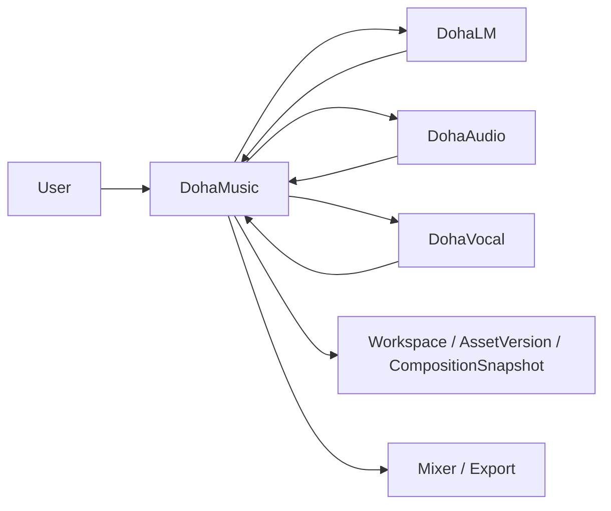

# DohaMusic

> 문서 역할: Repository entry point와 현재 상태 요약
> 문서 상태: [운영 기준]
> 최종 수정일: 2026-08-24
> 기준 브랜치: `develop`
> 관련 문서: [제품 방향](docs/02-product/ai-native-daw-product-direction.md), [시스템 아키텍처](docs/03-architecture/system-architecture.md), [현재 실행 로드맵](ROADMAP.md), [문서 Authority Map](docs/DOCUMENT_AUTHORITY_MAP.md)

## What is DohaMusic?

DohaMusic은 AI-native DAW를 목표로 하는 DohaStudio의 제품·Workspace·Orchestration Repository다. 사용자가 프롬프트·가사와 동의받은 본인 음성을 이용해 음악을 만들고, 생성 과정·모델·권리·버전 계보를 확인하며 결과를 편집·평가하는 안전한 제작 환경을 지향한다.

```text
DohaMusic = AI-native DAW
          + Project / Composition Runtime
          + Provider Orchestrator
          + Composition Evaluation / QA
          + Continuous Learning Hub
```

현재 구현과 장기 목표의 상세 기준은 [AI-native DAW 제품 방향](docs/02-product/ai-native-daw-product-direction.md) 한 곳에서 관리한다.

## CURRENT

현재 `develop`에서 확인되는 범위다.

- D1 Composition Read Workspace와 D2 Timeline Playback, Master / Mix Waveform·richer Playhead Foundation은 완료됐다. Project 상세의 선택된 CompositionSnapshot에는 읽기 전용 초 단위 Timeline, snapshot-local Track lane, 실제 media metadata 기반 duration·Playhead, play/pause·seek, horizontal scroll·zoom과 Track 선택 기반이 있다. 단일 `mix` Item과 단일 safe audio Artifact가 없으면 `NO_CANONICAL_PLAYBACK_SOURCE`로 재생을 비활성화한다.
- [ADR-040](docs/11-decisions/ADR-040-canonical-track-clip-working-composition-authority.md)과 [ADR-045](docs/11-decisions/ADR-045-clip-service-deletion-media-duration-authority.md)에서 mutable WorkingComposition, canonical Track·Clip, Track 삭제와 trusted source duration 권위를 확정했다. persistence와 trusted WAV·FLAC duration 기반은 구현했으며 mutation Service·API·Clip UI는 미구현이다.
- FastAPI Router → Service → Repository → SQLAlchemy 구조와 SQLite·Alembic 기반
- 생성·Stem·Voice Conversion·Pipeline·Lyrics의 Legacy API와 비동기 작업 흐름
- Workspace·MusicProject·ProjectAsset·Asset·AssetVersion·Artifact·CompositionSnapshot·Job 도메인과 공개 API 기반
- local Artifact Catalog·Resolver·Trusted Ingestion·무결성·reconciliation 기반
- Next.js Responsive Studio MVP
  - `/studio`, `/lyrics`, `/voice`, `/generation/[jobId]`, `/result/[jobId]`
  - `/history`, `/projects`, `/projects/[id]`, `/settings`, `/about`
- 프로젝트·생성 이력, WAV 재생·다운로드, Pipeline cancel·retry, Guided Voice Enrollment
- K-POP Structured Options와 final WAV Quality·Tempo·Hook 분석
- 기본 Mock Provider와 선택적 ACE-Step·Demucs·Seed-VC 로컬 호환 Adapter
- Common AI Contract의 `RightsMetadata` opt-in 검증 기반
- [DohaVocal Consumer Contract Foundation](docs/03-architecture/dohavocal-consumer-contract.md)의 4개 capability·9개 operation strict DTO와 config 기반 HTTP Transport·Mock HTTP 검증, Workspace Job의 4개 Vocal type·구조화 input·role 계약, [Provider Job Persistence](docs/03-architecture/provider-job-persistence.md)의 1:N identity·retry history·restart recovery, [Provider Result Ingestion Contract](docs/03-architecture/provider-result-ingestion-contract.md)의 metadata-only trust/eligibility gate와 [Trusted Payload Locator / Resolver Contract](docs/03-architecture/trusted-payload-locator-resolver-contract.md)의 DohaMusic-owned opaque locator Foundation. [Worker Reconciliation Contract](docs/03-architecture/dohavocal-worker-reconciliation-contract.md)은 Provider 성공과 Workspace 성공, lease·retry·payload·role·crash recovery 권위를 확정하고 [Worker Re-entry Lifecycle](docs/03-architecture/workspace-worker-reentry-lifecycle.md)은 replay-safe Provider Job의 `LEASE_EXPIRY_RECLAIMABLE` 목표 계약을 확정한다. reclaim runtime·Worker wiring·인증·payload downloader·durable locator·Completion adapter·실제 Artifact ingestion·실제 Vocal model은 미구현

다음은 CURRENT가 아니다.

- WorkingComposition Service/API와 편집 가능한 DAW Track/Clip Waveform·Section·Mixer·Undo/Redo·range selection
- MIDI Track·Piano Roll은 NOT IMPLEMENTED이며 SoundFont engine은 NOT INTEGRATED인 별도 우선순위다.
- 실제 DohaLM·DohaAudio transport, DohaVocal Worker 연결과 운영 Provider
- ReferenceAnalysis ingestion Workflow와 Reference Panel
- CompositionEvaluationRun 기반 완성곡 QA
- LearningCandidate review와 Dataset·Training 연결
- 인증·소유권이 적용된 공개 운영, 외부 Queue와 다중 프로세스 내구성
- DohaAudio semantic reviewer authentication Provider·identity mapping·ReviewerAuthority 활성화

V1 product authority는 local-only, 일반 product login 없음과 별도 single owner/operator reviewer authentication을 결정했다. DohaMusic의 provider-independent local operator authentication foundation과 `WINDOWS_WEBAUTHN_PLATFORM_CREDENTIAL` mechanism selection은 구현됐지만 concrete OS adapter는 미구현이다. Review는 향후 DohaMusic local governance UI에서 시작하고 DohaMusic identity verification을 거쳐 DohaAudio의 delegated assertion adapter로 연결한다. 이 foundation은 production authentication이나 ReviewerAuthority 활성화를 뜻하지 않으며 자세한 기준은 [Reviewer Authentication 배포 권위](docs/09-security/reviewer-authentication-deployment-authority.md)를 따른다.

세부 API와 구현 근거는 [API 개요](docs/06-api/api-overview.md), [Frontend Overview](docs/03-architecture/frontend-overview.md), [Validation 보고서](docs/DOCUMENT_AUTHORITY_MAP.md#validation--reports)에서 확인한다.

## TARGET

장기 목표는 Project 중심 AI-native DAW다.

- `/studio/[projectId]` 중심 Workspace
- Arrangement·Section·Track·Clip·Waveform·Playhead
- Playback·Seek·Range Selection과 Split·Trim·Move·Copy·Delete
- Fade·Gain·Loop·Undo·Redo와 Volume·Pan·Mute·Solo Mixer
- AI Music Director, 후보 비교·선택, Reference Panel, Lyrics Revision
- Composition Evaluation/QA와 불변 CompositionSnapshot 재평가
- 권리·적격성 검토를 거치는 Continuous Learning Hub
- WAV·MP3·FLAC Export, 향후 MIDI·Piano Roll·Automation 검토

이 목록은 모두 TARGET이며 구현 완료를 뜻하지 않는다. 세부 Workflow와 미구현 Gap은 [제품 방향](docs/02-product/ai-native-daw-product-direction.md)과 [목표 아키텍처](docs/03-architecture/ai-native-daw-target-architecture.md)를 따른다.

## Architecture



| Repository | 책임 |
|---|---|
| DohaMusic | 사용자 UX, 권한, Project·Composition, MusicIntent orchestration, Job, 후보 선택, AssetVersion·Snapshot, Mixer·Export |
| DohaLM | 창작 계획, 가사 생성·분석, MusicIntent·RevisionPlan 지원 |
| DohaAudio | Music Generation, Stem, audio/reference feature 분석 |
| DohaVocal | Singing Voice, Voice Conversion·Correction, vocal/reference feature 분석 |

Provider는 서로 직접 호출하지 않는다. DohaMusic의 Orchestrator가 요청·권한·상태·Artifact 계보와 사용자 최종 선택을 관리한다. 현재/목표 구조는 [시스템 아키텍처](docs/03-architecture/system-architecture.md), 저장소별 경계는 [Provider 책임 경계](docs/03-architecture/repository-provider-boundaries.md)를 따른다.

## Current Development Track

- AI-native DAW D0 제품 목표 정합화: [완료]
- 현재 제품 단계: D1 Composition Read Workspace [완료] / D2 Timeline Playback·Waveform·Richer Playhead [완료] / Clip Domain·Persistence Design [완료] / D3 Clip Persistence·Authority Foundation [완료] / NEXT: WorkingComposition Service + Product API
- 병행 Track: AI Provider 저장소 분리, [Reviewer Authentication 배포 권위](docs/09-security/reviewer-authentication-deployment-authority.md), F6 Voice Enrollment 운영 검증, K3.4 Preview Export, 사용자 청취 평가

현재 실행 순서와 `NEXT / LATER`는 [ROADMAP](ROADMAP.md), 장기 Phase·Track·Gate는 [MASTER_ROADMAP](MASTER_ROADMAP.md), 완료 판정은 [DoD](docs/DoD/README.md)를 기준으로 한다.

## Documentation

| 알고 싶은 것 | 먼저 읽을 문서 | 상세 문서 |
|---|---|---|
| 이 프로젝트가 무엇인가 | [제품 방향](docs/02-product/ai-native-daw-product-direction.md) | [기능 요구사항](docs/02-requirements/functional-requirements.md) |
| 지금 실제로 구현된 것과 바로 다음 작업 | [현재 실행 로드맵](ROADMAP.md) | [Master Roadmap](MASTER_ROADMAP.md) |
| 최종 AI-native DAW의 모습 | [제품 방향](docs/02-product/ai-native-daw-product-direction.md) | [Frontend 전환 계획](planning/ai-native-daw-frontend-migration.md) |
| 시스템과 Provider 연결 | [시스템 아키텍처](docs/03-architecture/system-architecture.md) | [Provider 경계](docs/03-architecture/repository-provider-boundaries.md) |
| Product identity와 DohaAudio reviewer 인증 경계 | [Reviewer Authentication 배포 권위](docs/09-security/reviewer-authentication-deployment-authority.md) | [Local Operator Authentication](docs/03-architecture/local-operator-authentication.md), [ADR-042](docs/11-decisions/ADR-042-v1-local-operator-authentication-foundation.md) |
| DohaVocal Consumer 계약 | [DohaVocal Consumer Contract](docs/03-architecture/dohavocal-consumer-contract.md) | [ADR-034](docs/11-decisions/ADR-034-dohavocal-consumer-contract.md) |
| DohaVocal Worker reconciliation | [Worker Reconciliation Contract](docs/03-architecture/dohavocal-worker-reconciliation-contract.md) | [ADR-043](docs/11-decisions/ADR-043-doha-vocal-worker-reconciliation-authority.md) |
| Workspace Worker re-entry | [Worker Re-entry Lifecycle](docs/03-architecture/workspace-worker-reentry-lifecycle.md) | [ADR-044](docs/11-decisions/ADR-044-workspace-worker-reentry-lifecycle-authority.md) |
| Durable execution handoff | [Handoff Analysis](docs/03-architecture/durable-execution-handoff-analysis.md) | [ADR-046](docs/11-decisions/ADR-046-durable-execution-handoff-authority.md) |
| Reference 분석 | [목표 아키텍처의 Reference Analysis](docs/03-architecture/ai-native-daw-target-architecture.md#41-reference-analysis) | [Common Contract 소비자 기준](docs/03-architecture/common-ai-contract-consumer.md) |
| 사용자 수정이 학습 후보가 되는 방식 | [목표 아키텍처의 Continuous Learning](docs/03-architecture/ai-native-daw-target-architecture.md#45-continuous-learning) | [제품 방향](docs/02-product/ai-native-daw-product-direction.md#55-continuous-learning) |
| 완성곡 품질·유사도 평가 | [목표 아키텍처의 Composition Evaluation](docs/03-architecture/ai-native-daw-target-architecture.md#44-composition-evaluation--qa) | [AI-native DAW DoD](docs/DoD/AI-Native-DAW.md) |
| API와 데이터 구조 | [API 개요](docs/06-api/api-overview.md) | [데이터베이스 개요](docs/07-database/database-overview.md) |
| 실행·설정·장애 대응 | [로컬 개발 환경](docs/10-operations/local-development.md) | [문제 해결](docs/10-operations/troubleshooting.md) |
| 설계 이유 | [ADR Index](docs/11-decisions/README.md) | 개별 ADR |
| 실제 실험·검증 | [문서 Authority Map](docs/DOCUMENT_AUTHORITY_MAP.md#validation--reports) | `reports/experiments`, `reports/evaluations`, `reports/validation` |
| 변경 시점과 내용 | [CHANGELOG](CHANGELOG.md) | 관련 PR·ADR·Validation |
| 어떤 문서가 현재 기준인가 | [문서 Authority Map](docs/DOCUMENT_AUTHORITY_MAP.md) | [Cleanup Plan](docs/DOCUMENT_CLEANUP_PLAN.md) |

## Quick Start

Python 3.11 이상이 필요하다. 아래 Migration은 새 로컬 개발 DB에만 적용한다.

```powershell
python -m venv .venv
.venv\Scripts\Activate.ps1
python -m pip install -e ".[dev]"
python -m alembic -c backend/alembic.ini upgrade head
python -m uvicorn backend.main:app --reload
```

Frontend는 별도 terminal에서 실행한다.

```powershell
Set-Location frontend
npm ci
npm run dev
```

- API 문서: `http://127.0.0.1:8000/docs`
- Health: `GET http://127.0.0.1:8000/health`
- Frontend: `http://localhost:3000`
- 상세 설정: [로컬 개발 환경](docs/10-operations/local-development.md), [환경 변수](docs/10-operations/environment-variables.md)

## Safety / Rights

- 본인 음성 또는 명시적 동의를 받은 음성만 사용한다.
- Reference URL의 존재는 다운로드·분석·학습 권한을 뜻하지 않는다.
- Reference Audio와 FeatureRecord, Project 저장과 Training Dataset을 동일시하지 않는다.
- LearningCandidate는 Dataset 포함이나 Training 승인이 아니다.
- DatasetVersion 생성은 Training 자동 실행이 아니다.
- `EvaluationRun`은 TrainingRun·checkpoint·model 평가 의미를 유지한다.
- `SimilarityReport`는 법적 표절 판정이나 법률 의견, 자동 승인 기준이 아니다.
- 모델·가중치·Dataset의 라이선스와 상업 이용 가능성은 정확한 버전별로 별도 검토한다.

보안·권리 기준은 [보안 정책](docs/09-security/security-policy.md), [Reviewer Authentication 배포 권위](docs/09-security/reviewer-authentication-deployment-authority.md), [음성 동의 정책](docs/09-security/voice-consent-policy.md), [라이선스 검토](docs/01-research/licensing-review.md)를 따른다.

기여 절차는 [CONTRIBUTING](CONTRIBUTING.md), 자동화 작업 규칙은 [AGENTS](AGENTS.md)에서 확인한다.
