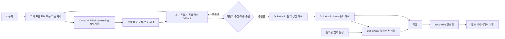

# DohaMusic

> Phase 6.5: OpenAI Responses API Lyrics Adapter가 `Experimental`로 추가되었고 기본 Provider는 계속 `template`입니다. 외부 실측은 `[사용자 승인 필요] [API Key 필요] [유료 실측 미수행]`이며, 실제 유료 API 호출 없음·발생 비용 0원·API Key 사용 없음 상태입니다.

> Phase 6.6~6.9: 권리 확보 Dataset으로 공개 Instruct Base Model을 QLoRA SFT하고 `LocalLyricsLLMAdapter`로 연결하는 구조는 `[계획] 0%`입니다. Base Model·Dataset·checkpoint는 없고 학습·Adapter·품질 평가는 미착수이며, 승인 전 `template` 기본값과 Pipeline 비연결을 유지합니다.

> DohaLM Lyrics 연동: 별도 저장소의 LLM 모델·추론 Provider인 [DohaLM](https://github.com/DohaStudio/DohaLM/tree/develop)을 REST/Streaming API 또는 향후 Python SDK로 호출하는 Reference Application 구조는 `[계획]`입니다. DohaLM의 현재 REST/SSE MVP는 일반 Chat 계약이며 Python SDK와 DohaMusic 전용 Lyrics API는 아직 확정되지 않았습니다. `AIHUB-71748` 계열은 비상업 연구 범위이므로 상업용 DohaMusic 작업에서 사용할 수 없습니다.

> Workspace Artifact 도메인: Provider Runtime 결과의 `DohaArtifacts/lm|audio|vocal`과 별도로 Mix·Export·Preview·Composition Snapshot·실행 기록을 위한 `DohaArtifacts/music` 구조는 `[계획]`입니다. 로컬 폴더·환경 변수·DB·Runtime은 아직 변경하지 않았습니다.

> AI Provider 저장소 분리: DohaMusic은 제품 서비스·Workspace·Job Orchestration·Mixer·최종 Export를 유지하고, 실제 저장소로 존재하는 DohaAudio의 Music Generation·Stem Separation과 DohaVocal의 Singing Voice·Voice Conversion은 `[계획]` 외부 Provider 기능으로 분리합니다. 저장소와 Runtime 이전은 별도 단계이며 기존 ACE-Step·Demucs·Seed-VC subprocess와 `PipelineExecutor`는 호환 계층으로 유지합니다.

> 공통 명세 기준선: 저장소 간 Asset·Artifact·Job·Provider 계약은 [DohaStudio Common Specification](https://github.com/DohaStudio/.github/tree/main/docs/specifications) `0.1.0` / `draft-baseline`을 따릅니다. 감사·재현 기준 commit은 `1e4b480c8cbd6e51835f8550e685e9b136d8071d`입니다.

> Workspace Database: AssetVersion 중심 목표 21개 SQLAlchemy 2.0 Entity와 additive Alembic revision `20260806_0012`는 구현·임시 DB 검증을 완료했습니다. 실제 사용자 DB 적용 전 [Preflight Runbook](docs/10-operations/workspace-db-migration-runbook.md)과 read-only·backup 도구를 준비했지만 실제 DB 접근·적용, backfill·dual write·Repository·Service·REST API는 미수행이며 현행 14개 Runtime Table이 source of truth입니다.

> Phase 8: Doha Studio 로컬 단일 사용자 Responsive Frontend MVP는 `[완료] 100%`입니다. Voice Profile, History·Project, 전역 WAV Player·Download와 cooperative Cancel·새 Job Retry를 실제 API에 연결했습니다. 인증·소유권·분산 Queue는 Phase 9 공개 운영 차단 조건입니다.

> F6 Guided Voice Enrollment는 `[진행 중]`입니다. 구현과 Windows FFmpeg 8.1.2·Ubuntu/Windows CI에 더해 실제 Chrome·Edge 채널, Playwright Firefox, Pixel 7·iPhone 14 에뮬레이션의 자동 Validation을 수행했습니다. 실제 사용자 마이크·실제 Android/iOS/Safari와 인증·소유권은 남아 있습니다. 결과는 [Validation Report](reports/validation/VALIDATION-VOICE-ENROLLMENT.md)와 [운영·수동 체크리스트](docs/10-operations/voice-enrollment-operations-checklist.md)를 따르며 Phase 8 완료 상태와 Phase 7 학습 범위는 변경하지 않습니다.

> K-POP Creation Control Track: K0·K1·K2·K3.0·K3.1·K3.2·K3.3은 `[완료]`입니다. 완료 Pipeline의 `final.wav`에서 Quality Metrics, 예상 Tempo와 에너지·반복 기반 후렴 후보를 분석하며 K3.4 Preview는 `[계획]`입니다.

External Lyrics는 strict JSON Schema, 안전한 오류·retry, 요청별 명시 fallback, 예상 비용 metadata와 원본 보존 Revision API를 제공합니다. 설정은 [External Lyrics Provider](docs/10-operations/external-lyrics-provider-setup.md), 근거는 [Provider 비교](docs/01-research/lyrics-llm-provider-comparison.md), 결정은 [ADR-015](docs/11-decisions/ADR-015-external-lyrics-llm-provider.md)를 참고하세요.

> 문서 목적: 프로젝트의 목표, 현재 상태, 전체 설계 문서로 가는 시작점을 제공한다.
> 현재 상태: **Phase 8 로컬 단일 사용자 Studio 완료 — K-POP Creation K0·K1·K2·K3.0·K3.1·K3.2·K3.3 완료**
> 최종 수정일: 2026-08-06
> 관련 문서: [Master Roadmap](MASTER_ROADMAP.md), [Phase DoD](docs/DoD/README.md), [Codex 작업 지침](AGENTS.md), [실행 로드맵](ROADMAP.md), [변경 이력](CHANGELOG.md)

DohaMusic은 자연어 프롬프트 또는 사용자가 작성한 가사를 바탕으로 노래를 생성하고, 생성된 보컬을 동의받은 사용자의 목소리로 변환해 완성 음원을 만드는 개인 창작용 AI 음악 생성 플랫폼이다. 향후 DohaLM을 외부 LLM Provider로 연결해 가사 초안 생성·기존 가사와 구조·운율·음절·반복 분석·수정안·제목·콘셉트 제안을 제공하되, 사용자가 편집하고 최종 승인한 가사만 음악 생성에 전달한다.

장기적으로 DohaMusic은 Next.js·FastAPI·인증·프로젝트·Job·DB·가사 승인·음성 동의·Provider Client·Workspace Workflow·결과 관리에 집중한다. 신규 Music Generator는 DohaAudio에서, 신규 Singing Voice·Voice Conversion은 DohaVocal에서 구현한다. 두 저장소는 존재하며 Runtime API는 아직 `[계획]`이다. 자세한 책임은 [저장소와 Provider 경계](docs/03-architecture/repository-provider-boundaries.md)를 따른다.

## 최종 목표

사용자가 음악적 전문 지식 없이도 자신의 가사와 목소리로 재현 가능한 곡을 만들고, 생성 과정·모델·권리 정보를 확인할 수 있는 안전한 제작 환경을 제공한다.

## 핵심 기능과 현재 상태

| 상태 | 기능 |
|---|---|
| [완료] | FastAPI Router·Service·Repository·SQLAlchemy 기반 Backend Foundation |
| [완료] | SQLite·Alembic 초기 schema와 로컬 Storage 구성 |
| [완료] | Mock Worker 기반 비동기 Job 생성·조회·결과 파일 목록 |
| [완료] | 동의 확인이 필수인 음성 프로필 생성·삭제 API |
| [완료] | 교체 가능한 `MusicGenerator` 결과 계약과 Provider Factory |
| [조건부 채택] | ACE-Step 1.5 v0.1.8 2B Turbo 로컬 추론·Backend Adapter 연결. 기본 Provider는 `mock`, 운영 Provider는 미확정 |
| [완료] | `StemSeparator`·Mock/Demucs Provider와 비동기 Stem API |
| [실험 완료] | HTDemucs 4.1.0 보컬/반주 분리, 48kHz Stereo 출력, RTX 3060 Ti Benchmark |
| [실험 완료] | 동일 Seed PCM 재현성, 다른 Seed 파형 다양성, 상주 12회 안정성·0.6B LM 실행 |
| [진행 중] | Responsive Studio에서 프롬프트·직접 작성/생성 가사 기반 Pipeline 요청 |
| [완료] | Pipeline 장르·길이·Seed와 K-POP 목표 BPM Prompt 설정 및 final WAV 예상 Tempo 분석 |
| [완료] | 보컬/반주 분리 Job과 개별 출력 metadata |
| [실험 완료] | `VoiceConverter`·Mock/Seed-VC Provider와 비동기 Voice Conversion API |
| [수동 평가 필요] | 동의받은 본인 참조 음성의 음색·발음·노래 자연스러움 |
| [완료] | Music → Stem → Mock Voice → Default Audio Mixer → WAV Export 비동기 Pipeline |
| [완료] | 단계별 진행률·재시도·timeout 판정·오류·metadata·Benchmark |
| [완료] | 변환 보컬·반주 gain, -1dBFS headroom, peak normalization, soft limiter, fade, 48kHz WAV 합성 |
| [수동 평가 필요] | 최종 Mixer volume·balance·naturalness·noise·clipping 청감 |
| [완료] | `LyricsGenerator`·Template/Mock Provider와 동기식 가사 생성·조회·검증·삭제 API |
| [완료] | 한국어·영어 구조화 가사, 섹션 파싱, 입력 정제, 길이·반복·구조 검증과 metadata 저장 |
| [수동 평가 필요] | EVAL-005 가사 주제 적합성·자연스러움·후렴 기억성·창작 활용성 평가 |
| [계획] | DohaLM API를 통한 가사 초안 생성·기존 가사 분석·구조·운율·음절·반복 분석·수정안·제목·콘셉트 제안 |
| [계획] | AI 최초 생성본과 사용자 수정본의 버전 관리, 사용자 최종 승인과 승인본만 Pipeline에 전달하는 게이트 |
| [계획] | 공개 Instruct Base + 권리 확보 Lyrics Dataset + QLoRA SFT 기반 Local Lyrics LLM |
| [계획] | MP3 변환 |
| [완료] | Frontend Pipeline 상태·진행률·오류·cooperative Cancel·새 Job Retry |
| [완료] | Pipeline 기반 생성 History·Project 관리와 Result 재진입·재생·다운로드 |
| [완료] | 사용자 안내형 Voice Enrollment Wizard와 브라우저 MediaRecorder·WAV fallback |
| [완료] | Guided Voice Enrollment 영속 모델·7개 API·다중 sample·정규화·기본 품질 검사·Profile 승격 |
| [완료] | Guided Voice Enrollment 주기 만료·cleanup 재시도·orphan scan·시작 시 crash recovery |
| [완료] | K-POP Structured Generation Options 검증·Prompt 컴파일·Snapshot·Retry·공개 설정 요약 |
| [완료] | K3.0 Audio Analysis 제품·결과·실패·평가·라이브러리·ADR 계약 문서 |
| [완료] | K3.1 final WAV duration·sample rate·channels·Sample Peak·clipping·Integrated LUFS 분석과 Result·History·Project UI |
| [완료] | K3.2 final WAV detected BPM·confidence·요청 BPM 오차·half/double-time 후보와 Result·History·Project UI |
| [완료] | K3.3 final WAV 에너지·반복 기반 15초 후렴 후보·confidence·중앙 fallback과 Result·History·Project UI |
| [계획] | K3.4 Preview Export 실제 구현 |
| [계획] | AssetVersion 기반 Composition Snapshot과 `DohaArtifacts/music`의 Mix·Export·Preview 저장 영역 |
| [부분 검증] | RTX 3060 Ti 8GB 실행 가능성·유효 WAV 출력 |
| [사용자 평가 진행 중] | ACE-Step은 조건부 채택. 5개 독립 산출물 평가 완료, 동일 산출물 참조 1개, 2개 미평가 |

음악 생성·Stem 분리·Voice Conversion의 기본 Provider는 계속 Mock이다. ACE-Step은 짧은 Instrumental과 0.6B LM의 가능성만 확인한 조건부 채택 상태이며 운영 Provider는 미확정이다. 선택적 ACE-Step, Demucs, Seed-VC Adapter는 격리 subprocess를 실행하며 설치와 모델 경로를 명시한 경우에만 동작한다. Mixer 기본값은 AI와 독립된 `DefaultAudioMixer`이며 Mock은 테스트용으로 유지한다. Lyrics 기본값은 외부 통신이 없는 `TemplateLyricsGenerator`이고, 실제 LLM 품질이나 자유 형식 수정 반영을 주장하지 않는다. Phase 4.6에서 Voice Primary와 Fallback은 미선정됐으므로 실제 음색 변환 품질이나 운영 배포 승인을 의미하지 않는다. Mixer와 가사 품질도 각각 EVAL-004·EVAL-005 사용자 평가 전에는 승인하지 않는다. 모델·가중치·개인 음성·실험 오디오는 저장소에 포함하지 않으며 Frontend 인증·소유권과 Redis/Celery는 구현하지 않았다.

Phase 2의 대표 평가 시나리오는 Instrumental, Korean Ballad, **Korean Dance Pop (Primary)**으로 구성한다. Instrumental과 Ballad는 기존 결과를 보존하는 보조 비교군이고, 제품 대표 시나리오는 한국 여성 댄스팝이다. 최종 목표는 사용자가 입력한 프롬프트로 한국 여성 댄스팝을 생성하고 후속 Voice Conversion을 통해 동의받은 사용자 자신의 목소리로 부를 수 있는 음악을 만드는 것이다. 세부 평가 기준과 계획은 [EVAL-001](reports/evaluations/EVAL-001-ace-step-listening-evaluation.md)을 따른다.

## 전체 AI 생성 흐름



## 예상 기술 스택

- Frontend: Next.js 16 App Router + TypeScript + CSS token + Zustand + TanStack Query **[진행 중]**, 결정은 [ADR-017](docs/11-decisions/ADR-017-frontend-technology-stack.md)
- Backend/Orchestrator: FastAPI + PipelineExecutor **[완료]**
- Persistence: SQLAlchemy 2, Alembic, SQLite **[완료]**
- AI Worker: Provider-neutral 공유 ThreadPool Worker **[완료]**, 격리형 ACE-Step·Demucs·Seed-VC subprocess **[실험 완료]**
- Database: SQLite **[완료]**, PostgreSQL/MySQL 교체 **[계획]**
- Task Queue: 프로세스 내부 단일 ThreadPool **[완료]**, 외부 Queue **[계획]**
- Audio Storage: 로컬 파일 저장소 **[완료]**, S3 호환 객체 저장소 **[계획]**
- Workspace Artifact: `DohaArtifacts/music/{mixes,exports,previews,snapshots,runs}` **[계획]**, 설계는 [Workspace Artifact 모델](docs/03-architecture/workspace-artifact-model.md)
- Audio DSP: NumPy·SciPy 기반 Default Mixer와 pyloudnorm Integrated LUFS 후처리 **[완료]**, True Peak **[미지원]**
- Lyrics: Template **[Stable 기본값]**, Mock **[Test]**, OpenAI **[Experimental]**, DohaLM **[Planned]**, `local_llm` **[Planned]**
- External AI Provider: DohaAudio·DohaVocal Runtime API **[계획]**, 현재 ACE-Step·Demucs·Seed-VC subprocess 호환 계층 유지
- AI 모델: 어댑터를 통한 교체 가능한 공개 사전학습 모델

모델명은 후보일 뿐이며, 라이선스와 로컬 벤치마크를 통과하기 전에는 채택하지 않는다. 자세한 기준은 [모델 비교](docs/01-research/model-comparison.md)와 [모델 선정 정책](docs/04-models/model-selection-policy.md)을 따른다.

## 저장소 구조

```text
DohaMusic/
├─ backend/    # FastAPI, DB, Worker, AI interface·adapter, tests
├─ frontend/   # Next.js Responsive Studio, API client, unit·E2E tests
├─ ai_worker/  # 선택적 로컬 AI 실행기와 재현용 benchmark 입력
├─ docs/       # 개요, 조사, 요구사항, 설계, 정책, 운영, ADR, Phase DoD
├─ planning/   # 단계별 실행 계획과 백로그
├─ reports/    # 실험 및 벤치마크 기록 템플릿
├─ MASTER_ROADMAP.md
├─ README.md
├─ ROADMAP.md
├─ CHANGELOG.md
└─ CONTRIBUTING.md
```

위 트리는 현재 실제 DohaMusic checkout이다. 목표 저장소 경계는 [저장소와 AI Provider 책임 경계](docs/03-architecture/repository-provider-boundaries.md)에 정의한다. DohaAudio·DohaVocal 저장소는 존재하지만 Runtime 기능은 `[계획]`이다.

## 빠른 시작

Python 3.11 이상이 필요하다.

아래 Alembic 명령은 새 로컬 개발 DB를 명시적으로 구성하는 절차다. 기존 사용자 DB에는 실행하지 않으며, 앱 startup 자동 Migration의 기본값은 `DOHAMUSIC_AUTO_MIGRATE=false`다.

```powershell
python -m venv .venv
.venv\Scripts\Activate.ps1
python -m pip install -e ".[dev]"
python -m alembic -c backend/alembic.ini upgrade head
python -m uvicorn backend.main:app --reload
```

API 문서는 실행 후 `http://127.0.0.1:8000/docs`, health는 `GET /health`에서 확인한다. 테스트는 `python -m pytest -q`로 실행한다. 자세한 설정은 [로컬 개발 환경](docs/10-operations/local-development.md)을 따른다.

Frontend는 별도 terminal에서 실행한다. `/backend` 요청은 기본적으로 `http://127.0.0.1:8000`에 proxy된다.

`NEXT_PUBLIC_ENABLE_DEV_VOICE_PATH=true`는 로컬 개발에서 이미 `voices/references` 아래에 준비된 참조 파일로 Profile 생성 계약을 확인할 때만 사용한다. 기본값은 `false`이며 공개·운영 환경에서 활성화하지 않는다. Backend는 허용 root, 실재 파일, 확장자, traversal·absolute path·symlink를 다시 검증한다.

`NEXT_PUBLIC_ENABLE_DEVELOPER_INFO=true`는 로컬 개발에서 API 연결과 생성 방식 정보를 확인할 때만 사용한다. 기본값은 `false`이며 일반 사용자 화면에서는 내부 기술 용어를 숨긴다.

```powershell
cd frontend
npm install
npm run dev
```

Frontend 검증은 `npm ci`, `npm run lint`, `npm run typecheck`, `npm run test`, `npm run build`, `npm run test:e2e`, `npm audit` 순서로 실행한다.

## 개발 로드맵

전체 Phase·진행률·선행 조건·산출물은 [Master Roadmap](MASTER_ROADMAP.md), 완료 판정은 [Phase별 Definition of Done](docs/DoD/README.md), 현재 실행 우선순위는 [ROADMAP](ROADMAP.md)에서 관리한다. 새 기능 작업은 `MASTER_ROADMAP → 해당 Phase DoD → AGENTS.md` 순서로 확인한다.

Phase 2 설치·연결은 [EXP-001](reports/experiments/EXP-001-ace-step-local-inference.md), Phase 2.5 재현성·운영 판단은 [EXP-002](reports/experiments/EXP-002-ace-step-quality-and-stability.md), Phase 3 Stem 분리 실측은 [EXP-003](reports/experiments/EXP-003-stem-separation.md)에 있다. 생성 품질은 [EVAL-001](reports/evaluations/EVAL-001-ace-step-listening-evaluation.md), Stem 품질은 [EVAL-002](reports/evaluations/EVAL-002-stem-separation-listening-evaluation.md)에 사용자가 직접 기록한다.

## 문서 안내

- 저장소 작업 규칙: [Codex 작업 지침](AGENTS.md)
- 전체 일정과 완료 기준: [Master Roadmap](MASTER_ROADMAP.md), [Phase DoD](docs/DoD/README.md), [실행 로드맵](ROADMAP.md)
- 목표와 범위: [프로젝트 개요](docs/00-overview/project-overview.md), [목표와 비목표](docs/00-overview/goals-and-non-goals.md)
- 요구사항: [기능 요구사항](docs/02-requirements/functional-requirements.md), [인수 기준](docs/02-requirements/acceptance-criteria.md), [Voice Enrollment 요구사항](docs/02-requirements/voice-enrollment-requirements.md)
- 시스템 설계: [시스템 아키텍처](docs/03-architecture/system-architecture.md), [AI 파이프라인](docs/03-architecture/ai-pipeline.md), [저장소와 Provider 경계](docs/03-architecture/repository-provider-boundaries.md), [DohaLM 연동](docs/03-architecture/dohalm-integration.md)
- Frontend 설계: [Overview](docs/03-architecture/frontend-overview.md), [Architecture](docs/03-architecture/frontend-architecture.md), [Design System](docs/03-architecture/design-system.md), [Design Reference Policy](docs/03-architecture/design-reference-policy.md), [Components](docs/03-architecture/ui-component-guide.md), [Responsive](docs/03-architecture/responsive-guide.md), [Studio UX](docs/03-architecture/studio-ux-flow.md), [Navigation](docs/03-architecture/navigation-guide.md), [Pages](docs/03-architecture/page-structure.md), [Roadmap](planning/frontend-roadmap.md), [ADR-017](docs/11-decisions/ADR-017-frontend-technology-stack.md)
- API와 데이터: [현재 API 개요](docs/06-api/api-overview.md), [Workspace v1 목표 계약](docs/06-api/workspace-rest-api-contract.md), [현재 ERD](docs/07-database/erd.md), [Asset 중심 목표 DB](docs/07-database/database-redesign-overview.md), [가사 버전 데이터 모델](docs/07-database/lyrics-versioning-data-model.md), [Voice Enrollment API](docs/06-api/voice-enrollment-api.md), [Voice Enrollment 데이터 모델](docs/07-database/voice-enrollment-data-model.md)
- Voice Enrollment 검증과 운영: [Validation Report](reports/validation/VALIDATION-VOICE-ENROLLMENT.md), [운영·수동 검증 체크리스트](docs/10-operations/voice-enrollment-operations-checklist.md)
- 안전과 권리: [음성 동의 정책](docs/09-security/voice-consent-policy.md), [생성 콘텐츠 정책](docs/09-security/generated-content-policy.md)
- 의사결정: [ADR 목록](docs/11-decisions/README.md)
- Provider 계약과 데이터: [Model Manifest](docs/04-models/provider-model-manifest.md), [로컬 Dataset·Artifact 정책](docs/05-data/local-dataset-artifact-policy.md), [분리 Roadmap](planning/repository-separation-roadmap.md)
- Pipeline: [Orchestrator](docs/03-architecture/pipeline-orchestrator.md), [Audio Quality Engine](docs/03-architecture/audio-quality-engine.md), [API](docs/06-api/pipeline-api.md), [EXP-005](reports/experiments/EXP-005-pipeline-execution.md), [EXP-006](reports/experiments/EXP-006-audio-mixing.md), [EVAL-004](reports/evaluations/EVAL-004-audio-mixing-listening-evaluation.md)
- Lyrics AI: [Architecture](docs/03-architecture/lyrics-ai.md), [API](docs/06-api/lyrics-api.md), [Dataset Policy](docs/05-data/lyrics-dataset-policy.md), [Local LLM Roadmap](planning/local-lyrics-llm-roadmap.md), [ADR-014](docs/11-decisions/ADR-014-lyrics-generator-architecture.md), [ADR-016](docs/11-decisions/ADR-016-local-lyrics-llm-finetuning.md), [EXP-007](reports/experiments/EXP-007-lyrics-generation.md), [EVAL-005](reports/evaluations/EVAL-005-lyrics-quality.md)
- K-POP 제작 제어: [제품 정의](docs/02-product/kpop-creation-product-definition.md), [Generation Options](docs/03-architecture/kpop-generation-options.md), [Prompt Compiler](docs/03-architecture/kpop-prompt-compiler.md), [Capability Matrix](docs/04-models/kpop-provider-capability-matrix.md), [K3 Audio Analysis](docs/02-product/k3-audio-analysis-product-definition.md), [K3 결과 계약](docs/03-architecture/audio-analysis-result-contract.md), [Roadmap](planning/kpop-creation-roadmap.md), [ADR-023](docs/11-decisions/ADR-023-audio-analysis-and-preview-architecture.md), [EVAL-008](reports/evaluations/EVAL-008-audio-analysis-validation.md)

## 안전 및 음성 사용 정책

본인 음성 또는 명시적으로 사용 동의를 받은 음성만 등록할 수 있다. 동의 증적과 철회 상태를 기록하고, 철회 또는 계정 삭제 시 원본 음성과 파생 음성 데이터를 삭제할 수 있어야 한다. 타인 음성의 무단 복제, 사칭, 권리 침해 목적 사용은 지원하지 않는다. 세부 시스템 요구사항은 [음성 동의 정책](docs/09-security/voice-consent-policy.md)에 정의한다.

## 라이선스 검토 상태

- 저장소 코드와 문서: [Apache License 2.0](LICENSE)
- Dataset·외부 모델·모델 가중치·Checkpoint·Adapter·생성 결과·개인 음성·동의 증적·제3자 콘텐츠: 저장소의 Apache-2.0 적용 대상이 아니며 권리를 별도로 검토한다.
- AI 모델·가중치·데이터셋·의존성의 개별 라이선스: **[검증 필요]**
- 상업적 이용 가능 여부: 모델별로 별도 판정하며 추정하지 않는다.

Seed-VC 기술 실측은 [EXP-004](reports/experiments/EXP-004-seed-vc.md), 사용자 음색 평가는 [EVAL-003](reports/evaluations/EVAL-003-seed-vc-listening-evaluation.md)에 분리한다. Phase 4.5 결정은 [QG-001](reports/quality-gates/QG-001-voice-conversion-operational-readiness.md), Provider 수명주기는 [ADR-010](docs/11-decisions/ADR-010-voice-provider-selection-policy.md), Phase 4.6 비교·점수·선정은 [Provider 비교](docs/01-research/voice-provider-comparison.md), [Provider Score](docs/04-models/voice-provider-score.md), [ADR-011](docs/11-decisions/ADR-011-voice-provider-selection.md)을 따른다.

검토 절차와 승인 기준은 [라이선스 검토](docs/01-research/licensing-review.md)를 따른다.
