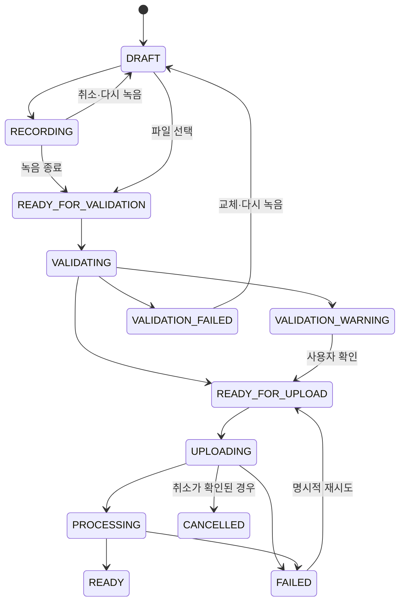

# Voice Enrollment 요구사항

> 문서 상태: [진행 중] [요구사항]
> 최종 수정일: 2026-08-02
> 관련 기능: 사용자 안내형 Voice Enrollment Wizard, Voice Profile 등록
> 관련 Phase: Phase 8 후속 F6, Phase 7 개인화 Dataset과 경계 분리, Phase 9 공개 운영 선행 조건
> 관련 문서: [Frontend Roadmap](../../planning/frontend-roadmap.md), [Frontend Architecture](../03-architecture/frontend-architecture.md), [현재 음성 프로필 API](../06-api/audio-api.md), [Voice Enrollment API 제안](../06-api/voice-enrollment-api.md), [데이터 모델 제안](../07-database/voice-enrollment-data-model.md), [음성 동의 정책](../09-security/voice-consent-policy.md), [ADR-024~026](../11-decisions/README.md#f6-guided-voice-enrollment), [Phase 7 DoD](../DoD/Phase-07.md), [Phase 8 DoD](../DoD/Phase-08.md)
> 구현 상태: Backend Enrollment 7개 API, 정규화, Storage 승격, 멱등성, 주기 만료·cleanup retry·orphan scan·crash recovery 및 Frontend Wizard를 구현했다. Windows와 CI의 FFmpeg 통합을 검증했으며 인증·소유권, 실제 사용자 마이크와 AI 품질 검사는 미구현이다.

## 1. 목적과 범위

Voice Enrollment는 사용자가 음성 Dataset 지식 없이도 본인 Voice Conversion용 참조 음성을 준비하고, 제출 전에 기본적인 파일·음질 문제를 발견하며, 동의와 처리 범위를 이해하도록 돕는 Studio UX다. `/voice`의 우선 범위는 기존 단일 Voice Profile 등록 흐름을 안내형 Wizard로 개선하는 것이다.

기존 단일 WAV 즉시 등록과 신규 다중 Sample Enrollment Backend, 후속 브라우저 녹음 UI를 구분한다. 문서의 `[제안]`, `[검증 필요]`, `[ADR 필요]`, `[Phase 9 선행]`은 구현 또는 승인 완료를 뜻하지 않는다.

### 목표

- 사용자가 어떤 음성을 어떤 환경에서 준비해야 하는지 이해한다.
- 제출 전에 형식·길이·기본 음량 문제를 발견하고 다시 준비할 수 있다.
- 본인 음성 또는 권리를 보유한 음성만 명시적으로 제출한다.
- 기존 Voice Profile API로 가능한 범위와 확장 선행 조건을 분리한다.
- 등록 완료 후 Studio에서 opaque Voice Profile ID를 선택한다.

### 비목표

- 타인 음성 복제, 특정 연예인·가수 모방 또는 사칭
- 자동 개인화 모델 학습과 대규모 Dataset 구축
- LoRA·Fine Tuning, 사용자별 모델 artifact와 Model Card 생성
- 공개 Production의 인증·소유권·법률 문제를 해결한 것으로 간주
- 실시간 Voice Conversion
- 검증되지 않은 AI 분석을 품질 보장이나 학습 적합 판정으로 표현
- 상용곡 가사 또는 유명 가수의 창법을 녹음 과제로 제공

## 2. 현재 구현 사실

### 2.1 Frontend

| 항목 | 현재 구현 | 실제 경로 |
|---|---|---|
| route | `/voice`에서 `VoiceProfilePanel` 렌더링 | `frontend/app/voice/page.tsx` |
| 등록 UI | 이름, 단일 WAV, 동의 checkbox, multipart 제출 | `frontend/features/voice/voice-profile.tsx` |
| client 검증 | `.wav`, 빈 파일, 25MB 상한만 확인 | `frontend/features/voice/voice-profile.tsx` |
| 목록·선택·삭제 | list 결과 표시, Studio 선택, delete 제공 | `frontend/features/voice/voice-profile.tsx`, `frontend/features/studio/voice-step.tsx` |
| API client·DTO | upload/list/get/delete와 공개 metadata DTO | `frontend/services/doha-api.ts`, `frontend/types/api.ts` |
| 오류 처리 | Backend code 일부를 사용자 문구로 mapping | `frontend/services/api-client.ts` |
| 상태 | upload/list/delete busy와 Backend `status` 문자열 표시 | `frontend/features/voice/voice-profile.tsx` |
| 개발용 path | `NEXT_PUBLIC_ENABLE_DEV_VOICE_PATH=true`일 때만 서버 경로 생성 UI | `frontend/features/voice/voice-profile.tsx` |
| 저장 | 선택 ID·이름은 `sessionStorage` allowlist에 저장, 음성 binary는 저장하지 않음 | `frontend/stores/studio-store.ts` |
| 테스트 | upload·동의·검증·목록·선택·삭제·개발 플래그 component test | `frontend/tests/voice-profile.test.tsx` |

현재 UI의 “10~30초 권장”은 Frontend 안내일 뿐 Backend 계약이나 Voice Provider 품질 검증값이 아니다. 녹음, 미리 듣기, 업로드 취소, progress byte, 상세 품질 설명, Profile 설명 입력은 없다.

### 2.2 Backend와 OpenAPI

실행 중인 `/openapi.json`과 다음 구현을 2026-08-01에 대조했다.

- route: `backend/api/routes/voice_profiles.py`
- schema·model: `backend/schemas/voice_profile.py`, `backend/models/voice_profile.py`
- upload·삭제: `backend/services/voice_upload_service.py`, `backend/services/voice_profile_service.py`
- repository: `backend/repositories/voice_profile_repository.py`
- 검증 test: `backend/tests/test_voice_profile_upload_api.py`, `backend/tests/test_voice_profiles_api.py`

| Endpoint | 현재 책임 | 주요 계약 |
|---|---|---|
| `POST /api/voice-profiles/upload` | 사용자용 단일 WAV 검증·저장·Profile 생성 | multipart `file`, `name`, `consent_confirmed=true`, 기본 `consent_text_version=v1`; 성공 `201` |
| `POST /api/voice-profiles` | 개발·내부 테스트용 기존 Storage path 등록 | JSON `name`, `reference_file_path`, `consent_confirmed=true`; 일반 사용자 경로가 아님 |
| `GET /api/voice-profiles` | 최신순 목록 | `limit` 1~100, 기본 50; `offset` 0 이상 |
| `GET /api/voice-profiles/{profile_id}` | 공개 Profile metadata 상세 | 내부 경로 제외 |
| `DELETE /api/voice-profiles/{profile_id}` | 미사용 Profile과 관리 upload 삭제 | 사용 중이면 `409 VOICE_PROFILE_IN_USE`; 성공 `204` |

현재 upload 계약은 다음을 서버에서 강제한다.

- 단일 `.wav`, MIME `audio/wav` 또는 `audio/x-wav`
- 최대 25MB, 실제 byte를 1MiB chunk로 집계
- RIFF/WAVE decode 가능한 비압축 16-bit PCM
- 16kHz 이상, mono 또는 stereo
- 5초 이상 60초 이하
- 빈 파일 거절
- RMS `< 0.01`이면 `LOW_VOLUME`, 무음 비율 `> 0.8`이면 `HIGH_SILENCE_RATIO`, clipping 후보 비율 `> 0.001`이면 `POSSIBLE_CLIPPING` warning
- warning은 등록을 차단하지 않으며 화자·권리·Voice Conversion 적합성을 판정하지 않음

파일은 검증 전 `voices/references/.uploads/{uuid}.tmp`, 검증 후 `voices/references/{profile_uuid}/reference.wav`에 저장된다. 실패 시 임시·최종 orphan을 정리한다. 공개 DTO에는 `id`, `name`, 표시 파일명, MIME, 크기, duration, sample rate, channels, consent, `status`, warning, 생성·수정 시각만 포함하며 `reference_file_path`는 없다.

Backend가 실제로 생성하는 Profile status는 `READY`다. Frontend DTO의 `INVALID`, `DELETED` union과 Enrollment 후보 상태는 현재 Backend response로 확인되지 않았다.

### 2.3 현재 동의·삭제 경계

- 로컬 MVP는 consent boolean, 정책 version과 확인 시각을 저장하지만 인증된 사용자 identity를 증명하지 않는다.
- Pipeline 또는 Voice Conversion Job이 한 번이라도 참조한 Profile은 현재 repository 검사상 삭제가 차단된다. “실행 중”에만 한정되지 않는다.
- 관리 upload는 Profile과 함께 물리 삭제한다. legacy 운영자 배치 파일은 Profile row만 삭제한다.
- 동의 철회 전용 endpoint, 철회 status, 대기 작업 중단, 파생 파일·cache 삭제 workflow는 없다.
- 원본 참조 음성 content/download endpoint는 없다.

## 3. 사용자 유형과 핵심 시나리오

### 사용자 유형

- 처음 본인 목소리를 등록하며 녹음 기준을 모르는 사용자
- 이미 녹음한 WAV 파일이 있는 사용자
- 브라우저에서 직접 녹음하려는 사용자
- 등록한 Voice Profile을 다시 확인·선택·삭제하려는 사용자

### 핵심 시나리오

1. 첫 방문 사용자가 안내와 처리 범위를 읽고 등록을 시작한다.
2. 사용자가 프로젝트 자체 안내 문장을 보고 여러 sample을 녹음한다. `[Backend 확장 필요]`
3. 사용자가 기존 5~60초 PCM WAV 하나를 업로드한다.
4. MP3·M4A, 5초 미만 또는 손상된 파일을 선택하고 지원 계약 안내를 받는다.
5. 음량이 작거나 무음이 많은 WAV를 등록하고 warning과 재녹음 선택지를 확인한다.
6. 사용자가 마이크 권한을 거부하거나 장치가 없어 파일 업로드 fallback을 사용한다. `[Backend 확장 필요]`
7. 녹음 중 페이지 이동·새로고침을 시도하고 미제출 녹음 손실 경고를 받는다. `[계획]`
8. 등록 완료 후 Studio에서 새 Voice Profile을 선택한다.
9. Pipeline 또는 Voice Conversion이 참조한 Profile 삭제를 시도하고 차단 이유를 확인한다.
10. 사용자가 동의를 철회하고 원본·파생 삭제를 요청한다. `[Backend 확장 필요] [Phase 9 선행]`

## 4. Voice Enrollment Wizard

| 단계 | 사용자 목적·표시 정보 | 입력과 진행 조건 | 오류·재시도·접근성 | API와 Backend 경계 |
|---|---|---|---|---|
| 1. 시작 안내 | 참조 음성의 용도, 현재 단일 WAV 계약, 비목표, 예상 단계 확인 | 필수 입력 없음; “시작” 명시 선택 | 제목에 focus, step 수 텍스트 제공 | API 없음; Frontend 가능 |
| 2. 동의 확인 | 본인·권리 보유, 처리 목적, 보관·철회·삭제, 로컬 MVP 한계 확인 | 권리 확인과 정책 동의 필수; 선택 marketing 동의를 섞지 않음 | checkbox와 설명 연결, 미체크 시 다음 차단 | 현재 upload consent 가능; 철회·증적은 `[Backend 확장 필요] [Phase 9 선행]` |
| 3. 등록 방법 선택 | 브라우저 녹음과 기존 WAV 업로드의 형식·privacy 차이 비교 | `record` 또는 `upload` 하나 필수 | 비지원 브라우저는 upload fallback으로 focus 이동 | Backend 정규화 API 구현, MediaRecorder UI 미구현 |
| 4. 녹음 또는 업로드 | 안내 문장, 환경 가이드, 시간·레벨, 파일 목록과 미리 듣기 | 현재 MVP는 WAV 하나; 다중 sample은 제안 모델 확정 후 | 권한·decode·형식 오류, 삭제·다시 녹음, 이탈 경고, 상태 `aria-live` | 단일 WAV는 현재 upload 전 client 준비 가능; 다중·WebM/Ogg는 `[Backend 확장 필요]` |
| 5. 품질 확인 | 파일 metadata, 차단 오류와 non-blocking warning, 기술값과 사용자 문구 분리 | 차단 오류 0건; warning은 확인 후 진행 허용 후보 | 오류에 해당 sample focus, 재녹음·교체 제공 | 현재 서버 검사는 upload와 Profile 생성이 결합됨; 사전 validation은 `[Backend 확장 필요]` |
| 6. 프로필 정보 입력 | 이름, `[제안]` 설명, 등록 후 사용 위치 확인 | 현재 이름 1~100자 필수; 설명은 현재 schema에 없음 | 입력 오류 summary와 field 연결 | 이름은 현재 가능; 설명은 `[Backend 확장 필요]` |
| 7. 등록 처리 | sample별 명시 upload·검증 후 Profile 제출, 중복 제출 차단, 취소 가능 여부 표시 | 동의 안내와 사용자의 sample upload 행동 전 서버 전송 금지; 최종 submit 전 Profile 생성 금지 | network 결과 불명확, timeout, 재시도 안내; 자동 재제출 금지 | [Enrollment API](../06-api/voice-enrollment-api.md)의 임시 upload와 idempotency 구현, UI 미구현 |
| 8. 완료 | 공개 metadata와 warning, Studio에서 선택·이동 | 성공 Profile ID 수신 | 완료 제목 focus, warning 재안내, 실패 시 제출 단계 복귀 | 현재 `201 VoiceProfileRead`와 Studio 선택 가능 |

### Wizard 공통 규칙

- 단계 전환은 사용자의 명시적 행동으로만 하며 녹음·업로드를 자동 시작하지 않는다.
- 뒤로 가기는 제출 전 허용하되 녹음 중에는 먼저 종료·폐기 여부를 확인한다.
- 새로고침 복원은 metadata·UI 단계만 후보로 삼고 음성 binary를 Web Storage에 저장하지 않는다. 복원 계약은 `[제안]`이다.
- 등록 요청의 성공 여부가 불명확하면 같은 파일을 자동 재전송하지 않는다. idempotency 계약 전에는 목록 새로고침과 사용자 명시 재시도를 제공한다.
- `READY`, 실패, 취소 같은 terminal 의미는 Backend가 실제로 제공하는 값과 UI workflow 상태를 구분한다.

## 5. 녹음 가이드

### 기본 조건

- 본인 목소리 또는 명시적인 권리를 가진 음성만 포함한다.
- 조용한 실내에서 마이크와 일정한 거리를 유지한다.
- 반주, 배경음악, 다른 사람 목소리, 에코와 리버브를 제외한다.
- 지나치게 작거나 clipping이 생기는 큰 음량을 피한다.
- 무손실 WAV를 우선한다. 현재 서버는 MP3·M4A·FLAC·WebM·Ogg upload를 지원하지 않는다.
- 현재 확정 계약은 한 개의 5~60초, 25MB 이하, 16-bit PCM, 16kHz 이상 mono/stereo WAV다.
- 안내형 다중 sample의 총 길이·개수·구성은 `[모델 선정 후 확정] [검증 필요]`이며 현재 계약으로 표현하지 않는다.

### 안내 문장 제안 모델

다음 metadata는 Frontend content model 후보이며 현재 API field가 아니다.

```text
prompt_id
category
display_text
instruction
recommended_duration_seconds
required
order
locale
```

| prompt_id | category | display_text | instruction | 권장 길이 | required | order | locale |
|---|---|---|---|---:|---:|---:|---|
| `ko_speech_neutral_01` | 기본 말하기 | 오늘의 작은 선택이 내일의 새로운 리듬을 만듭니다. | 평소 말투와 편안한 속도로 읽는다. | `[제안] 5~10초` | `[제안] true` | 1 | `ko-KR` |
| `ko_speech_bright_01` | 밝은 말하기 | 맑은 아침처럼 가벼운 마음으로 새로운 노래를 시작해요. | 웃는 표정의 자연스러운 밝기로 읽는다. | `[제안] 5~10초` | `[제안] false` | 2 | `ko-KR` |
| `ko_speech_calm_01` | 차분한 말하기 | 천천히 숨을 고르면 조용한 마음의 소리가 선명해집니다. | 낮은 강도와 일정한 속도로 읽는다. | `[제안] 5~10초` | `[제안] false` | 3 | `ko-KR` |
| `ko_speech_strong_01` | 힘찬 말하기 | 우리는 지금부터 더 넓은 무대를 향해 힘차게 나아갑니다. | 소리 지르지 말고 또렷하고 힘 있게 읽는다. | `[제안] 5~10초` | `[제안] false` | 4 | `ko-KR` |
| `ko_speech_soft_01` | 부드러운 말하기 | 따뜻한 바람이 머무는 곳에서 편안한 이야기를 들려줄게요. | 속삭이지 말고 부드럽게 읽는다. | `[제안] 5~10초` | `[제안] false` | 5 | `ko-KR` |
| `ko_pitch_low_01` | 낮은 음역 | 고요한 밤의 울림을 편안한 낮은 소리로 이어 봅니다. | 무리하지 않는 낮은 음으로 말하거나 음을 잇는다. | `[검증 필요]` | `[제안] false` | 6 | `ko-KR` |
| `ko_pitch_mid_01` | 중간 음역 | 익숙한 음역에서 밝고 안정된 소리를 길게 이어 봅니다. | 가장 편한 음역으로 일정하게 소리 낸다. | `[검증 필요]` | `[제안] false` | 7 | `ko-KR` |
| `ko_pitch_high_01` | 높은 음역 | 가볍고 맑은 소리로 무리하지 않는 높이까지 올라가 봅니다. | 목에 힘을 주지 말고 가능한 범위에서만 소리 낸다. | `[검증 필요]` | `[제안] false` | 8 | `ko-KR` |
| `ko_singing_dry_01` | 짧은 무반주 노래 | 오늘의 빛을 따라 우리만의 길을 천천히 노래해 | 프로젝트 자체 문장을 반주 없이 자연스러운 선율로 부른다. | `[검증 필요]` | `[제안] false` | 9 | `ko-KR` |

음역·가창 prompt의 권장 길이와 필수 여부는 Voice Provider의 공식 요구와 사용자 수동 평가 전에는 확정하지 않는다. 사용자가 불편하거나 통증을 느끼는 음역을 요구하지 않는다.

## 6. 길이와 sample 정책

| 항목 | 현재 단일 WAV MVP | Guided Enrollment 목표 |
|---|---|---|
| 단일 파일 최소 | 5초, 서버 강제 | 현재 Backend를 재사용하면 5초; 새 validation 계약은 `[검증 필요]` |
| 단일 파일 최대 | 60초, 서버 강제 | 60초 상한 유지 여부 `[모델 선정 후 확정]` |
| 전체 권장 길이 | 계약 없음 | `[검증 필요]`; 사용자 파일과 모델 평가 근거 후 결정 |
| 전체 최소 길이 | 계약 없음 | `[검증 필요]` |
| 최대 파일 개수 | 1개 | API 자원 상한 `[제안]` 10개; 필수·권장 개수는 Provider 평가 후 확정 `[Backend 확장 필요]` |
| 파일별 역할 | 단일 reference | 말하기 표현·음역·짧은 무반주 가창 metadata 후보 `[제안]` |
| 말하기:노래 비율 | 계약 없음 | `[모델 선정 후 확정]`; Voice Conversion Provider별 비교 필요 |
| Phase 7 Dataset | 해당 없음 | 장시간 수집·전사·split·lineage는 별도 Phase 7이며 Enrollment 계약에 포함하지 않음 |

임의의 3~5분을 제품 계약으로 정하지 않는다. F6 구현 전에 목표 Provider를 대상으로 sample 수·총 길이·말하기/가창 구성의 품질·지연·저장비용을 평가한다.

## 7. 브라우저 녹음 요구사항

### UX와 lifecycle

- 사용자 행동 직후에만 마이크 권한을 요청한다.
- 시작, 일시정지, 재개, 종료, 취소, 다시 녹음을 제공한다.
- 경과 시간을 텍스트와 `aria-live` 정책에 맞게 제공하고 입력 레벨은 시각·텍스트 양쪽으로 표시한다.
- 녹음 결과는 명시적 제출 전에 미리 듣고 삭제할 수 있다.
- 파일명은 사용자 원본명을 요구하지 않는 안전한 식별자로 자동 생성한다.
- 페이지 이탈·새로고침 시 미제출 녹음이 사라짐을 경고한다.
- 교체·삭제·unmount 때 media track을 중지하고 Blob URL을 revoke한다.
- 음성 binary를 `localStorage`·`sessionStorage`에 저장하지 않는다.
- Safari·모바일·비지원 환경에서는 현재 계약의 WAV 파일 업로드로 fallback한다.
- 장치 없음, 일시적인 권한 거부, 브라우저 설정의 영구 차단을 다른 안내로 구분한다.
- 녹음은 사용자가 권리·임시 보관 안내를 확인하고 sample upload를 명시하기 전에는 서버로 전송하지 않는다. upload 뒤에도 final submit 전에는 Profile을 생성하지 않으며 Analytics·외부 서비스에는 전송하지 않는다.

### MediaRecorder MIME과 WAV 계약 차이

MediaRecorder는 브라우저에 따라 `audio/webm`, `audio/ogg` 등을 생성한다. 신규 Enrollment upload는 MIME·확장자·signature가 일치하는 WAV/WebM/Ogg를 허용하고 서버가 PCM16 48kHz mono WAV로 정규화한다. 기존 `/api/voice-profiles/upload`는 계속 WAV 전용이다.

| 선택지 | 장점 | 단점·위험 | 상태 |
|---|---|---|---|
| Frontend에서 WAV 변환 | 현재 upload API 재사용 가능 | 큰 PCM memory·CPU, 브라우저별 decode, 변환 일관성과 품질 검증 필요 | ADR-024에서 기본안 제외 |
| Backend가 WebM/Ogg 수용 후 WAV 정규화 | 서버에서 decoder·limit·metadata를 통제 | FFmpeg 등 의존성, 공격면, 임시 원본·cleanup·timeout 증가 | ADR-024 선택 `[제안] [Backend 확장 필요]` |
| 브라우저별 MIME 제한 | 구현 범위가 작음 | Safari·모바일 호환성과 사용자 도달률 저하 | `[제안]` |
| 정규화 계약 전 녹음 비활성 | 안전하게 기존 WAV upload 유지 | Guided recording 가치 지연 | 현재 fallback |

[ADR-024](../11-decisions/ADR-024-browser-voice-recording-server-normalization.md)는 Backend가 WAV/WebM/Ogg를 PCM16 48kHz mono WAV로 정규화하고 Frontend 값은 보조 정보로만 쓰는 방향을 `[제안]`했다. FFmpeg의 Windows·CI 배포와 Provider 청감 검증 전에는 브라우저 녹음을 구현 완료 기능으로 표시하지 않는다.

## 8. 파일 업로드와 데이터 모델

### 현재 계약

- 허용 확장자: `.wav`
- 허용 MIME: `audio/wav`, `audio/x-wav`
- 크기: 25MB 이하
- duration: 5~60초
- format: 16-bit PCM, 16kHz 이상, mono/stereo
- 파일 수: 요청당 한 개, Profile당 관리 reference 한 개
- 파일명: 표시용으로 정제하되 내부 경로에는 사용하지 않음
- 취소: HTTP request abort의 서버 보장 계약 없음
- 재시도: idempotency key 없음; 명시적 사용자 재요청
- cleanup: 검증·Storage·DB 실패 시 현재 Service가 temp/final을 정리

### Guided Enrollment 추가 요구

- client와 server 모두 확장자·MIME·크기를 검사하되 서버 판정을 최종 권위로 둔다.
- decode 실패, 중복 file, 전체 duration, sample별 역할과 quality result를 표현해야 한다.
- 등록 전 임시 파일, 사용자 취소, server timeout, DB 실패와 정기 orphan 정리 책임을 정의한다.
- 원본 표시 파일명, 내부 Storage path, OS 오류를 공개 DTO·로그에 노출하지 않는다.
- 업로드 progress·cancel·retry와 결과 불명확 상태를 명시한다.

### 다중 sample 대안

| 대안 | 장점 | 단점·영향 |
|---|---|---|
| Profile당 reference 한 개 유지 | 현재 DB·Pipeline·Provider 계약 재사용 | 안내 sample을 제출 전에 병합해야 하며 sample별 lineage·품질 결과 손실 |
| Profile과 여러 Voice Sample 연결 | sample별 역할·품질·삭제·lineage 보존 | 새 table·API·Storage·Pipeline reference 선택 정책 필요 |
| 여러 녹음을 하나의 WAV로 병합 | 기존 Provider 입력 단순화 | Frontend/Backend 병합 위치, gap·level·format 정규화와 원본 보존 결정 필요 |
| 대표 reference와 보조 sample 분리 | 현재 변환 입력과 향후 평가 자료 분리 | 대표 선정 규칙과 보조 sample 보존 목적·삭제 범위 필요 |

현재 `voice_profiles.reference_file_path NOT NULL` 단일 구조와 다중 sample 요구는 직접 충돌한다. [ADR-025](../11-decisions/ADR-025-voice-profile-multiple-samples-reference.md)는 Profile 1:N Sample과 사용자가 확정한 active reference 하나, legacy 호환 path를 `[제안]`했다. DB·API 변경 전에는 다중 sample을 현재 지원 기능으로 표현하지 않는다.

## 9. 품질 검사

### 9.1 MVP 기본 검사

| 검사 | 목적 | 실행 위치 | 현재 가능 | 통과·경고·실패 기준 | 사용자 문구 | 저장 metadata·보안 |
|---|---|---|---|---|---|---|
| 확장자·MIME | 허용 입력 제한 | Frontend + Backend | 가능 | `.wav`와 허용 MIME 외 실패 | 현재 WAV 파일만 등록할 수 있습니다. | MIME; 내부 path 제외 |
| byte 크기·빈 파일 | 자원 제한 | Frontend + Backend | 가능 | 1~25MB 통과, 0 또는 초과 실패 | 빈 파일입니다 / 25MB 이하로 준비해 주세요. | `size_bytes` |
| WAV decode·PCM | 손상·미지원 차단 | Backend | 가능 | RIFF/WAVE, little-endian PCM16, 무압축만 성공. PCM24·float32·ADPCM·WAVE_FORMAT_EXTENSIBLE은 `VOICE_SAMPLE_UNSUPPORTED_CODEC`, RF64·손상 header는 container/decode 오류 | 이 WAV 파일의 오디오 형식은 지원하지 않습니다. PCM 16-bit WAV로 변환해 주세요. | format tag·bit depth allowlist만 기록하고 원본 이름·path는 제외 |
| duration | 현재 Provider 입력 경계 | Backend | 가능 | 5~60초 통과, 범위 밖 실패 | 5초 이상 60초 이하로 준비해 주세요. | `duration_seconds` |
| channel·sample rate | 기본 호환성 | Backend | 가능 | mono/stereo, 16kHz 이상 외 실패 | 16kHz 이상 mono 또는 stereo WAV가 필요합니다. | `channels`, `sample_rate` |
| peak·clipping | 과대 입력 경고 | Backend | 부분 가능 | sample `>=32735` 비율 `>0.001` warning; 제품 임계값은 재검증 필요 | 소리가 찌그러질 수 있습니다. 음량을 낮춰 다시 녹음해 보세요. | 현재 warning만 저장, peak 값 미저장 |
| RMS | 너무 작은 음량 경고 | Backend | 부분 가능 | RMS `<0.01` warning; 통과 품질을 보장하지 않음 | 목소리가 너무 작게 녹음됐을 수 있습니다. | 현재 warning만 저장, RMS 값 미저장 |
| 무음 비율 | 긴 무음 경고 | Backend | 부분 가능 | 절대 sample `<164` 비율 `>0.8` warning | 목소리가 들리지 않는 구간이 너무 많습니다. | 현재 warning만 저장, ratio 미저장 |
| client decode·metadata | 제출 전 feedback | Frontend | 미구현 | 기준 `[검증 필요]`; 서버 판정을 대체하지 않음 | 서버 제출 전에 확인 가능한 항목만 표시 | raw audio를 Web Storage에 저장하지 않음 |

현재 warning은 등록을 차단하지 않는다. Guided UX에서 warning 후 진행은 사용자가 확인하고 명시적으로 선택하게 하며, “좋음”, “학습 가능”, “Voice Conversion 적합 보장”으로 표시하지 않는다.

### 9.2 후속 DSP·AI 검사

| 검사 | 목적 | 실행 위치 후보 | 현재 가능 | 판정 기준 | 개인정보·보안 |
|---|---|---|---|---|---|
| Voice Activity Detection | 실제 발화 비율 추정 | Backend 또는 검증 Worker | 미구현 | `[모델 선정 후 확정]` | frame 결과 최소 저장 |
| Signal-to-Noise Ratio | 배경 잡음 후보 | Backend DSP | 미구현 | `[검증 필요]` | 원본 외부 전송 금지 |
| 배경음악 감지 | 반주 혼입 warning | 격리 AI Worker | 미구현 | `[모델 선정 후 확정]` | 모델·license·오탐 평가 필요 |
| 다중 화자 감지 | 다른 화자 혼입 warning | 격리 AI Worker | 미구현 | `[모델 선정 후 확정]` | biometric 해석·오탐·보관 검토 |
| 발화 구간 비율 | 유효 sample 구성 확인 | Backend DSP | 미구현 | `[검증 필요]` | 집계값만 후보 |
| 음역 분포 | 가창 coverage 참고 | 격리 AI Worker | 미구현 | `[모델 선정 후 확정]` | 성별·정체성 추론 금지 |
| 발음 다양성 | prompt coverage 확인 | Backend metadata | 미구현 | `[검증 필요]` | 전사 보관 목적·기간 필요 |
| 노래 여부 | sample 역할 확인 | 격리 AI Worker | 미구현 | `[검증 필요]` | 확정 판정 금지 |
| 화자 일관성·기존 Profile 유사성 | sample 혼입 후보 | 격리 AI Worker | 미구현 | `[모델 선정 후 확정]` | 생체정보·소유권·오용 검토 `[Phase 9 선행]` |

후속 검사는 version, 실행 Provider, 판정 범위, confidence와 safe warning을 분리해야 한다. 원시 embedding, 내부 경로, 모델 cache와 개인 식별 추정값을 공개 응답이나 일반 로그에 남기지 않는다.

## 10. 상태 모델

### 현재 Backend 상태

- upload 성공 response: `READY`
- 실패: Profile을 만들지 않고 HTTP 오류 반환
- 삭제 성공: `204`, 삭제 status response 없음
- Frontend DTO의 `INVALID`, `DELETED`는 현재 Backend 생성 근거가 확인되지 않으므로 새 Enrollment 계약의 근거로 사용하지 않는다.

### UI workflow 상태 제안



`DRAFT`, `RECORDING`, `READY_FOR_VALIDATION`, `VALIDATING`, `VALIDATION_WARNING`, `VALIDATION_FAILED`, `READY_FOR_UPLOAD`, `UPLOADING`, `PROCESSING`, `FAILED`, `CANCELLED`, `DELETING`은 Frontend workflow 후보다. 현재 Backend response enum으로 전송하지 않는다. `READY`만 현재 Profile status와 연결할 수 있다.

- 중복 제출: `UPLOADING`·`PROCESSING`에서 primary action을 잠근다.
- 뒤로 가기: 서버 제출 전 허용, 제출 중에는 임의 허용하지 않고 cancel 계약을 따른다.
- network 결과 불명확: `FAILED`로 단정하지 않고 목록 재조회와 사용자 선택을 제공한다.
- 새로고침: 현재 단일 upload에는 복원 가능한 Enrollment ID가 없다. UI draft만 복원할 경우 binary는 복원하지 않는다.
- retry: 현재는 새 HTTP 요청이다. 같은 Enrollment 요청으로 재개하려면 idempotency·임시 상태 API가 필요하다.
- terminal: UI `READY`, 확정된 `FAILED`, `CANCELLED`; server와 상태 정의를 확정하기 전에는 이름을 API에 노출하지 않는다.

## 11. 동의·보안·개인정보

- 동의하지 않으면 녹음·파일 제출 단계로 진행할 수 없다.
- 본인 음성 또는 권리 보유 음성만 허용하며 타인 사칭과 무단 복제를 금지한다.
- 정책 version, 확인 시각, 처리 목적, 보관 범위와 철회 방법을 제출 전에 표시한다.
- 권리·임시 보관 안내 확인과 명시적 sample upload 행동 전에는 음성을 서버로 전송하지 않으며, final submit 전에는 Profile을 생성하지 않는다.
- 음성 binary를 `localStorage`·`sessionStorage`에 저장하지 않는다.
- Analytics·광고·외부 서비스로 음성을 전송하지 않고 자동 재업로드하지 않는다.
- 원본 파일명, 내부 경로, 임시 경로, 음성 내용과 embedding을 일반 로그에서 최소화한다.
- Profile과 이를 사용한 Pipeline·Voice Conversion provenance를 유지한다.
- 철회는 신규 사용 차단, 대기 작업 처리, 원본·전처리·cache·파생 음성·개인화 artifact 범위를 명시해야 한다. 현재 전용 workflow는 없다. `[Backend 확장 필요]`
- 현재 로컬 MVP는 인증·소유권이 없어 consent 주체와 삭제 권한을 증명하지 못한다. 공개 운영 전 인증·인가·rate limit·감사·보존·신고 대응이 필요하다. `[Phase 9 선행]`
- 원본 preview endpoint는 현재 제공하지 않는다. 공개 운영에서 추가하려면 인증·소유권·감사·no-store 정책을 먼저 결정한다.

## 12. API 영향 분석

| 기능 | 현재 Endpoint로 가능 | 계약 변경 필요 | 신규 Endpoint 필요 | 비고 |
|---|---:|---:|---:|---|
| 단일 WAV 등록 | 예 | 아니요 | 아니요 | 현재 upload가 Profile까지 즉시 생성 |
| 브라우저 녹음 upload | 아니요 | 예 | F6 Backend | ADR-024 Backend 정규화와 신규 Enrollment API가 구현된 뒤 가능 `[제안]` |
| 여러 sample 등록 | 아니요 | 예 | 미정 | DB·Storage·대표 reference 결정 필요 |
| sample별 품질 결과 | 아니요 | 예 | 미정 | 현재 Profile warning만 반환 |
| 전체 duration | 아니요 | 예 | 미정 | 다중 sample 집계 모델 필요 |
| Profile 이름 | 예 | 아니요 | 아니요 | 현재 1~100자 |
| Profile 설명 | 아니요 | 예 | 미정 | schema·DB field 없음 |
| Enrollment 임시 상태 | 아니요 | 예 | 가능성 높음 | resumable 상태·소유권·만료 필요 |
| upload 취소 | 아니요 | 예 | 미정 | client abort와 server cleanup 보장 분리 |
| 미완료 sample cleanup | 부분 | 예 | 미정 | 현재 단일 요청 실패 temp cleanup만 존재 |
| 동의 철회 | 아니요 | 예 | 가능성 높음 | 신규 사용 차단·삭제 범위·감사 필요 `[Phase 9 선행]` |
| 원본·파생 삭제 | 부분 | 예 | 가능성 높음 | 미사용 관리 원본만 현재 delete; 참조 이력과 파생 삭제 미지원 |

신규 path와 field는 이번 문서에서 확정하지 않는다. 후속 API 설계는 다음 책임을 다뤄야 한다.

- request: Profile metadata, 정책 version, sample 역할·format·순서, idempotency key 후보
- response: opaque Enrollment/Profile/Sample ID, safe metadata, versioned quality result, 상태·재시도 가능성
- 오류: validation, 권한, timeout, storage, 중복, 결과 불명확
- cleanup: client cancel, timeout, DB 실패, 만료된 임시 upload와 orphan 정기 정리
- 보안: 인증·사용자 소유권, rate limit, 내부 path 비노출

## 13. Frontend 아키텍처 영향

기존 `app → features → services/stores/hooks/lib/types` 책임 경계를 유지한다.

```text
app/voice
- route entry, loading, error boundary

features/voice
- enrollment orchestration, recording lifecycle, file selection
- quality result mapping, profile form, submit flow

services
- 기존 Voice Profile API
- Enrollment 7개 endpoint와 명시적 DTO mapper

hooks
- microphone permission, MediaRecorder lifecycle, page-leave protection

lib
- duration formatting, client-safe audio metadata, feature detection

types
- 실제 API DTO, UI view model, UI workflow state union 분리
```

현재 `voice-enrollment-wizard.tsx`가 단계와 API mutation을 조합하고 `use-voice-recorder.ts`가 마이크·MediaRecorder·입력 수준·메모리 cleanup을 담당한다. `voice-enrollment-types.ts`와 `voice-enrollment-utils.ts`는 서버 DTO·UI 상태, allowlist mapper, 품질·오류·session 변환을 분리한다. 기존 `voice-profile.tsx`는 빠른 WAV fallback과 Profile 목록 책임을 유지한다.

## 14. 접근성

- 모든 단계와 녹음 제어를 키보드만으로 수행한다.
- 녹음 시작·일시정지·종료 상태를 아이콘·색상뿐 아니라 텍스트로 알린다.
- 시간처럼 자주 바뀌는 정보는 과도한 읽기를 막는 `aria-live` 주기를 설계한다.
- 입력 레벨 meter는 현재 상태와 clipping warning의 텍스트 대안을 제공한다.
- 오류 summary에서 해당 입력·sample로 focus를 이동하고 `aria-describedby`로 연결한다.
- 단계 전환 후 단계 제목에 focus를 이동한다.
- 녹음 중 종료·삭제·이탈은 확인 절차로 실수를 방지한다.
- interactive target은 최소 44×44px, 모바일 primary recording control은 엄지 접근 영역에 둔다.
- `prefers-reduced-motion`과 사용자 설정에서 waveform·level animation을 줄인다.
- screen reader에 파일 추가·삭제·validation·upload 결과를 전달한다.
- 권한 거부, 영구 차단, 장치 없음, 미지원 브라우저를 구분하고 설정 이동 또는 WAV fallback을 안내한다.

## 15. 오류 코드와 사용자 메시지

| 코드 | 존재 | 발생 계층 | 사용자 메시지 | 재시도·조치 | 로그·숨김 정보 |
|---|---|---|---|---|---|
| `VOICE_CONSENT_REQUIRED` | 현재 | Backend | 목소리 사용 동의를 확인해 주세요. | 동의 확인 후 가능 | 정책 version; identity 추정 숨김 |
| `VOICE_FILE_REQUIRED` | 현재 | Backend | WAV 파일을 선택해 주세요. | 파일 선택 | 원본 path 숨김 |
| `VOICE_FILE_EMPTY` | 현재 | Backend | 빈 파일은 등록할 수 없습니다. | 다시 선택 | 크기만 safe 기록 |
| `VOICE_FILE_TOO_LARGE` | 현재 | Frontend·Backend | 파일은 25MB 이하여야 합니다. | 작은 파일 선택 | 실제 제한·safe size |
| `VOICE_FILE_TOO_SHORT` | 현재 | Backend | 음성은 5초 이상이어야 합니다. | 다시 녹음·교체 | 측정 duration |
| `VOICE_FILE_TOO_LONG` | 현재 | Backend | 음성은 60초 이하여야 합니다. | 짧게 준비 | 측정 duration |
| `VOICE_FILE_TYPE_UNSUPPORTED` | 현재 | Backend | 현재 PCM WAV 파일만 등록할 수 있습니다. | WAV 준비 | declared MIME·확장자; path 숨김 |
| `VOICE_FILE_DECODE_FAILED` | 현재 | Backend | 파일을 읽을 수 없습니다. 다른 WAV를 선택해 주세요. | 교체 | decoder safe category, 원문 예외 숨김 |
| `VOICE_REFERENCE_INVALID` | 현재 | Backend | 16-bit PCM, 16kHz 이상 mono/stereo WAV가 필요합니다. | 변환·재녹음 | safe format metadata |
| `VOICE_PROFILE_NOT_FOUND` | 현재 | Backend | 음성 프로필을 찾을 수 없습니다. | 목록 새로고침 | opaque ID만 제한 기록 |
| `VOICE_PROFILE_IN_USE` | 현재 | Backend | 음악 작업이 참조한 목소리는 현재 삭제할 수 없습니다. | 관련 정책 확인 | Job 존재 여부; 내부 SQL 숨김 |
| `VOICE_STORAGE_WRITE_FAILED` | 현재 | Backend | 음성 파일을 안전하게 저장하지 못했습니다. | 잠시 후 명시 재시도 | correlation ID; OS path·오류 숨김 |
| `VOICE_STORAGE_DELETE_FAILED` | 현재 | Backend | 음성 파일을 안전하게 삭제하지 못했습니다. | 다시 시도·지원 안내 | correlation ID; tombstone path 숨김 |
| `MICROPHONE_PERMISSION_DENIED` | 제안 | Frontend | 마이크 권한이 필요합니다. 브라우저 설정을 확인하거나 WAV를 올려 주세요. | 설정 또는 fallback | 권한 상태만, 장치 label 최소화 |
| `MICROPHONE_NOT_FOUND` | 제안 | Frontend | 사용할 수 있는 마이크를 찾지 못했습니다. | 장치 연결·WAV fallback | 장치 상세 숨김 |
| `RECORDING_NOT_SUPPORTED` | 제안 | Frontend | 이 브라우저에서는 녹음을 지원하지 않습니다. WAV를 올려 주세요. | fallback | feature detection 결과 |
| `RECORDING_INTERRUPTED` | 제안 | Frontend | 녹음이 중단되었습니다. 다시 녹음해 주세요. | 재녹음 | safe lifecycle event |
| `VOICE_AUDIO_SILENT` | 제안 | validation | 목소리가 들리지 않는 구간이 너무 많습니다. | 재녹음 또는 warning 확인 | ratio·version; 원본 숨김 |
| `VOICE_AUDIO_CLIPPING` | 제안 | validation | 소리가 찌그러질 수 있습니다. 음량을 낮춰 보세요. | 재녹음 또는 warning 확인 | ratio·version |
| `VOICE_VALIDATION_FAILED` | 제안 | validation | 음성 파일을 확인하지 못했습니다. 다시 시도해 주세요. | 교체·재시도 | safe 검사명·version |
| `REQUEST_TIMEOUT` | 현재 Frontend | HTTP client | 응답이 지연되고 있습니다. 목록을 확인한 뒤 다시 시도해 주세요. | 자동 재제출 금지 | timeout·correlation ID |
| `NETWORK_ERROR` | 현재 Frontend | HTTP client | 서버에 연결할 수 없습니다. 연결을 확인해 주세요. | 명시 재시도 | URL secret·body 숨김 |

현재 코드명과 제안 코드명을 섞어 Backend 계약으로 사용하지 않는다. 예를 들어 현재는 `VOICE_FILE_TYPE_UNSUPPORTED`이며 `VOICE_FILE_UNSUPPORTED_TYPE`이 아니다.

## 16. 테스트 전략

### Frontend unit

- UI workflow 상태 전이와 terminal 상태
- 단일·다중 duration 집계 후보
- 확장자·MIME·크기와 client-safe metadata 검증
- Backend warning과 후속 quality 결과 mapping
- 권한·장치·MediaRecorder 오류 mapping
- Profile 이름·후속 설명 validation
- Blob URL revoke와 media track 종료

### Component

- 단계 이동과 consent 미체크 차단
- 녹음 시작·일시정지·재개·종료·취소·다시 녹음
- 파일 추가·삭제, warning과 failure 구분
- 중복 제출 차단과 결과 불명확 상태
- focus·`aria-live`·keyboard·reduced motion
- 360px 모바일 배치

### Backend

- 허용 MIME·확장자·RIFF/PCM, 25MB, 5~60초
- 손상·빈·무음·clipping WAV와 warning
- temp·final·DB 실패 cleanup, orphan 만료 정책
- consent version과 철회 workflow
- 사용 이력 Profile 삭제 차단
- 공개 DTO·로그의 내부 path 비노출
- 다중 sample·validation API는 계약 확정 후 별도 test

### E2E

- 기존 WAV upload → Profile 생성 → Studio 선택
- MediaRecorder mock 또는 고정 Blob fixture를 사용한 녹음 흐름
- 권한 거부·장치 없음·비지원 MIME fallback
- 지원하지 않는 파일, warning 후 진행, failure 후 재녹음
- upload timeout·network 복구와 중복 제출 방지
- 새로고침·이탈 경고, mobile viewport

브라우저 자동화는 실제 개인 마이크 입력을 수집하지 않는다. CI에서는 MediaRecorder·`getUserMedia` mock과 저장소에 커밋 가능한 비개인 합성 WAV fixture를 사용한다. 실제 마이크 평가는 사용자가 동의한 로컬 수동 평가로 분리하며 음성 파일을 Git에 추가하지 않는다.

## 17. ADR·Backend 선행 결정

ADR-019는 현재 단일 WAV upload·atomic 저장·삭제 경계를 승인했다. 후속 ADR은 아래 방향을 구체화했지만 모두 `[제안]`이며 Runtime 구현·검증 승인을 뜻하지 않는다.

| 결정 질문 | 선택지 | 차단 범위 | 상태 |
|---|---|---|---|
| MediaRecorder MIME을 어디서 WAV로 정규화할 것인가 | Frontend / Backend / 지원 브라우저 제한 / 녹음 보류 | 브라우저 녹음 | Backend 정규화 `[제안]`, [ADR-024](../11-decisions/ADR-024-browser-voice-recording-server-normalization.md) |
| 단일 reference와 다중 sample을 어떻게 연결할 것인가 | 단일 유지 / sample table / 병합 / 대표+보조 | 다중 sample·품질·lineage | Profile 1:N + active reference `[제안]`, [ADR-025](../11-decisions/ADR-025-voice-profile-multiple-samples-reference.md) |
| 품질 검사를 어디서 실행할 것인가 | client preview / API / 비동기 Worker | 사전 검사·상태·latency | Client 보조·Backend 최종·고급 Worker 보류 `[제안]`, [ADR-024](../11-decisions/ADR-024-browser-voice-recording-server-normalization.md) |
| 임시 upload와 cleanup을 어떻게 관리할 것인가 | 단일 request / Enrollment session / object lifecycle | cancel·resume·orphan | 별도 Enrollment root·24h sliding/7d absolute·retry `[승인]`, [ADR-026](../11-decisions/ADR-026-voice-enrollment-lifecycle-cleanup.md) |
| 원본 sample을 보존할 것인가 | 즉시 정규화 후 삭제 / 보존 / 사용자 선택 | 삭제·감사·저장비용 | Enrollment 동안만 임시 보존, 완료·취소·만료 시 삭제 `[제안]`, ADR-024·026 |
| F6 sample을 Phase 7 Dataset에 재사용할 것인가 | 분리 / 별도 opt-in 복제 | 동의 목적·lineage·학습 | 자동 재사용 금지, 별도 opt-in은 `[Phase 9 선행]` |

## 18. 완료 판정

F6는 [Frontend Roadmap](../../planning/frontend-roadmap.md)의 별도 후속 Track으로 관리한다. Backend·Frontend·scheduler와 Windows/CI FFmpeg 통합, Desktop 설치 채널·Playwright browser/mobile emulation 자동 Validation은 완료했다. 실제 사용자 마이크·실제 Android/iOS/Safari MIME과 인증은 남아 F6 전체는 `[진행 중]`이며 Phase 8의 기존 `15/15, 100%` 분모와 상태를 변경하지 않는다. 검증 근거와 한계는 [Validation Report](../../reports/validation/VALIDATION-VOICE-ENROLLMENT.md)에 기록한다.

구현 완료에는 최소한 다음이 필요하다.

- MIME·WAV 정규화와 sample 데이터 모델 결정
- Backend 계약·migration·cleanup·보안 검증
- Wizard·녹음·upload·품질·오류·접근성 구현
- Frontend unit·component·E2E와 Backend test
- 합성 fixture 자동 검증과 사용자 동의 로컬 녹음 평가
- 관련 API·DB·보안·운영 문서와 CHANGELOG
- 작업 브랜치·`develop` PR·병합 검증

Phase 7은 장시간 Dataset, 전사·lineage·split, preprocessing, LoRA·Fine Tuning과 Model Card를 다루는 별도 계획이다. F6 참조 음성 등록만으로 Phase 7 항목을 완료 처리하지 않는다.
