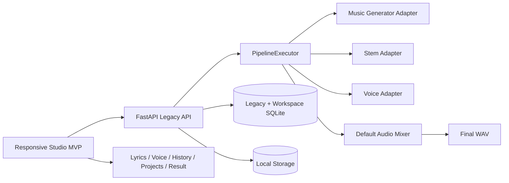
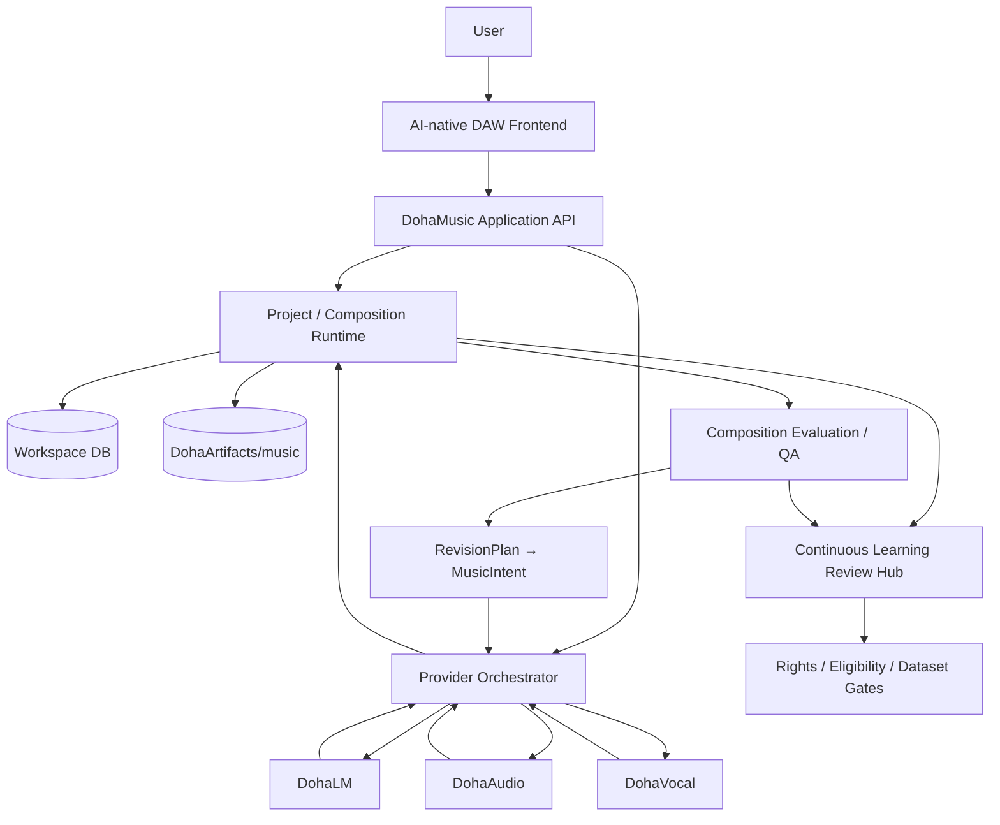
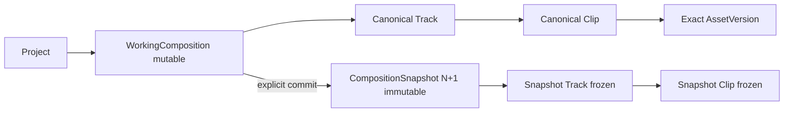
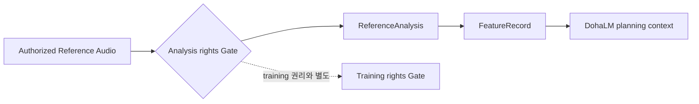
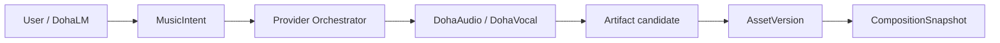
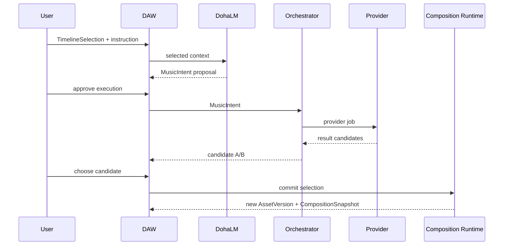
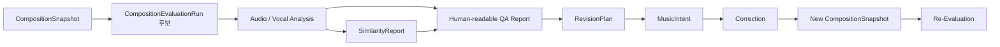
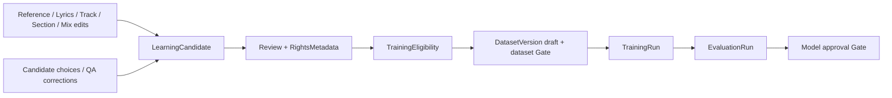

# AI-native DAW 현재·목표 아키텍처

> 문서 역할: AI-native DAW 목표 Runtime·Workflow·Gap의 Canonical Authority
> 문서 상태: [운영 기준]
> 구현 상태: [D1·D2 Timeline Playback·Waveform CURRENT / D3 Clip Persistence·Authority·Revision-safe Idempotency Foundation 구현 / 장기 TARGET 부분 구현]
> 최종 수정일: 2026-08-25
> 관련 기능: Project/Composition Runtime, Provider Orchestrator, Composition Evaluation, Continuous Learning
> 관련 문서: [제품 방향](../02-product/ai-native-daw-product-direction.md), [시스템 아키텍처](system-architecture.md), [Workspace Artifact 모델](workspace-artifact-model.md), [D1 Composition Read 계약](../06-api/composition-read-workspace.md), [Clip Domain ADR](../11-decisions/ADR-040-canonical-track-clip-working-composition-authority.md), [Frontend 전환 계획](../../planning/ai-native-daw-frontend-migration.md)

## 1. 상태 표기

- `CURRENT`: 현재 `develop`의 코드·API·문서로 확인한 상태
- `TARGET`: 장기 제품 목표
- `NOT IMPLEMENTED`: 설계는 있으나 현재 Runtime·DB·UI에 없는 상태

TARGET Diagram은 구현 완료 증거가 아니다.

## 2. CURRENT — 기능 검증 MVP

현재 Pipeline은 로컬 Adapter와 Mock 중심의 Compatibility Workflow다. Workspace AssetVersion·Artifact·CompositionSnapshot·Job 기반과 일부 Resource API가 별도로 구현되어 있으나 기존 Pipeline 전체의 source of truth를 대체하지 않았다. 외부 DohaAudio·DohaVocal 실제 transport와 DohaLM 제품 통합도 미구현이다.

현재 Frontend는 생성 Wizard와 결과 탐색, Project별 Composition의 `empty`·명시 Snapshot 선택·`ready` read projection을 제공한다. ready 화면은 단일 Global Player 권위의 읽기 전용 Timeline과 제한된 Master / Mix Waveform overview, draggable Playhead·정밀 seek feedback을 제공한다. 편집 가능한 Track/Clip Timeline·Waveform, Arrangement, 다중 Track Mixer, AI 후보 선택, Composition QA 화면은 없다.

D1-A Backend read path인 `Project Composition aggregate → CompositionService → Workspace Repository → Workspace DB`를 구현했다. D1-Transition은 기존 persistence에 project-level selected Snapshot authority가 없음을 확인하고 `NO_PREEXISTING_SELECTION_AUTHORITY`로 고정했다. Bootstrap Service transaction에서 active Workspace의 Project·Snapshot·selection을 단일 batch로 검사하지만 selection row를 생성하거나 바꾸지 않는다. Legacy Runtime은 migration input이지 aggregate fallback authority가 아니며 GET은 bootstrap·backfill·selection 변경을 수행하지 않는다. Project의 explicit selected Snapshot을 current로 사용하고, SnapshotItem 기반 Track projection과 Section 비가용 상태를 [ADR-035](../11-decisions/ADR-035-d1-composition-read-authority.md)에 따라 분리한다. D1-B Frontend는 이 aggregate와 selection PATCH를 Project 상세에서 소비하며, 실제 사용자 DB 전환은 여전히 별도 승인 TARGET이다.

[ADR-040](../11-decisions/ADR-040-canonical-track-clip-working-composition-authority.md)은 mutable WorkingComposition과 canonical Track·Clip, exact AssetVersion과 불변 Snapshot commit 경계를 설계했다. [ADR-045](../11-decisions/ADR-045-clip-service-deletion-media-duration-authority.md)는 non-empty Track 삭제 거부와 trusted ingestion이 저장한 WAV·FLAC duration만 쓰는 authority를 확정했다. [ADR-047](../11-decisions/ADR-047-revision-safe-idempotency-completion-result.md)은 최초 완료 revision과 복수 identity replay authority를 확정했다. schema·Repository·trusted duration·idempotency foundation은 revision `20260825_0022`까지 구현했지만 mutation orchestration, API와 UI는 아직 구현하지 않았다. D1 snapshot-local projection은 계속 canonical Track이 아니다.

## 3. TARGET — 제품 Runtime

Composition Runtime의 편집·commit 내부 경계는 다음과 같다.

### 3.1 DohaMusic 소유

- Frontend와 AI Music Director UX
- 인증·권한·Project·Composition·Selection
- MusicIntent orchestration과 Workspace Job
- Provider 결과 후보의 검증·표시·사용자 선택
- Artifact·AssetVersion·CompositionSnapshot lineage
- Composition Evaluation orchestration과 QA Report
- Mixer, Preview, 최종 Export
- LearningCandidate 등록·검토 UX와 권리 Gate 연결

### 3.2 Provider 소유

| Provider | 목표 책임 |
|---|---|
| DohaLM | 창작 계획, 가사·음악 지시 해석, MusicIntent와 RevisionPlan 지원 |
| DohaAudio | Music Generation, Stem, audio/reference feature 분석 |
| DohaVocal | Singing Voice, Voice Conversion, Vocal Correction, vocal/reference feature 분석 |

Provider는 서로 직접 호출하지 않는다. Workspace AssetVersion, CompositionSnapshot, 사용자 최종 선택, Mix와 Export를 직접 생성·변경하지 않는다.

## 4. Target 실행 흐름

### 4.1 Reference Analysis

Reference URL은 다운로드 허가가 아니다. 실제 source access 정책, `analysis_allowed`, retention과 철회 상태를 확인해야 한다. 원본 Audio, 분석 JSON/FeatureRecord와 학습 사용 권리는 각각 분리한다.

### 4.2 Creation

### 4.3 DAW Editing

직접 Clip 편집은 `WorkingComposition → Track → Clip`에 즉시 지속 저장하고, explicit commit에서만 새 불변 Snapshot을 만든다. Save는 mutable state persistence이며 Snapshot commit과 다르다. 현재 GlobalPlayer의 committed Master/Mix playback과 후속 working multi-track preview도 분리한다.

새 `EditIntent`는 만들지 않는다. 선택 범위는 우선 `MusicIntent.target.project_id`, `asset_version_id`, `track_id`, `section_id`, `time_range`로 표현한다.

### 4.4 Composition Evaluation / QA

`CompositionEvaluationRun`은 이 Workflow의 product-domain identity 후보이며 Common Contract schema로 확정하지 않는다. 공통 `EvaluationRun`은 TrainingRun/checkpoint/model 평가 의미를 유지한다.

평가 결과는 최소 다음 공통 위치 문맥을 유지해야 한다.

- CompositionSnapshot과 subject AssetVersion
- Track·Section·시간 범위
- 분석기·metric·model/version과 confidence
- limitation과 사람이 읽는 설명
- 관련 SimilarityReport·RevisionPlan reference

`SimilarityReport`는 증거 중 하나이며 법적 표절 판정이나 자동 차단 실행기가 아니다.

### 4.5 Continuous Learning

각 화살표는 자동 승격이 아니라 별도 검토와 불변 lineage를 뜻한다. DohaMusic은 Project 활동을 임의로 수집하거나 TrainingRun을 직접 허용하지 않는다.

## 5. NOT IMPLEMENTED — 아키텍처 Gap

| 영역 | 현재 Gap |
|---|---|
| Composition edit model | ADR-040과 5개 persistence table·Repository foundation 구현; Service/API/UI 미구현 |
| Provider orchestration | 외부 DohaLM·DohaAudio·DohaVocal 실제 transport 미구현 |
| Candidate workflow | 다중 후보 저장·비교·선택·commit 미구현 |
| Composition QA | CompositionEvaluationRun, 통합 Report, RevisionPlan 실행 미구현 |
| Reference | 승인 source ingestion·ReferenceAnalysis·FeatureRecord 연결 미구현 |
| Learning | LearningCandidate review와 Rights/Eligibility/Dataset 연결 미구현 |
| Frontend | 편집 가능한 Track/Clip Timeline·Waveform·Mixer·AI Director·QA page 미구현 |
| Export | 독립 Export Asset과 MP3·FLAC 미구현 |

## 6. 설계 보류 항목

구현 전에 별도 ADR 또는 versioned 계약 검토가 필요한 항목이다.

- canonical Section identity와 편집 표현. canonical Track·Clip·WorkingComposition과 Snapshot extension persistence는 구현했지만 Timeline edit·Undo/Redo Service/API/UI는 미구현
- `CompositionEvaluationRun`의 제품 수명주기·저장·API 및 Common Contract 승격 필요성
- QA issue의 Track·Section·time range deep-link 형식
- `MusicIntent.target`에서 실제로 부족함이 입증될 때의 `clip_id`, `bar_range`, `beat_range` 최소 확장
- LearningCandidate 자동 제안과 사용자의 opt-in·review·철회 UX
- Reference source ingestion·retention·삭제 정책
