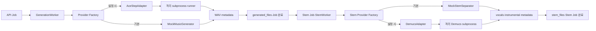

# AI 파이프라인

> 문서 목적: 생성·Stem 분리 경계와 모델 교체 계약을 정의한다.
> 현재 상태: **음악·Stem Mock 기본 / ACE-Step·Demucs 선택적 Provider 구현**

서비스 계층은 `GenerationInput`과 `GenerationResult`만 안다. 결과에는 파일 경로, Provider, 모델·버전, 실제 Seed, 출력 길이, 추론 시간, 최대 VRAM과 메타데이터 경로가 포함된다. ACE-Step 전용 요청·응답·오류는 `backend/ai/adapters/ace_step` 밖으로 노출하지 않는다.

Backend 환경은 ACE-Step을 import하지 않는다. Adapter가 격리 Python으로 `ai_worker/scripts/run_ace_step_smoke_test.py`를 실행하므로 선택 의존성이 없어도 Mock·API·단위 테스트가 시작된다. 실행기는 모델을 자동 다운로드하지 않으며 설정 경로가 없으면 명시적 오류를 반환한다.

Phase 2.5 상주 suite는 warm 추론 속도 이점을 확인했지만 6회 동안 process RSS가 약 14.2GiB 증가했다. 따라서 운영 경로는 계속 Job마다 subprocess를 만들고 종료한다. 다회 상주 실행기는 제품 경로가 아니라 명시적 benchmark 도구다. [ADR-007](../11-decisions/ADR-007-ace-step-runtime-lifecycle.md)을 따른다.

Stem 분리는 생성과 별도 Job으로 구현됐다. `StemSeparator` 결과는 `vocals`, `instrumental`, 선택 metadata이며 Demucs 전용 4-stem 구조는 Adapter 밖으로 나오지 않는다. 생성·Stem Worker는 같은 단일 executor를 공유해 GPU AI 작업을 직렬화한다. 음색 변환, 믹싱과 인코딩은 구현하지 않았다. Provider 선택은 시작 시 환경 변수로 고정되며 작업별 동적 선택은 없다.
