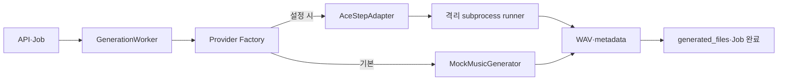

# AI 파이프라인

> 문서 목적: 생성 경계와 모델 교체 계약을 정의한다.
> 현재 상태: **Mock 기본 Provider / ACE-Step 선택적 실험 Provider 연결 완료**

서비스 계층은 `GenerationInput`과 `GenerationResult`만 안다. 결과에는 파일 경로, Provider, 모델·버전, 실제 Seed, 출력 길이, 추론 시간, 최대 VRAM과 메타데이터 경로가 포함된다. ACE-Step 전용 요청·응답·오류는 `backend/ai/adapters/ace_step` 밖으로 노출하지 않는다.

Backend 환경은 ACE-Step을 import하지 않는다. Adapter가 격리 Python으로 `ai_worker/scripts/run_ace_step_smoke_test.py`를 실행하므로 선택 의존성이 없어도 Mock·API·단위 테스트가 시작된다. 실행기는 모델을 자동 다운로드하지 않으며 설정 경로가 없으면 명시적 오류를 반환한다.

Stem 분리, 음색 변환, 믹싱과 인코딩은 이번 범위에 없다. 현재 Provider 선택은 시작 시 환경 변수로 고정되며 작업별 동적 선택은 구현하지 않았다.
