# AI 파이프라인

> 문서 목적: 생성·Stem·Voice와 Pipeline Orchestrator의 모델 교체 계약을 정의한다.
> 현재 상태: **음악·Stem·Voice Mock 기본 / 선택적 Adapter / Default Audio Mixer 통합 완료**
> 최종 수정일: 2026-08-05
> 관련 문서: [저장소와 Provider 경계](repository-provider-boundaries.md), [Pipeline Orchestrator](pipeline-orchestrator.md), [ADR-028](../11-decisions/ADR-028-provider-runtime-artifact-contract.md)

```mermaid
flowchart LR
  A[API·Job] --> W[GenerationWorker]
  W --> F[Provider Factory]
  F -->|기본| M[MockMusicGenerator]
  F -->|설정 시| C[AceStepAdapter]
  C --> R[격리 subprocess runner]
  R --> O[WAV·metadata]
  M --> O
  O --> D[generated_files·Job 완료]
  D --> S[Stem Job·StemWorker]
  S --> SF[Stem Provider Factory]
  SF -->|기본| SM[MockStemSeparator]
  SF -->|설정 시| DA[DemucsAdapter]
  DA --> DR[격리 Demucs subprocess]
  SM --> ST[vocals·instrumental·metadata]
  DR --> ST
  ST --> SD[stem_files·Stem Job 완료]
  SD --> VJ[독립 Voice Job·VoiceWorker]
  VJ --> VF[Voice Provider Factory]
  VF -->|기본| VM[MockVoiceConverter]
  VF -->|명시적 실험| SV[SeedVCAdapter]
  VM --> VO[converted voice·metadata]
  SV --> SR[격리 Seed-VC subprocess]
  SR --> VO
```



서비스 계층은 `GenerationInput`과 `GenerationResult`만 안다. 결과에는 파일 경로, Provider, 모델·버전, 실제 Seed, 출력 길이, 추론 시간, 최대 VRAM과 메타데이터 경로가 포함된다. ACE-Step 전용 요청·응답·오류는 `backend/ai/adapters/ace_step` 밖으로 노출하지 않는다.

Backend 환경은 ACE-Step을 import하지 않는다. Adapter가 격리 Python으로 `ai_worker/scripts/run_ace_step_smoke_test.py`를 실행하므로 선택 의존성이 없어도 Mock·API·단위 테스트가 시작된다. 실행기는 모델을 자동 다운로드하지 않으며 설정 경로가 없으면 명시적 오류를 반환한다.

Phase 2.5 상주 suite는 warm 추론 속도 이점을 확인했지만 6회 동안 process RSS가 약 14.2GiB 증가했다. 따라서 운영 경로는 계속 Job마다 subprocess를 만들고 종료한다. 다회 상주 실행기는 제품 경로가 아니라 명시적 benchmark 도구다. [ADR-007](../11-decisions/ADR-007-ace-step-runtime-lifecycle.md)을 따른다.

Stem 분리는 생성과 별도 Job으로 구현됐다. `StemSeparator` 결과는 `vocals`, `instrumental`, 선택 metadata이며 Demucs 전용 4-stem 구조는 Adapter 밖으로 나오지 않는다. Voice Conversion도 Stem과 Voice Profile을 입력으로 받는 별도 Job이며 `mock` 또는 명시적 `seed_vc`를 사용한다. 생성·Stem·Voice Worker는 같은 단일 executor를 공유해 GPU AI 작업을 직렬화한다. Provider 선택은 시작 시 환경 변수로 고정되며 작업별 동적 선택은 없다.

Phase 5에서는 독립 Job을 제거하지 않고 `PipelineExecutor`가 동일 인터페이스를 직접 연결한다.


각 단계는 `PipelineContext`의 다음 입력만 채운다. 재시도·진행률·오류·benchmark는 Executor와 Worker가 통합 관리한다. Mixer 기본 Provider는 실제 합성을 수행하는 `DefaultAudioMixer`이고 `MockAudioMixer`는 회귀·격리 테스트용으로 유지한다. 자세한 DSP 경계는 [Audio Quality Engine](audio-quality-engine.md), Workflow 경계는 [Pipeline Orchestrator](pipeline-orchestrator.md)를 따른다.

## 외부 Provider 전환 경계 — [계획]

`PipelineExecutor`와 단계 순서는 DohaMusic에 유지한다. 신규 Music Generator와 Stem Separation Runtime은 DohaAudio, 신규 Singing Voice·Voice Conversion Runtime은 DohaVocal에서 구현한다. Provider는 서로 직접 호출하지 않고 DohaMusic이 선택·호출·상태 전이와 GPU admission control을 관리한다.

현재 `PipelineContext`의 로컬 파일 경로와 ACE-Step·Demucs·Seed-VC subprocess 호출은 실제 구현된 호환 계약이다. 이를 즉시 제거하지 않으며 새 Runtime의 Job·취소·재시도·오류·Health와 Artifact ID·URI 계약을 검증한 뒤 Provider별로 순차 전환한다. DohaVocal Fake Runtime과 DohaMusic Consumer Contract Foundation은 구현됐지만 Production transport·Artifact payload·URI와 DohaAudio Runtime은 아직 구현되지 않았다.

장기 Provider Client는 기존 `MusicGenerator`, `StemSeparator`, `VoiceConverter`의 역할을 유지하되 모델 내부 경로와 의존성을 노출하지 않는다. 출력에는 [Model Manifest](../04-models/provider-model-manifest.md) identity와 Artifact checksum을 포함하는 방향으로 확장한다.

## 향후 Voice Provider Matrix

```text
Primary       미선정
  ↓
Fallback      미선정
  ↓ opt-in only
Experimental  seed_vc / 향후 검증 Adapter
  ↓ development
Mock          현재 기본값
```

이 Matrix는 [ADR-011](../11-decisions/ADR-011-voice-provider-selection.md)의 목표 구조다. Phase 5는 Mock으로만 통합됐으며 Primary와 Fallback은 동일한 `VoiceConverter` 결과 계약과 `Preview` 이상 상태를 충족할 때만 추가한다.

Phase 6 Lyrics AI는 이 Pipeline 밖의 독립 모듈이다. `LyricsGenerator`가 만든 문서를 Pipeline이나 MusicGenerator에 자동 전달하지 않는다. 향후 입력 계약은 [Lyrics AI 아키텍처](lyrics-ai.md)를 따른다.
