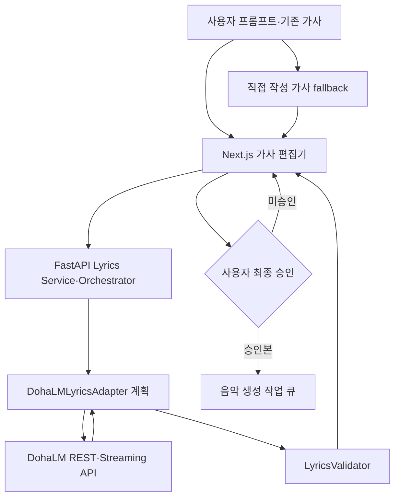

# DohaLM 가사 생성·분석 연동

> 문서 상태: [계획]
> 최종 수정일: 2026-08-05
> 관련 기능: Phase 6.5 External Lyrics LLM 확장
> 관련 문서: [Lyrics AI](lyrics-ai.md), [시스템 아키텍처](system-architecture.md), [가사 버전 데이터 모델](../07-database/lyrics-versioning-data-model.md), [생성 콘텐츠 정책](../09-security/generated-content-policy.md), [ADR-027](../11-decisions/ADR-027-dohalm-lyrics-provider-boundary.md)

## 1. 목적과 현재 상태

DohaMusic은 별도 저장소의 [DohaLM](https://github.com/DohaStudio/DohaLM/tree/develop)을 LLM 모델·추론 Provider로 호출하는 Reference Application이다. DohaLM은 모델과 Runtime을 소유하고 DohaMusic은 사용자 공동 창작 흐름과 음악 제작을 소유한다.

2026-08-05 DohaLM `develop` 기준 실제 상태는 다음과 같다.

| 항목 | 상태 |
|---|---|
| 일반 Chat REST API | MVP 구현: `POST /api/v1/chat` |
| 일반 Chat SSE | MVP 구현: `POST /api/v1/chat/stream` |
| Provider metadata | MVP 구현: `GET /api/v1/models` |
| DohaMusic 전용 Lyrics API | [검증 필요] 미확정 |
| Python SDK | [계획] `not_started` |
| 정식 versioned model release·manifest 계약 | [계획] |
| DohaMusic 통합 | [계획] 별도 저장소 |
| Cloud 배포 | 범위 밖 |

따라서 이 문서의 전용 Lyrics endpoint와 SDK 호출은 설계 예시이며 구현된 계약이 아니다. 구현 시 DohaLM의 versioned OpenAPI·SDK·manifest를 다시 확인한다.

## 2. 시스템 경계

| DohaLM 책임 | DohaMusic 책임 |
|---|---|
| LLM 모델·Adapter 로딩 | 사용자 UI와 가사 편집기 |
| 가사 생성·기존 가사 분석 | 가사 프로젝트·버전 관리 |
| 구조·운율·음절·반복 분석 | 사용자 수정·선택·배열·최종 승인 |
| 수정안·제목·콘셉트 제안 | 음악 비즈니스 로직과 생성 작업 관리 |
| streaming 응답과 prompt 처리 | 음성 동의·오디오 처리·결과 저장 |
| 모델 버전 관리와 manifest 제공 | 상업 이용 검토 상태와 사용 차단 |

DohaMusic의 Router·Service·Repository 또는 Pipeline이 DohaLM의 모델 경로·checkpoint 내부 구조에 의존하지 않는다. `DohaLMLyricsAdapter`가 versioned REST/Streaming 또는 향후 SDK 응답을 기존 `LyricsGenerator` 결과로 변환하고 공통 `LyricsValidator`를 다시 통과시킨다.



## 3. 연동 방식

### REST API

초기 통합은 DohaLM의 versioned REST 계약을 우선 검토한다. 현재 구현된 일반 Chat endpoint를 가사 전용 운영 계약으로 간주하지 않는다. 전용 endpoint가 확정되면 request ID, API version, model manifest ID, timeout·취소와 오류 schema를 고정한다.

다음은 **미확정 설계 예시**다.

```http
POST /v1/lyrics/generate
```

```json
{
  "prompt": "청춘과 성장에 대한 K-pop 가사",
  "language": "ko",
  "genre": "kpop",
  "mood": "hopeful"
}
```

```http
POST /v1/lyrics/analyze
```

```json
{
  "lyrics": "...",
  "analysis_types": [
    "structure",
    "syllable",
    "rhyme",
    "repetition",
    "theme"
  ]
}
```

예상 응답에는 결과 본문 외에 `request_id`, `model_name`, `model_version`, `manifest_id`, `generation_config`, `license_review_status`가 필요하다. 필드명과 endpoint는 DohaLM 공식 계약 확정 전까지 `[검증 필요]`다.

### Python SDK

DohaLM Python SDK는 현재 `not_started`다. SDK가 versioning·timeout·stream cancellation·오류 변환·manifest identity를 REST와 동일하게 제공할 때 대안으로 검토한다. SDK가 모델을 DohaMusic process 안에 직접 로드하거나 내부 checkpoint 경로를 노출한다면 모듈 격리 원칙에 맞지 않으므로 채택하지 않는다.

## 4. Streaming 생성 흐름

현재 DohaLM SSE는 `start → delta... → done` 또는 `start → ... → error` 계약을 사용하며 timeout과 client cancellation을 Provider task에 전파한다. Lyrics 전용 streaming은 다음 흐름을 목표로 하되 공식 event schema는 `[검증 필요]`다.

```text
DohaMusic request 생성
→ DohaLM stream 연결
→ start에서 request·model identity 확인
→ delta를 임시 preview로만 표시
→ done 결과를 Validator로 검증
→ AI 최초 생성본을 불변 버전으로 저장
→ 사용자 편집·승인
```

부분 `delta`는 저장 가능한 최종 가사나 승인본이 아니다. `done` 전 연결 종료·취소·timeout은 실패로 기록하고 음악 Pipeline으로 전달하지 않는다.

## 5. 오류·timeout·fallback

- DohaLM readiness 실패, network 오류와 timeout은 안전한 Provider 오류로 변환하고 원문 prompt·가사를 로그에 남기지 않는다.
- 5초 이상 걸릴 가능성이 있는 생성·분석은 비동기 Job·취소·재시도 경계를 사용한다.
- 일시적 오류만 제한적으로 재시도하고 인증·입력 거부·라이선스 차단·invalid output은 재시도하지 않는다.
- 자동으로 연구용 모델이나 다른 외부 Provider로 전환하지 않는다.
- DohaLM 장애와 무관하게 사용자가 가사를 직접 입력·편집·승인하는 경로를 유지한다.
- fallback 발생 여부와 실제 Provider·모델 identity를 `ModelUsage`에 기록한다.

## 6. 모델 버전과 상업 이용 기록

각 호출은 최소한 Provider, 모델명·버전, manifest ID 또는 hash, 생성 설정, prompt hash 또는 보호된 prompt 참조, 생성 시각, license review ID와 판정 상태를 기록한다. prompt 원문 접근과 보존 기간은 별도 개인정보·콘텐츠 정책을 따른다.

상업 작업에는 `commercial_approved`인 정확한 모델·가중치·Adapter·데이터 계보 조합만 허용한다. `AIHUB-71748` 계열과 현재 연구 baseline은 `research_only`이며 상업용 Provider 선택에서 fail closed한다. 사람의 수정·승인은 모델이나 학습 데이터의 제한을 해제하지 않는다.

## 7. 가사 버전과 승인

가사는 `user_input`, `ai_generated`, `ai_suggestion`, `user_edited`, `final_approved` 버전을 덮어쓰기 없이 보존한다. AI 결과와 사용자 수정본을 분리하고 각 버전의 parent, 작성 주체, 생성·수정 원인과 hash를 기록한다. `final_approved`는 별도 승인 이벤트와 승인 시각을 가지며, 승인 대상 version hash가 바뀌면 기존 승인은 무효다.

음악 생성 요청은 `final_approved` 버전 ID와 승인 ID를 snapshot으로 보존해야 한다. 세부 개념은 [가사 버전 데이터 모델](../07-database/lyrics-versioning-data-model.md)을 따른다.

## 8. 구현 전 검증 게이트

- DohaLM 전용 Lyrics API 또는 범용 Chat 기반 공식 prompt·response 계약
- Python SDK 공개 surface와 versioning
- model manifest schema와 release identity
- 인증·소유권·rate limit·데이터 보존 정책
- timeout·취소·재시도·SSE event schema
- 상업용 model·weights·dataset·Adapter·Runtime의 `commercial_approved` 근거
- 가사 버전·승인 migration과 Pipeline 입력 계약
- 한국어 품질·유사성·지연·실패율·8GB 로컬 실행성 평가

검증 전에는 기본 `template` Provider와 직접 작성 경로를 유지하고 DohaLM을 Stable 또는 production으로 표시하지 않는다.
