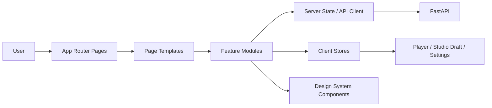
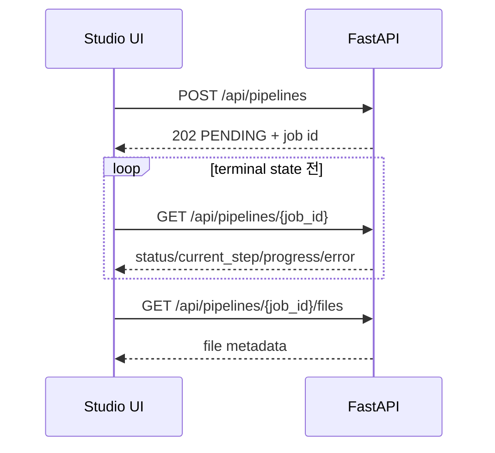

# Frontend 아키텍처

> 문서 상태: [진행 중]
> 최종 수정일: 2026-07-31
> 관련 기능: Phase 8 Doha Studio
> 관련 문서: [Frontend Overview](frontend-overview.md), [Design System](design-system.md), [UI Component Guide](ui-component-guide.md), [Responsive Guide](responsive-guide.md), [Studio UX Flow](studio-ux-flow.md), [Page Structure](page-structure.md), [Frontend Roadmap](../../planning/frontend-roadmap.md), [ADR-017](../11-decisions/ADR-017-frontend-technology-stack.md)

## 아키텍처 목표

Next.js App Router 기반 `frontend/`에서 화면, 기능, 서버 상태, Player shell과 디자인 토큰을 분리한다. 현재 MVP는 FastAPI의 Health·Lyrics·Voice Profile·Pipeline 계약을 연결하며 Backend 계약은 [API 개요](../06-api/api-overview.md)를 사실 기준으로 사용한다.



## 계층과 책임

| 계층 | 책임 | 금지 |
|---|---|---|
| `app` | route, layout, loading, error boundary, metadata | API 세부 로직과 거대 화면 컴포넌트 |
| `features` | Studio·Lyrics·Voice·Pipeline·Player 단위 사용자 행동 | 다른 feature 내부 구현 직접 참조 |
| `components` | 재사용 가능한 시각 구성 요소와 접근성 | Backend response 형식 직접 의존 |
| `services` | HTTP client, endpoint 함수, 오류 정규화, polling | UI 상태 저장 |
| `stores` | Client 전용 상태와 session 복원 | 서버 응답의 영구 source of truth 대체 |
| `hooks` | feature 조합, polling lifecycle, media query | 도메인 규칙 은닉 |
| `types` | API DTO, view model, discriminated union | 서버와 다른 상태값 발명 |
| `lib` | formatter, validation helper, constants | feature 전용 비즈니스 로직 |
| `styles` | token, theme, global motion/accessibility 정책 | 페이지별 임의 색상·spacing |

## 구현 기준 폴더 구조

```text
frontend/
├─ app/
│  ├─ (marketing)/page
│  ├─ (studio)/studio/page
│  ├─ (studio)/lyrics/page
│  ├─ (studio)/voice/page
│  ├─ (studio)/generation/[jobId]/page
│  ├─ (studio)/result/[jobId]/page
│  ├─ settings/page
│  ├─ about/page
│  ├─ loading
│  ├─ error
│  └─ not-found
├─ components/
│  ├─ atoms/
│  ├─ molecules/
│  ├─ organisms/
│  ├─ templates/
│  └─ primitives/
├─ features/
│  ├─ studio/
│  ├─ lyrics/
│  ├─ voice/
│  ├─ pipeline/
│  ├─ player/
│  └─ settings/
├─ hooks/
├─ services/
├─ stores/
├─ lib/
├─ types/
└─ styles/
```

실제 라이브러리와 버전은 승인된 [ADR-017](../11-decisions/ADR-017-frontend-technology-stack.md)과 `frontend/package-lock.json`으로 고정한다. 구현은 이 책임 경계를 따르되 작은 공통 component는 역할별 파일로 묶어 불필요한 디렉터리 깊이를 피한다.

## 상태 모델

| State | Source of truth | 주요 값 | 지속 범위 |
|---|---|---|---|
| Global | App shell | online, API health, active overlay | session |
| Studio | client draft | current workspace, settings, lyrics, voice profile ID, review validity | session/local draft 후보 |
| Lyrics | API + draft | document, validation, revision, provider 표시 | API 결과 + 편집 draft |
| Pipeline | API | job ID, status, current step, progress, safe error, files metadata | URL로 복원 |
| Voice | API 제한 + draft | 방금 생성한 profile metadata, consent draft | 현재 API에는 list/get 없음 |
| Player | client media | queue, current item, position, volume, repeat | session |
| Settings | client | theme, reduced motion, polling preference | local |

서버 상태는 client store에 복제해 진실처럼 사용하지 않는다. Job URL을 canonical identity로 사용하고 terminal state에서 polling을 중단한다. 새로고침 시 `GET /api/pipelines/{job}`으로 복원한다.

## API 연결 원칙



- Lyrics 생성·검증은 동기 요청이다. `POST /api/lyrics`, `POST /api/lyrics/validate`의 loading과 validation 결과를 구분한다.
- Pipeline은 `202` 이후 초기 5회 1초, foreground 2초, background 5초 간격으로 polling한다.
- `COMPLETED`와 `FAILED`에서 polling을 중단한다. 네트워크 오류는 Job 실패와 분리해 “연결 재시도”를 제공한다.
- API의 `{ error: { code, message } }`를 공통 UI 오류로 정규화하되 내부 경로나 원문 prompt를 노출하지 않는다.
- Backend에 재시도 API가 없으므로 “재시도”는 동일 draft를 검토 화면으로 복사한 뒤 새 Job을 만드는 사용자 행동으로만 표현한다.

## 현재 API 제약

| UX | 현재 가능 여부 | 설계 처리 |
|---|---|---|
| Health 표시 | 가능 | `GET /health` |
| Lyrics 생성·조회·수정·검증·삭제 | 가능 | 현재 계약 사용 |
| Pipeline 생성·상태·파일 metadata | 가능 | Studio 핵심 흐름 |
| 음성 프로필 생성·삭제 | 부분 가능 | list/get/upload 없음을 UI에 명시 |
| 오디오 재생·다운로드 | 불가 | 파일 metadata만 존재; content endpoint 선행 필요 |
| 프로젝트·생성 이력 목록 | 불가 | 목록 API 선행 필요, 빈 shell만 설계 |
| Job 취소·수동 retry | 불가 | 기능 비활성 및 후속 API 표시 |
| 인증·소유권 | 불가 | 공개 운영 차단 조건 |
| 모델 목록 | 불가 | `Backend Required`; UI에서 하드코딩된 선택 기능 금지 |

상태 분류의 단일 기준은 [Frontend Overview의 지원 범위](frontend-overview.md#frontend-지원-범위)다. 이 표의 “가능”은 `Available`, “부분 가능”은 `Partial`, “불가”는 `Backend Required`를 뜻한다.

## 페이지별 API 상태 설계

| 화면 | Request | 주요 Response | Loading | Error·Retry | Polling |
|---|---|---|---|---|---|
| Landing·Settings | `GET /health` | service health | 작은 status indicator | 수동 reconnect, Studio 정적 shell 유지 | 주기 polling 없이 진입·수동 확인 |
| Studio / Lyrics | `POST /api/lyrics`, `POST /api/lyrics/validate` | Lyrics document 또는 validation | editor action 단위 busy | field/schema 오류 수정 후 명시 재요청 | 없음, 동기 API |
| Lyrics Lab detail | `GET /api/lyrics/{id}` | stored Lyrics document | editor skeleton | 404와 network 분리 | 없음 |
| Lyrics revision | `POST /api/lyrics/{id}/revise` | 새 parent/version document | revision action busy | 미지원 Provider·차단·network별 안내 | 없음 |
| Lyrics delete | `DELETE /api/lyrics/{id}` | `204` | confirm action busy | 자식 revision·404 안내 | 없음 |
| Voice | `POST /api/voice-profiles`, `DELETE /api/voice-profiles/{id}` | profile metadata 또는 `204` | form/card 단위 busy | 동의·경로·404 오류 후 수정 | 없음; list/get 없음 |
| Studio Review | `POST /api/pipelines` | `202`, `PENDING`, job ID | 중복 제출 차단 | 입력 오류 수정; network 결과 불명확 시 조회 가능한 ID 없으면 자동 재제출 금지 | 생성 후 Progress로 이동 |
| Generation Progress | `GET /api/pipelines/{jobId}` | status, step, progress, safe error, metadata | 최초 skeleton, 이후 non-blocking refresh | network reconnect; `FAILED`는 새 Job만 가능 | terminal 전 adaptive polling |
| Result | `GET /api/pipelines/{jobId}`, `/files` | completed Job, 6개 file metadata 가능 | artwork/metric skeleton | metadata 재조회; content 없는 Player는 disabled | 완료 후 중단 |
| 독립 Generation·Stem·Voice 화면 후보 | 각 `POST`·Job `GET`·files `GET` | 해당 Job과 file metadata | Pipeline과 동일 | safe error code 기반 새 요청 | terminal 전 polling |

Audio Metadata는 별도 endpoint가 아니라 Pipeline의 `result_metadata`와 files의 metadata record에서 읽는다. Response DTO는 API 문서와 OpenAPI에서 생성·검증하고 UI 전용 view model로 변환한다.

OpenAPI는 FastAPI request·response 명세이고 OpenAI API는 Experimental 외부 Lyrics Provider다. Local Lyrics LLM은 공개 Base를 자체 권리 Dataset으로 파인튜닝하는 Planned Backend Provider다. Frontend API client는 이 세 용어를 구분하고 Provider SDK를 포함하지 않는다.

## 접근성·성능·보안

- 키보드만으로 Navigation, Dialog, Wizard step, Player 제어가 가능해야 한다.
- 모든 interactive target은 최소 44×44px, focus ring은 accent와 구별되는 밝은 outline을 사용한다.
- `prefers-reduced-motion`에서 턴테이블 회전·parallax·waveform animation을 정지한다.
- artwork와 waveform은 layout shift를 막는 고정 aspect ratio를 사용한다.
- 입력 draft에 비밀이나 원본 음성 binary를 임의 저장하지 않는다.
- Backend 인증 전에는 개인 데이터가 있는 Production 공개 배포를 금지한다.
