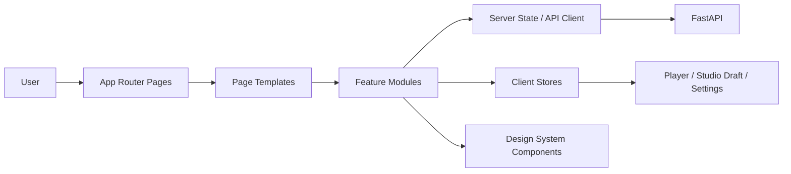
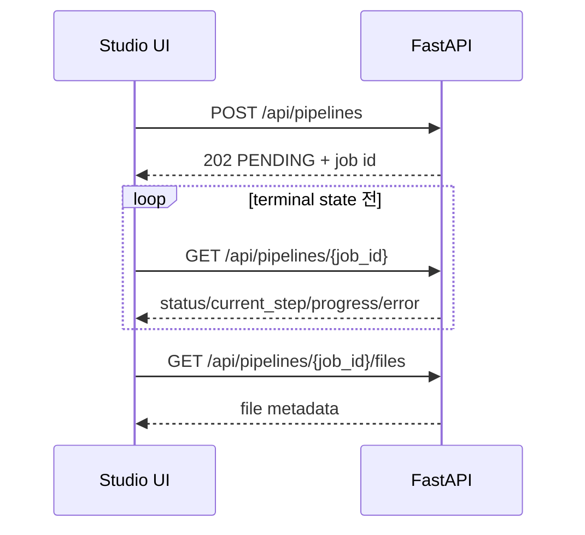

# Frontend 아키텍처

> 문서 상태: [진행 중]
> 최종 수정일: 2026-08-01
> 관련 기능: Phase 8 Doha Studio, F6 Guided Voice Enrollment Frontend [완료]
> 관련 문서: [Frontend Overview](frontend-overview.md), [Design System](design-system.md), [UI Component Guide](ui-component-guide.md), [Responsive Guide](responsive-guide.md), [Studio UX Flow](studio-ux-flow.md), [Voice Enrollment 요구사항](../02-requirements/voice-enrollment-requirements.md), [Voice Enrollment API](../06-api/voice-enrollment-api.md), [History](history-management.md), [Project](project-management.md), [Frontend Roadmap](../../planning/frontend-roadmap.md), [ADR-017](../11-decisions/ADR-017-frontend-technology-stack.md)

## 아키텍처 목표

Next.js App Router 기반 `frontend/`에서 화면, 기능, 서버 상태, 전역 Player와 디자인 토큰을 분리한다. 현재 MVP는 FastAPI의 Health·Lyrics·Voice Profile·Voice Enrollment·Pipeline·Audio content/download 계약을 연결하며 Backend 계약은 [API 개요](../06-api/api-overview.md)를 사실 기준으로 사용한다.



## 계층과 책임

| 계층 | 책임 | 금지 |
|---|---|---|
| `app` | route, layout, loading, error boundary, metadata | API 세부 로직과 거대 화면 컴포넌트 |
| `features` | Studio·Lyrics·Voice·Pipeline·Player 단위 사용자 행동 | 다른 feature 내부 구현 직접 참조 |
| `components` | 재사용 가능한 시각 구성 요소와 접근성 | Backend response 형식 직접 의존 |
| `services` | HTTP client, endpoint 함수, 오류 정규화, polling | UI 상태 저장 |
| `stores` | Client 전용 상태와 session 복원 | 서버 응답의 영구 source of truth 대체 |
| `hooks` | feature 조합, polling lifecycle, media query | 도메인 규칙 은닉 |
| `types` | API DTO, view model, discriminated union | 서버와 다른 상태값 발명 |
| `lib` | formatter, validation helper, constants | feature 전용 비즈니스 로직 |
| `styles` | token, base, layout, component, page, responsive motion/accessibility 정책 | 페이지별 임의 색상·spacing |

## 구현 기준 폴더 구조

```text
frontend/
├─ app/
│  ├─ (marketing)/page
│  ├─ (studio)/studio/page
│  ├─ (studio)/lyrics/page
│  ├─ voice/page
│  ├─ (studio)/generation/[jobId]/page
│  ├─ (studio)/result/[jobId]/page
│  ├─ settings/page
│  ├─ about/page
│  ├─ loading
│  ├─ error
│  └─ not-found
├─ components/
│  ├─ atoms/
│  ├─ molecules/
│  ├─ organisms/
│  ├─ templates/
│  └─ primitives/
├─ features/
│  ├─ studio/             # orchestration, step UI, schema, request mapper
│  ├─ lyrics/
│  ├─ voice/
│  ├─ pipeline/
│  ├─ player/
│  └─ settings/
├─ hooks/
├─ services/
├─ stores/
├─ lib/
├─ types/
└─ styles/                # tokens, base, pages, layout, components, responsive
```

실제 라이브러리와 버전은 승인된 [ADR-017](../11-decisions/ADR-017-frontend-technology-stack.md)과 `frontend/package-lock.json`으로 고정한다. 구현은 이 책임 경계를 따르되 작은 공통 component는 역할별 파일로 묶어 불필요한 디렉터리 깊이를 피한다.

## 상태 모델

| State | Source of truth | 주요 값 | 지속 범위 |
|---|---|---|---|
| Global | App shell | online, API health, active overlay | session |
| Studio | client draft | current workspace, settings, lyrics, voice profile ID, review validity | `sessionStorage` allowlist |
| Lyrics | API + draft | document, validation, revision, provider 표시 | API 결과 + 편집 draft |
| Pipeline | API | job ID, status, current step, progress, safe error, files metadata | URL로 복원 |
| Voice | API + draft | upload·list·get·delete Profile metadata, 선택 ID·이름, consent draft | API 결과 + `sessionStorage` 선택 allowlist; 음성 binary 저장 금지 |
| Player | client media | queue, current item, position, volume, repeat | session |
| Settings | client | 현재는 reduced motion만 구현 | `localStorage` allowlist |

서버 상태는 client store에 복제해 진실처럼 사용하지 않는다. Job URL을 canonical identity로 사용하고 terminal state에서 polling을 중단한다. 새로고침 시 `GET /api/pipelines/{job}`으로 복원한다.

## API 연결 원칙



- Lyrics 생성·검증은 동기 요청이다. `POST /api/lyrics`, `POST /api/lyrics/validate`의 loading과 validation 결과를 구분한다.
- Pipeline은 `202` 이후 정상 응답 초기 5회 1초, foreground 2초, background 최소 5초 간격으로 polling한다. 연속 오류 1~2회는 5초, 3회 이상은 10초이며 성공 시 오류 횟수를 초기화한다.
- `COMPLETED`, `FAILED`, `CANCELLED`, 404에서 polling을 중단한다. `CANCEL_REQUESTED`는 취소 확정까지 제한적으로 polling한다. Timeout·network 오류는 Job 실패와 분리하고 같은 Job ID 수동 재조회를 제공하며 자동 재제출하지 않는다.
- API Client는 caller signal과 10초 timeout을 `AbortSignal.any()`로 결합한다. Node 24·현재 TypeScript DOM 계약과 Chromium E2E에서 지원을 확인했으며 외부 취소는 `REQUEST_ABORTED`, timeout은 `REQUEST_TIMEOUT`으로 구분한다.
- 성공 HTTP의 JSON parsing 실패는 실제 status를 가진 `INVALID_RESPONSE`다. API의 `{ error: { code, message } }`는 Backend code를 보존하고 그 밖의 HTTP·network 오류와 구분한다.
- Files public DTO와 Voice Profile response에는 내부 물리·상대 Storage 경로가 없다. Result UI는 실제 공개 필드 allowlist만 표시하며 알 수 없는 nested metadata를 숨긴다.
- 실패·취소 Retry는 서버 입력 Snapshot으로 새 Job을 생성한다. mutation 중에는 버튼을 잠그고 성공한 새 Job ID의 Generation route로 이동한다.

## 현재 API 제약

| UX | 현재 가능 여부 | 설계 처리 |
|---|---|---|
| Health 표시 | 가능 | `GET /health` |
| Lyrics 생성·조회·수정·검증·삭제 | 가능 | 현재 계약 사용 |
| Pipeline 생성·상태·파일 metadata | 가능 | Studio 핵심 흐름 |
| 음성 프로필 upload·조회·삭제 | 가능 | 기본 UI는 WAV 등록·목록 선택; 서버 경로 생성과 UUID 직접 입력은 개발 플래그 전용 |
| 오디오 재생·다운로드 | 가능 | 완료 Pipeline의 capability URL만 사용; 내부 경로 금지 |
| 프로젝트·생성 이력 목록 | 가능 | History 검색·상태·페이지네이션, Project CRUD·상세, Result 재진입 |
| Job 취소·수동 retry | 가능 | cooperative Cancel과 새 Job Retry |
| 인증·소유권 | 불가 | 공개 운영 차단 조건 |
| 모델 목록 | 불가 | `Backend Required`; UI에서 하드코딩된 선택 기능 금지 |

상태 분류의 단일 기준은 [Frontend Overview의 지원 범위](frontend-overview.md#frontend-지원-범위)다. 이 표의 “가능”은 `Available`, “부분 가능”은 `Partial`, “불가”는 `Backend Required`를 뜻한다.

## 페이지별 API 상태 설계

| 화면 | Request | 주요 Response | Loading | Error·Retry | Polling |
|---|---|---|---|---|---|
| Landing·Settings | `GET /health` | service health | 작은 status indicator | 수동 reconnect, Studio 정적 shell 유지 | 주기 polling 없이 진입·수동 확인 |
| Studio / Lyrics | `POST /api/lyrics`, `POST /api/lyrics/validate` | Lyrics document 또는 validation | editor action 단위 busy | field/schema 오류 수정 후 명시 재요청 | 없음, 동기 API |
| Lyrics Lab detail | `GET /api/lyrics/{id}` | stored Lyrics document | editor skeleton | 404와 network 분리 | 없음 |
| Lyrics revision | `POST /api/lyrics/{id}/revise` | 새 parent/version document | revision action busy | 미지원 Provider·차단·network별 안내 | 없음 |
| Lyrics delete | `DELETE /api/lyrics/{id}` | `204` | confirm action busy | 자식 revision·404 안내 | 없음 |
| Voice | upload·list·get·delete | 공개 Profile metadata 또는 `204` | upload/list 단위 busy | consent·파일·quality·삭제 오류 | 선택 ID를 session draft에 저장 |
| Studio Review | `POST /api/pipelines` | `202`, `PENDING`, job ID | 중복 제출 차단 | 입력 오류 수정; network 결과 불명확 시 조회 가능한 ID 없으면 자동 재제출 금지 | 생성 후 Progress로 이동 |
| Generation Progress | `GET /api/pipelines/{jobId}` | status, step, progress, safe error, metadata | 최초 skeleton, 이후 non-blocking refresh | network reconnect; `FAILED`는 새 Job만 가능 | terminal 전 adaptive polling |
| Result | Pipeline 조회·files·content·download | completed Job, 안전한 audio capability | artwork/metric skeleton | 파일별 불가 상태 표시 | 완료 후 중단 |
| 독립 Generation·Stem·Voice 화면 후보 | 각 `POST`·Job `GET`·files `GET` | 해당 Job과 file metadata | Pipeline과 동일 | safe error code 기반 새 요청 | terminal 전 polling |

Audio Metadata는 별도 endpoint가 아니라 Pipeline의 `result_metadata`와 files의 공개 metadata에서 읽는다. UI는 duration·execution time, Provider 식별자와 Mixer의 실제 audio quality 필드만 allowlist로 변환한다. 파일·모델 경로, 명령, 환경, 내부 host, stack trace와 알 수 없는 key는 표시하지 않는다. Response DTO는 API 문서와 OpenAPI에서 검증하고 UI 전용 view model로 변환한다.

OpenAPI는 FastAPI request·response 명세이고 OpenAI API는 Experimental 외부 Lyrics Provider다. Local Lyrics LLM은 공개 Base를 자체 권리 Dataset으로 파인튜닝하는 Planned Backend Provider다. Frontend API client는 이 세 용어를 구분하고 Provider SDK를 포함하지 않는다.

## F6 Voice Enrollment 책임 경계 [Frontend 완료]

F6는 `app/voice/page.tsx`와 기존 `features/voice/voice-profile.tsx`를 유지하면서 다음 책임으로 확장했다.

```text
app/voice
- route entry, loading, error boundary

features/voice
- voice-enrollment-wizard: 단계·server mutation·복원·submit orchestration
- use-voice-recorder: permission, MediaRecorder, 입력 수준, Blob·stream cleanup
- voice-enrollment-types/utils: 공개 DTO allowlist·상태·품질·오류·session mapper
- voice-profile: 기존 빠른 WAV fallback과 Profile 목록·선택·삭제

services
- 기존 Voice Profile API와 Enrollment create/get/sample get·upload·delete/submit/cancel

hooks
- microphone permission, MediaRecorder lifecycle, page-leave protection

lib
- duration formatting, client-safe audio metadata, feature detection

types
- 실제 API DTO, UI view model, UI workflow state union 분리
```

컴포넌트 후보는 `VoiceEnrollmentPage`, `VoiceEnrollmentStepper`, `VoiceConsentStep`, `VoiceMethodSelector`, `VoicePromptCard`, `VoiceRecorder`, `AudioLevelMeter`, `VoiceFileUploader`, `VoiceSampleList`, `VoiceDurationSummary`, `VoiceQualityResult`, `VoiceProfileForm`, `VoiceEnrollmentComplete`다.

- `app`은 route·loading·error boundary만 담당하고 MediaRecorder·upload orchestration을 갖지 않는다.
- `features/voice`는 녹음·파일·validation·제출 흐름을 조합하고 snake_case 공개 DTO를 명시적 mapper로 allowlist한 뒤 UI 상태와 분리한다.
- `services`에는 실제 OpenAPI의 7개 Enrollment endpoint만 추가했다. 서버 상태는 Backend enum과 일치하며 `RECORDING`, `PAUSED`, `PREVIEW`는 UI 전용이다.
- microphone stream, recording Blob과 Object URL은 메모리 lifecycle로 관리하고 `localStorage`·`sessionStorage`에 저장하지 않는다.
- `sessionStorage`에는 Studio 선택용 opaque Profile ID·이름과 Enrollment ID·현재 단계 allowlist만 유지한다. 음성 binary, idempotency raw key와 내부 path는 저장하지 않는다.
- [ADR-024](../11-decisions/ADR-024-browser-voice-recording-server-normalization.md)에 따라 `audio/wav → audio/webm;codecs=opus → audio/webm → audio/ogg;codecs=opus → audio/ogg`를 feature detection하고 Backend PCM16 48kHz mono 정규화에 전달한다. Windows/CI에서 FFmpeg WebM/Ogg 경로를 검증했으며 FFmpeg 미탐지 환경에서는 해당 오류를 WAV fallback으로 안내한다.
- sample upload 뒤 받은 server-generated Enrollment·Sample ID와 공개 metadata만 복원 후보로 두고, final submit 전 Profile 생성 완료로 표시하지 않는다. audio binary·내부 path는 Web Storage에 넣지 않는다.
- 접근성·상태·오류·테스트 기준은 [Voice Enrollment 요구사항](../02-requirements/voice-enrollment-requirements.md)을 따른다.

## 접근성·성능·보안

- 키보드만으로 Navigation, Dialog, Wizard step, Player 제어가 가능해야 한다.
- 모든 interactive target은 최소 44×44px, focus ring은 accent와 구별되는 밝은 outline을 사용한다.
- reduced motion은 사용자 `localStorage` 명시 설정, system `prefers-reduced-motion`, 기본값 순으로 결정하며 턴테이블 회전·parallax·waveform animation을 정지한다.
- artwork와 waveform은 layout shift를 막는 고정 aspect ratio를 사용한다.
- 입력 draft에 비밀이나 원본 음성 binary를 임의 저장하지 않는다.
- Backend 인증 전에는 개인 데이터가 있는 Production 공개 배포를 금지한다.
