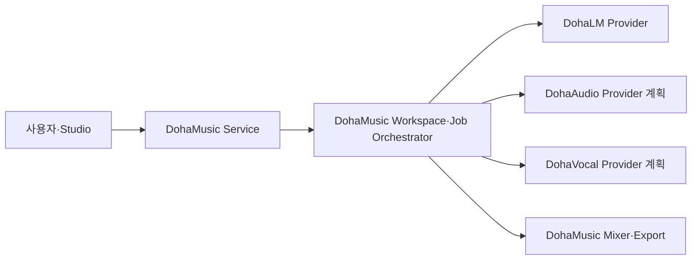

# 저장소와 AI Provider 책임 경계

> 문서 상태: [제안]
> 최종 수정일: 2026-08-05
> 관련 기능: 저장소 분리와 외부 AI Provider 전환
> 관련 문서: [시스템 아키텍처](system-architecture.md), [AI 파이프라인](ai-pipeline.md), [전환 로드맵](../../planning/repository-separation-roadmap.md), [ADR-028](../11-decisions/ADR-028-provider-runtime-artifact-contract.md), [DohaStudio 공통 Provider 계약](https://github.com/DohaStudio/.github/blob/develop/docs/specifications/04-provider-contract.md)

## 목적과 현재 상태

DohaMusic은 제품 서비스와 Workspace·Job Orchestration을 소유하고, 모델별 Dataset·학습·평가·추론 Runtime은 독립 AI Provider 저장소가 소유하는 방향을 제안한다. 저장소 책임 경계의 결정과 실제 Runtime 이전은 별도 단계다. 현재 `PipelineExecutor`는 목표 제품 책임 자체가 아니라 Legacy·Compatibility Workflow다.

DohaLM, [DohaAudio](https://github.com/DohaStudio/DohaAudio)와 [DohaVocal](https://github.com/DohaStudio/DohaVocal)은 실제 저장소로 존재한다. DohaAudio·DohaVocal은 현재 문서 기반 아키텍처 Draft 단계이며 Runtime API·공통 Model Registry·Artifact URI 전환은 `[계획]`이다. 기존 DohaMusic의 ACE-Step·Demucs·Seed-VC Adapter와 subprocess Runner는 단계적 전환 기간의 호환 계층으로 유지한다.

## 목표 구조

```text
DohaMusic
├── frontend
├── backend
├── auth / projects / jobs / db
├── lyrics editor / approval
├── pipeline orchestration
├── provider clients
├── artifact and result management
└── voice consent / authorization

DohaLM
├── lyrics generation
├── lyrics analysis
├── dataset / training / evaluation
├── model manifests
└── runtime API

DohaAudio [저장소 존재·기능 계획]
├── music generation
├── stem separation
├── music dataset
├── training / fine-tuning
├── evaluation
├── model manifests
└── runtime API

DohaVocal [저장소 존재·기능 계획]
├── singing voice
├── voice conversion
├── vocal dataset
├── training / fine-tuning
├── evaluation
├── model manifests
└── runtime API
```

## 통신 원칙



- Provider는 다른 Provider를 직접 호출하지 않는다.
- 모든 Workspace Workflow, Provider 선택, 작업 상태와 GPU admission control은 DohaMusic Workspace·Job Orchestrator가 관리한다.
- DohaMusic은 Provider의 모델 내부 구현, checkpoint 경로 또는 CUDA·PyTorch 세부사항에 의존하지 않는다.
- 외부 Provider가 실패해도 다른 모델로 자동 전환하지 않는다. 재시도·fallback은 상업 이용 상태와 provenance를 보존하는 명시적 정책을 따른다.

## DohaMusic 책임

- Next.js와 FastAPI
- 사용자·인증·권한, 프로젝트, DB
- 작업 큐와 작업 상태
- Lyrics Editor, 가사 버전과 최종 승인
- Voice Consent, 음성 소유권·접근 권한·삭제 결정
- Provider 선택·호출과 Workspace·Job Orchestration
- 결과 파일·metadata·artifact 접근 제어
- 상업 이용 상태와 모델 사용 provenance
- Mixer와 최종 WAV·MP3 Export

DohaMusic에서 신규로 구현하지 않는 책임은 모델 다운로드·로딩, Dataset 전처리, Training·Fine-tuning, Checkpoint 생성, 모델별 Benchmark·품질 평가, CUDA·PyTorch 실행 환경과 모델 내부 추론 코드다.

## DohaLM 책임

DohaLM은 Lyrics Generation·Analysis, LLM Dataset·Training·Evaluation, Model Manifest와 Runtime API를 소유한다. DohaMusic은 가사 편집·버전·승인과 Provider Client만 소유한다. 세부 연동 상태와 검증 게이트는 [DohaLM 연동](dohalm-integration.md)을 따른다.

## DohaAudio 책임 — [저장소 존재·기능 계획]

- Music Generation과 Stem Separation
- 음악 Dataset의 기술 관리와 전처리
- Training·Fine-tuning과 Checkpoint
- 음악 품질 평가와 모델별 Benchmark
- Model Manifest와 Music Runtime API

신규 Music Generator는 DohaMusic 내부에 추가하지 않고 DohaAudio에서 구현한다. DohaAudio 저장소는 존재하지만 Runtime API가 아직 없으므로 구현 완료 기능으로 표시하지 않는다.

## DohaVocal 책임 — [저장소 존재·기능 계획]

- Singing Voice와 Voice Conversion
- Vocal Dataset의 기술 처리
- Training·Fine-tuning
- 사용자별 Checkpoint 또는 Adapter
- 발음·음질·음색 유사도 평가
- Model Manifest와 Vocal Runtime API

신규 Singing Voice·Voice Conversion 구현은 DohaVocal에서 수행한다. 현재 구현된 기능은 DohaMusic의 Seed-VC 실험 Adapter·Runner이며, Singing Voice Runtime이 구현됐음을 의미하지 않는다.

음성 동의, 소유권, 접근 권한, 보존과 삭제 결정은 계속 DohaMusic이 소유한다. DohaVocal은 명시적으로 승인된 작업 범위의 입력만 처리하며 사용자나 동의 정책의 원장이 되지 않는다.

## 현재 호환 계층

다음 구성은 Runtime 이전이 검증될 때까지 유지한다.

| 구성 | 현재 상태 | 전환 방향 |
|---|---|---|
| ACE-Step Adapter·Runner | [조건부 채택] 로컬 subprocess | DohaAudio로 순차 이전 |
| Demucs Adapter·Runner | [실험 완료] 로컬 subprocess | DohaAudio로 순차 이전 |
| Seed-VC Adapter·Runner | [실험 완료] 운영 보류 | DohaVocal로 순차 이전 |
| `MusicGenerator`·`StemSeparator`·`VoiceConverter` | 기존 내부 인터페이스 | Provider Client가 동일 역할을 제공하도록 유지 |
| `PipelineExecutor` | [완료] Legacy·Compatibility Workflow | 목표 Workspace·Job 계약 전환 동안 유지 |
| `DefaultAudioMixer`·Export | [완료] | DohaMusic에 유지 |

호환 계층 제거는 새 Runtime의 Job·취소·재시도·오류·Health·Artifact 계약과 회귀 검증이 끝난 뒤에만 수행한다.

## 경계 밖 항목

이 결정은 저장소 생성, 코드 이동, HTTP API 구현, 공통 Model Registry 구축, 기존 Provider의 운영 승격 또는 Dataset 수집을 승인하지 않는다. 실제 전환 순서와 완료 증거는 [저장소 분리 로드맵](../../planning/repository-separation-roadmap.md)과 [DoD](../DoD/Provider-Separation.md)에서 관리한다.
