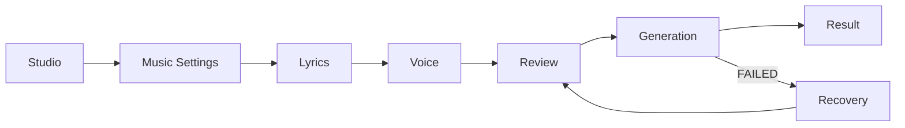
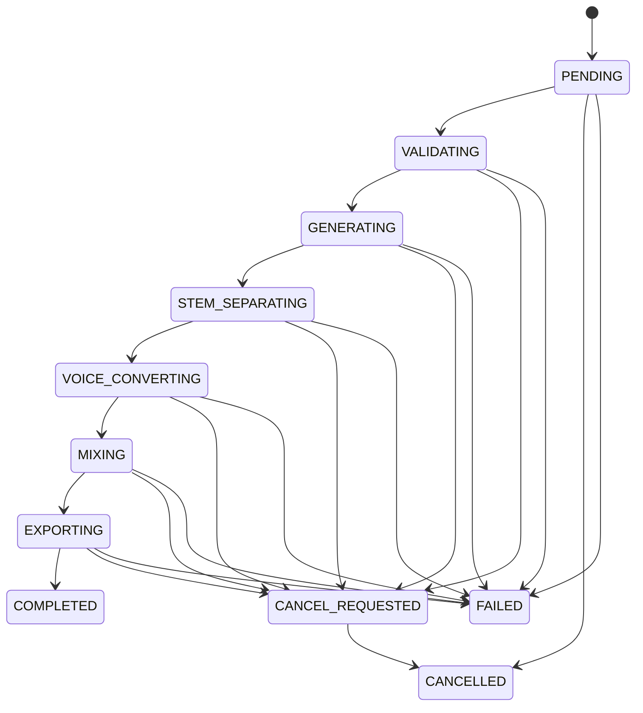

# Studio UX Flow

> 문서 상태: [계획]
> 최종 수정일: 2026-07-31
> 관련 문서: [Frontend Architecture](frontend-architecture.md), [Page Structure](page-structure.md), [Pipeline API](../06-api/pipeline-api.md)

## 전체 Flow

Desktop에서는 모든 section이 하나의 작업 공간과 timeline에 공존하며 사용자가 이전 section을 자유롭게 수정한다. Mobile에서는 같은 상태를 순차 화면으로 보여준다. Review 이후 설정을 바꾸면 기존 결과를 덮지 않고 새 Job을 시작한다.

## 1. Music Settings

- 현재 활성 필드는 `prompt`, `genre`, `duration_seconds`, `seed`다.
- `lyrics`와 `voice_profile_id`는 Lyrics·Voice 후속 단계에서 결합해 Review의 Pipeline 요청을 구성한다.
- instrumental 생성 옵션은 현재 Pipeline API에 없으므로 `planned/disabled` 상태다. Backend 계약이 추가되기 전까지 실제 요청에 포함하지 않으며 UI에 노출하더라도 “준비 중” 또는 비활성 기능으로만 표현한다.
- BPM·고급 모델 선택도 Backend 계약 전까지 `planned/disabled`다.
- 입력 validity와 권장 범위를 inline으로 안내한다.
- K1에서는 K-POP Dance·Easy Listening·Performance Preset과 Mood·Concept·optional Hook phrase를 기본 흐름으로 검토한다. Requested BPM·Language Ratio·Hook Style·Post-Chorus·Dance Break·Vocal Energy는 capability가 구현된 뒤에만 고급 설정으로 활성화한다.
- Preset과 사용자 Prompt가 충돌하면 사용자 입력을 우선하고 Review의 최종 Prompt Preview와 warning에서 확인하게 한다.

## 2. Lyrics

- 직접 작성, Lyrics Lab에서 생성한 문서 복사, 검증의 세 경로를 제공한다.
- Pipeline API는 raw `lyrics`를 받으므로 Lyrics ID 자동 연결을 주장하지 않는다.
- `POST /api/lyrics/validate` 결과의 error는 진행 차단, warning은 review에서 재확인한다.
- OpenAI revision은 서버가 해당 Provider로 설정됐을 때만 가능하며 Template에서는 미지원임을 표시한다.

## 3. Voice

- 동의된 `voice_profile_id`가 필요하다.
- Voice Profile list에서 등록된 Profile을 선택하고, 목록이 비면 `/voice`에서 WAV를 등록한다. 선택 ID는 session draft에 유지한다.
- 참조 파일 배치는 운영자 작업이며 브라우저 upload UX는 Backend endpoint 전까지 구현 대상으로 표시하지 않는다.

## 4. Review

- prompt, genre, duration, seed, lyrics summary, voice profile ID와 미해결 warning을 한 화면에서 확인한다.
- K-POP 제어 계층 구현 후에는 Preset, 적용된 Options, compile warning과 compiler version을 함께 확인하되 Provider 내부 옵션은 노출하지 않는다.
- “생성 시작”은 단 하나의 primary action이다.
- 시작 전 API 제한과 Mock/선택 Provider 상태를 숨기지 않는다.

## 5. Generation

- 현재 step, 전체 progress, elapsed와 연결 상태를 표시한다.
- ETA는 Backend가 제공하지 않으므로 추정값을 사실처럼 표시하지 않는다.
- 취소 가능 상태에서는 확인 Dialog 뒤 `POST /api/pipelines/{job_id}/cancel`을 호출한다. 실행 중 취소는 현재 단계가 안전하게 정리된 뒤 확정될 수 있음을 안내한다.
- network polling 실패는 Job 실패가 아니다. reconnect 후 동일 job ID를 조회한다.

## 6. Result

- artwork placeholder, 제목, duration, provider/model/seed와 audio quality metadata를 표시한다.
- `GET /api/pipelines/{job_id}/files`의 metadata를 file inventory로 보여준다.
- 완료 결과는 capability가 있는 WAV만 Player와 Download를 활성화하고, 사용할 수 없는 파일은 이유를 숨기지 않고 disabled로 표시한다.
- Voice 단계는 등록 목록에서 Profile을 선택하며, 목록이 비면 `/voice` upload로 안내한다. UUID 직접 입력과 서버 경로 생성은 개발 플래그에서만 보조 수단으로 제공한다.
- 실패·취소된 작업의 “같은 설정으로 다시 만들기”는 서버의 입력 Snapshot을 검증해 새 Pipeline Job을 생성하며 기존 Job을 변경하지 않는다. 성공 Result에는 이 Retry action을 표시하지 않는다.

## 오류·복구

| 상황 | UI | 행동 |
|---|---|---|
| 입력 오류 | field error + summary | 해당 section 이동 |
| API 4xx | inline alert | 요청 수정 |
| network | reconnect banner | 동일 Job polling 재개 |
| Job FAILED | 실패 step + safe code | Review로 돌아가 새 Job |
| 404 Job | not-found state | Studio로 이동 |
| 결과 metadata 없음 | partial result 경고 | 다시 조회, 가짜 player 금지 |

## Draft 보존

브라우저 draft 저장은 민감하지 않은 설정과 가사에 한해 사용자 동의와 보존 기간을 정의한 뒤 구현한다. 원본 음성 binary, API key, 내부 파일 경로는 저장하지 않는다. 인증 전 multi-user project 보존을 제공하지 않는다.
