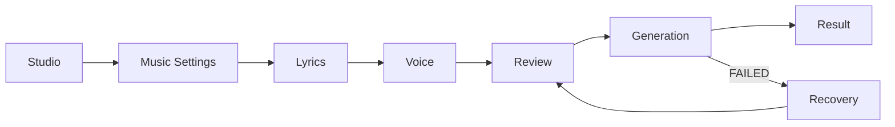
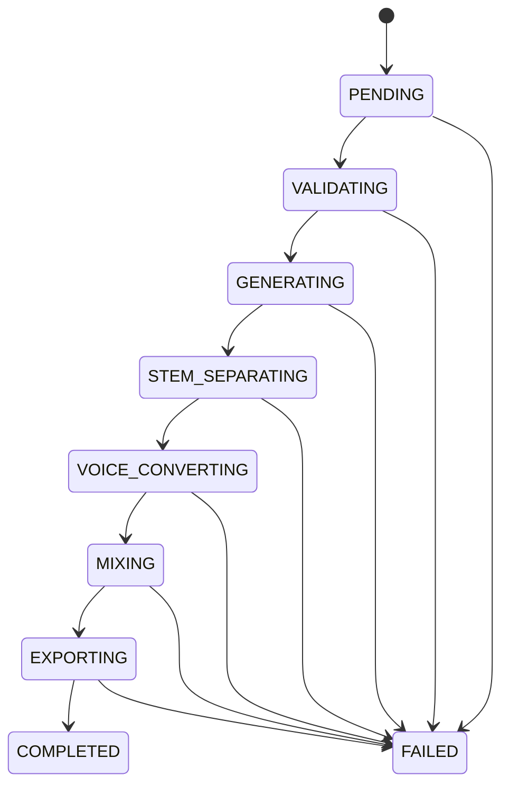

# Studio UX Flow

> 문서 상태: [계획]
> 최종 수정일: 2026-07-31
> 관련 문서: [Frontend Architecture](frontend-architecture.md), [Page Structure](page-structure.md), [Pipeline API](../06-api/pipeline-api.md)

## 전체 Flow

Desktop에서는 모든 section이 하나의 작업 공간과 timeline에 공존하며 사용자가 이전 section을 자유롭게 수정한다. Mobile에서는 같은 상태를 순차 화면으로 보여준다. Review 이후 설정을 바꾸면 기존 결과를 덮지 않고 새 Job을 시작한다.

## 1. Music Settings

- prompt, genre, duration, seed와 instrumental 여부를 편집한다.
- 현재 Pipeline API가 받는 필드만 활성화한다. BPM·고급 모델 선택은 Backend 계약 전까지 planned/disabled다.
- 입력 validity와 권장 범위를 inline으로 안내한다.

## 2. Lyrics

- 직접 작성, Lyrics Lab에서 생성한 문서 복사, 검증의 세 경로를 제공한다.
- Pipeline API는 raw `lyrics`를 받으므로 Lyrics ID 자동 연결을 주장하지 않는다.
- `POST /api/lyrics/validate` 결과의 error는 진행 차단, warning은 review에서 재확인한다.
- OpenAI revision은 서버가 해당 Provider로 설정됐을 때만 가능하며 Template에서는 미지원임을 표시한다.

## 3. Voice

- 동의된 `voice_profile_id`가 필요하다.
- 현재 API는 profile list/get/upload가 없으므로 이미 알고 있는 profile ID 또는 현재 session에서 생성한 metadata만 사용할 수 있다.
- 참조 파일 배치는 운영자 작업이며 브라우저 upload UX는 Backend endpoint 전까지 구현 대상으로 표시하지 않는다.

## 4. Review

- prompt, genre, duration, seed, lyrics summary, voice profile ID와 미해결 warning을 한 화면에서 확인한다.
- “생성 시작”은 단 하나의 primary action이다.
- 시작 전 API 제한과 Mock/선택 Provider 상태를 숨기지 않는다.

## 5. Generation

- 현재 step, 전체 progress, elapsed와 연결 상태를 표시한다.
- ETA는 Backend가 제공하지 않으므로 추정값을 사실처럼 표시하지 않는다.
- 취소 API가 없으므로 cancel button을 활성화하지 않는다.
- network polling 실패는 Job 실패가 아니다. reconnect 후 동일 job ID를 조회한다.

## 6. Result

- artwork placeholder, 제목, duration, provider/model/seed와 audio quality metadata를 표시한다.
- `GET /api/pipelines/{job_id}/files`의 metadata를 file inventory로 보여준다.
- 현재 다운로드/content API가 없어 Player와 Download는 disabled 상태 및 선행 조건을 표시한다.
- “다시 만들기”는 Review draft를 복사하여 새 Pipeline Job을 생성하며 기존 Job을 변경하지 않는다.

## 오류·복구

| 상황 | UI | 행동 |
|---|---|---|
| 입력 오류 | field error + summary | 해당 section 이동 |
| API 4xx | inline alert | 요청 수정 |
| network | reconnect banner | 동일 Job polling 재개 |
| Job FAILED | 실패 step + safe code | Review로 돌아가 새 Job |
| 404 Job | not-found state | Studio로 이동 |
| 결과 metadata 없음 | partial result 경고 | 다시 조회, 가짜 player 금지 |

## Draft 보존

브라우저 draft 저장은 민감하지 않은 설정과 가사에 한해 사용자 동의와 보존 기간을 정의한 뒤 구현한다. 원본 음성 binary, API key, 내부 파일 경로는 저장하지 않는다. 인증 전 multi-user project 보존을 제공하지 않는다.
