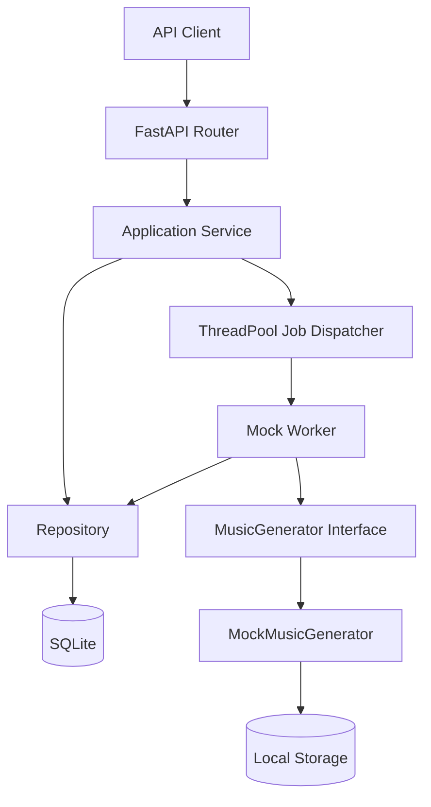

# 시스템 아키텍처

> 문서 목적: Phase 1에서 구현된 구성요소와 향후 확장 경계를 정의한다.
> 현재 상태: **Backend Foundation 구현 완료**

HTTP 요청은 Router → Service → Repository 계층을 따른다. 생성 요청은 `202 Accepted`로 즉시 반환되고, 프로세스 내부 ThreadPool에서 Mock Worker가 실행된다. Worker는 `MusicGenerator` 인터페이스만 의존하므로 향후 실제 모델 Adapter를 서비스 계층 변경 없이 연결할 수 있다.

현재 영속 계층은 SQLite와 SQLAlchemy, 스키마 관리는 Alembic, 파일 저장소는 로컬 디렉터리다. 외부 Queue, 실제 AI 모델, 인증, 프론트엔드는 Phase 1 범위에 포함되지 않는다. 장시간 작업을 여러 프로세스에서 안전하게 처리하기 위한 외부 Queue 도입은 후속 ADR에서 결정한다.

관련 결정은 [ADR-002](../11-decisions/ADR-002-modular-ai-pipeline.md), [ADR-003](../11-decisions/ADR-003-async-job-processing.md)을 따른다.
