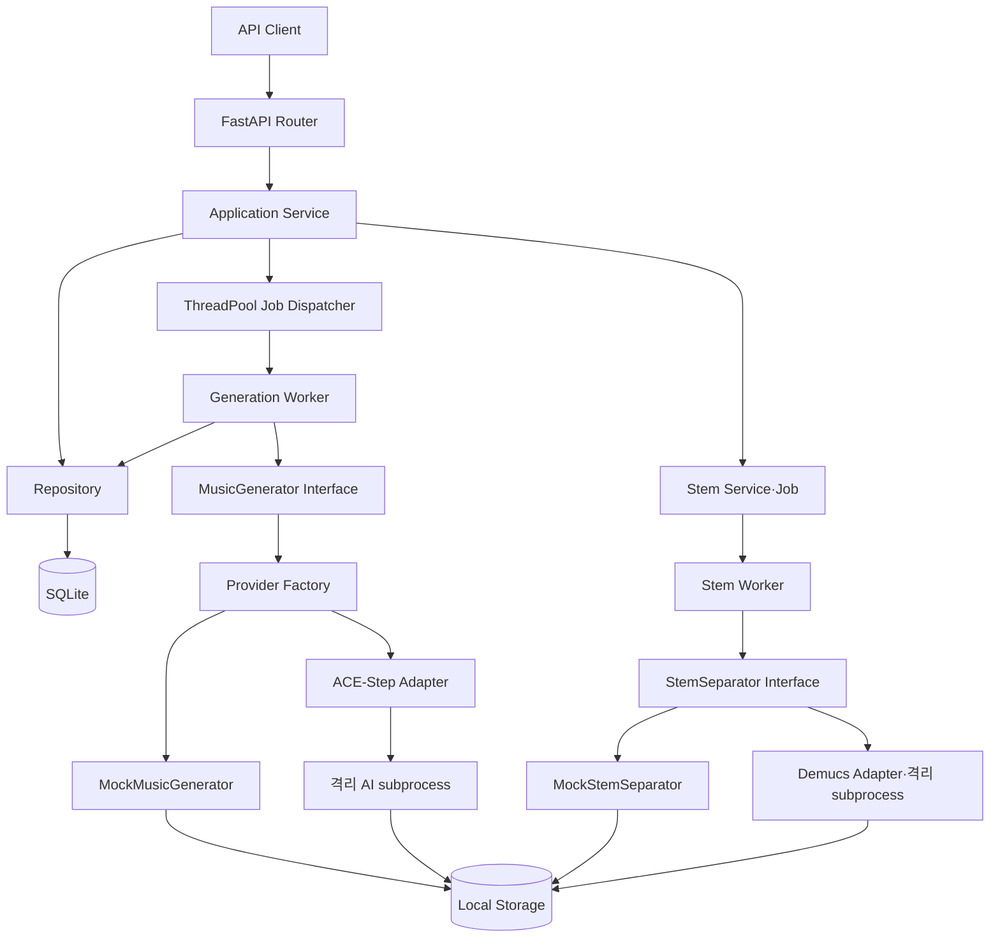

# 시스템 아키텍처

> 문서 목적: 구현된 구성요소와 향후 확장 경계를 정의한다.
> 현재 상태: **Backend Foundation + 선택적 ACE-Step·Demucs Adapter 구현**

HTTP 요청은 Router → Service → Repository 계층을 따른다. 생성 요청은 `202 Accepted`로 즉시 반환되고 프로세스 내부 ThreadPool에서 Provider-neutral Worker가 실행된다. Worker는 `MusicGenerator` 인터페이스만 의존하며 설정에 따라 Mock 또는 격리된 ACE-Step Adapter가 동작한다.

현재 영속 계층은 SQLite와 SQLAlchemy, 스키마 관리는 Alembic, 파일 저장소는 로컬 디렉터리다. ACE-Step과 Demucs는 선택적 실험 Provider이며 기본값이 아니다. Stem 분리는 별도 Job·API로 구현했고 음색 변환은 포함하지 않는다. 외부 Queue, 인증과 프론트엔드는 범위 밖이며 다중 프로세스 내구성은 후속 ADR에서 결정한다.

관련 결정은 [ADR-002](../11-decisions/ADR-002-modular-ai-pipeline.md), [ADR-003](../11-decisions/ADR-003-async-job-processing.md), [ADR-005](../11-decisions/ADR-005-ai-worker-dependency-isolation.md), [ADR-006](../11-decisions/ADR-006-ace-step-primary-provider.md), [ADR-007](../11-decisions/ADR-007-ace-step-runtime-lifecycle.md), [ADR-008](../11-decisions/ADR-008-stem-separation-provider.md)을 따른다.
