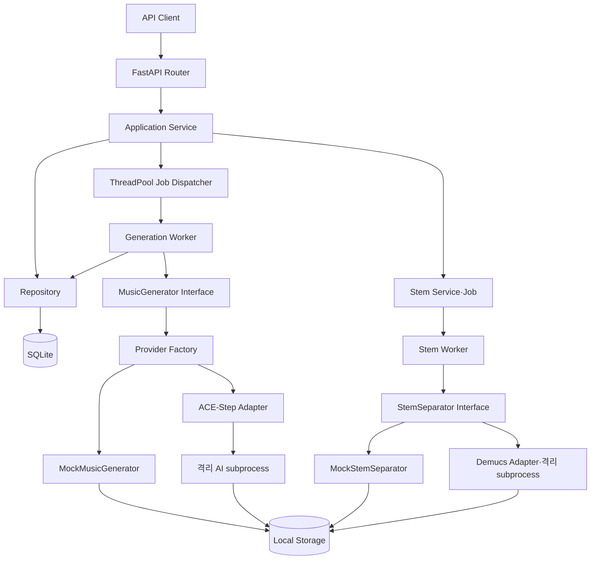
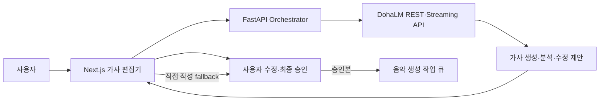

# 시스템 아키텍처

> 문서 역할: 현재 시스템 연결과 상세 Architecture 탐색의 Canonical Authority
> 문서 목적: 구현된 구성요소와 향후 확장 경계를 정의한다.
> 현재 상태: **Legacy·Responsive Studio MVP 구현 / DohaVocal Consumer Contract·HTTP Transport Foundation 구현 / AI-native DAW Product Runtime·Production Provider 전환 [계획]**
> 최종 수정일: 2026-09-03
> 관련 문서: [현재·목표 아키텍처](ai-native-daw-target-architecture.md), [저장소와 Provider 경계](repository-provider-boundaries.md), [DohaLM 연동](dohalm-integration.md), [Pipeline Orchestrator](pipeline-orchestrator.md), [Workspace Artifact 모델](workspace-artifact-model.md)

이 문서는 상위 연결과 CURRENT 경계를 설명한다. AI-native DAW의 상세 TARGET Workflow와 NOT IMPLEMENTED 목록은 [목표 아키텍처](ai-native-daw-target-architecture.md), 개별 API·DB·Artifact 계약은 연결된 상세 문서를 Authority로 사용한다.

| 질문 | CURRENT | TARGET·상세 Authority |
|---|---|---|
| DohaMusic 책임 | Frontend·FastAPI·Workspace·Job·결과·Mixer | Project/Composition Runtime과 Provider Orchestrator |
| DohaLM·DohaAudio·DohaVocal 책임 | DohaVocal strict DTO·HTTP Transport Foundation 존재, Worker·Artifact production 통합 미구현, 로컬 호환 Adapter 유지 | [DohaVocal Consumer Contract](dohavocal-consumer-contract.md), [저장소와 Provider 경계](repository-provider-boundaries.md) |
| Workspace·AssetVersion·Artifact | Entity·Service·공개 API와 local Storage 기반 존재 | [Workspace Artifact 모델](workspace-artifact-model.md), [Storage 계약](artifact-storage-contract.md) |
| Job | Legacy ThreadPool과 Workspace Job 실행 기반·API 존재 | Provider dispatch wiring·background daemon 미구현 |
| CompositionSnapshot | 불변 Snapshot Entity·Application·API, Working/Track/Clip persistence·atomic mutation Service·22개 Product API와 Frontend Clip Copy·Commit·Gain UI, Clip Fade Backend foundation 존재 | Fade UI·Loop·Section·Mixer 미구현 |
| MusicIntent | 문서상 Common Contract 재사용 기준, Runtime 미연결 | DohaLM 제안 → DohaMusic orchestration → Provider 실행 |
| ReferenceAnalysis | Runtime·ingestion 미구현 | 허용 Reference → FeatureRecord → planning context |
| LearningCandidate | review·Dataset 연결 미구현 | RightsMetadata·TrainingEligibility·DatasetVersion Gate |
| Composition Evaluation | 통합 완성곡 QA 미구현 | product-only CompositionEvaluationRun 후보와 RevisionPlan |

`TimelineSelection`과 `CompositionEvaluationRun`은 DohaMusic product-domain 후보이며 Common Contract schema가 아니다. `EvaluationRun`은 TrainingRun·checkpoint·model 평가 의미를 유지한다.

HTTP 요청은 Router → Service → Repository 계층을 따른다. 생성 요청은 `202 Accepted`로 즉시 반환되고 프로세스 내부 ThreadPool에서 Provider-neutral Worker가 실행된다. Worker는 `MusicGenerator` 인터페이스만 의존하며 설정에 따라 Mock 또는 격리된 ACE-Step Adapter가 동작한다.

현재 영속 계층은 SQLite와 SQLAlchemy, 스키마 관리는 Alembic, 파일 저장소는 로컬 디렉터리다. ACE-Step과 Demucs는 선택적 실험 Provider이며 기본값이 아니다. Stem 분리는 별도 Job·API로 구현했다. Next.js Responsive Studio Frontend는 존재하지만 편집 가능한 DAW Timeline·Mixer·Composition QA는 없다. 외부 Queue와 인증은 범위 밖이며 다중 프로세스 내구성은 후속 ADR에서 결정한다.

장기 제품 Runtime의 CURRENT/TARGET/NOT IMPLEMENTED 구분과 Reference·Creation·DAW Editing·Composition QA·Continuous Learning 흐름은 [AI-native DAW 현재·목표 아키텍처](ai-native-daw-target-architecture.md)를 따른다.

## 외부 AI Provider 목표 경계 — [계획]

DohaMusic은 Frontend·Backend·인증·프로젝트·Job·DB, 가사 편집·승인, Voice Consent, Pipeline Orchestration, Provider Client, 결과·Artifact 관리와 Mixer·최종 Export를 소유한다. 모델 다운로드·로딩, Dataset 전처리, Training·Fine-tuning, Checkpoint, 모델별 Benchmark·평가와 CUDA·PyTorch 환경은 AI Provider 저장소로 분리한다.

DohaAudio는 Music Generation·Stem Separation, DohaVocal은 Singing Voice·Voice Conversion의 기술 책임을 갖는 외부 Provider 저장소다. 두 저장소는 존재하며 Runtime 기능은 `[계획]`이다. 신규 Music Generator는 DohaAudio에서, 신규 Singing Voice·Voice Conversion은 DohaVocal에서 구현한다. Provider끼리는 직접 호출하지 않으며 반드시 DohaMusic Workspace·Job Orchestrator를 통과한다.

현재 Runtime과 공개 API는 변경하지 않는다. ACE-Step·Demucs·Seed-VC Adapter·Runner는 새 Provider Job·Artifact 계약이 검증될 때까지 로컬 subprocess 호환 계층으로 유지한다. 세부 책임과 단계는 [저장소와 Provider 경계](repository-provider-boundaries.md), [ADR-028](../11-decisions/ADR-028-provider-runtime-artifact-contract.md)을 따른다.

## DohaLM 가사 연동 경계 — [계획]

DohaLM은 LLM 모델·Adapter 로딩, 가사 생성·분석·수정안 생성, streaming, prompt 처리, 모델 버전 관리와 model manifest 제공을 담당한다. 현재 확인된 `develop` 구현은 일반 Chat REST/SSE MVP와 Provider metadata이며, 전용 Lyrics API·정식 versioned manifest·Python SDK는 `[검증 필요]` 또는 `[계획]`이다.

DohaMusic은 사용자 UI, 가사 편집기·버전 관리, 사용자 수정·승인, 음악 비즈니스 로직, 음악 생성 작업, 음성 동의, 오디오 처리, 결과 저장과 상업 이용 검토 상태를 담당한다. 새 기능은 DohaLM을 직접 호출하지 않고 FastAPI의 Provider Adapter와 Workspace·Job Orchestrator 경계를 통과한다. DohaLM 장애·timeout·상업 승인 실패 시 직접 작성 가사 경로를 유지하며, 승인되지 않은 AI 초안은 음악 생성 작업 큐로 전달하지 않는다.

## Provider Artifact와 Workspace 결과 경계 — [계획]

DohaLM·DohaAudio·DohaVocal의 모델·학습·평가·Runtime 결과는 각각 `DohaArtifacts/lm`, `DohaArtifacts/audio`, `DohaArtifacts/vocal`에 속한다. DohaMusic은 사용자가 선택한 AssetVersion 조합의 Composition Snapshot, Mix, Preview와 Export를 `DohaArtifacts/music`에 관리한다.

Mix와 최종 Export는 DohaMusic 책임이다. Provider는 서로 직접 호출하거나 Workspace `music` 영역에 직접 쓰지 않으며 DohaMusic Orchestrator가 Provider 결과와 프로젝트 Asset의 연결을 관리한다. 현재 로컬 Pipeline Storage와 API는 유지되고 이 외부 Artifact 구조는 아직 구현되지 않았다.

관련 결정은 [ADR-002](../11-decisions/ADR-002-modular-ai-pipeline.md), [ADR-003](../11-decisions/ADR-003-async-job-processing.md), [ADR-005](../11-decisions/ADR-005-ai-worker-dependency-isolation.md), [ADR-006](../11-decisions/ADR-006-ace-step-primary-provider.md), [ADR-007](../11-decisions/ADR-007-ace-step-runtime-lifecycle.md), [ADR-008](../11-decisions/ADR-008-stem-separation-provider.md), [ADR-027](../11-decisions/ADR-027-dohalm-lyrics-provider-boundary.md), [ADR-028](../11-decisions/ADR-028-provider-runtime-artifact-contract.md), [ADR-029](../11-decisions/ADR-029-dohamusic-workspace-artifact-domain.md)을 따른다.
