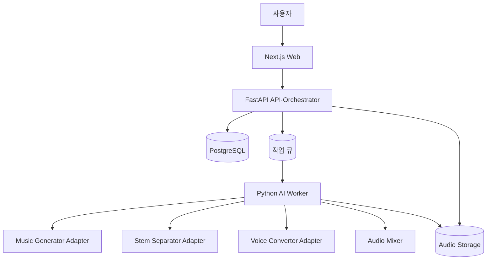

# 시스템 아키텍처

> 문서 목적: 주요 컴포넌트, 책임과 데이터 흐름을 정의한다.
> 현재 상태: **논리 설계 초안**

Web은 입력과 상태 표시, API는 인증·검증·메타데이터·작업 조정, Worker는 GPU 파이프라인 실행을 담당한다. DB에는 경로와 메타데이터만 저장하고 오디오 바이트는 저장소에 둔다.

초기에는 DB 기반 작업 획득과 로컬 저장소를 허용하되 인터페이스 경계는 Redis 큐와 S3 호환 저장소로 교체할 수 있게 한다. 관련 결정은 [ADR-002](../11-decisions/ADR-002-modular-ai-pipeline.md), [ADR-003](../11-decisions/ADR-003-async-job-processing.md)에 있다.
