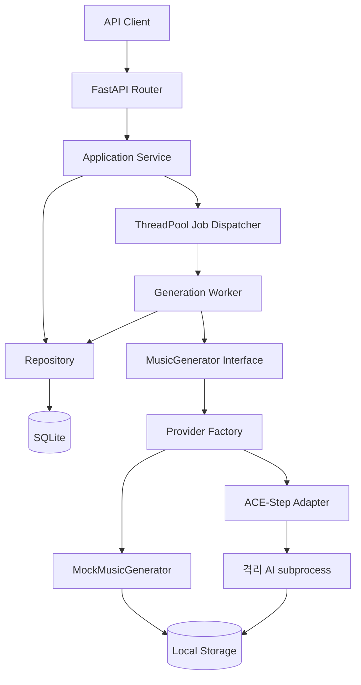

# 시스템 아키텍처

> 문서 목적: 구현된 구성요소와 향후 확장 경계를 정의한다.
> 현재 상태: **Backend Foundation + 선택적 ACE-Step Adapter 구현**

HTTP 요청은 Router → Service → Repository 계층을 따른다. 생성 요청은 `202 Accepted`로 즉시 반환되고 프로세스 내부 ThreadPool에서 Provider-neutral Worker가 실행된다. Worker는 `MusicGenerator` 인터페이스만 의존하며 설정에 따라 Mock 또는 격리된 ACE-Step Adapter가 동작한다.

현재 영속 계층은 SQLite와 SQLAlchemy, 스키마 관리는 Alembic, 파일 저장소는 로컬 디렉터리다. ACE-Step은 선택적 실험 Provider이며 기본값이 아니다. 외부 Queue, 인증, 프론트엔드와 다른 AI 단계는 포함하지 않는다. 장시간 작업을 여러 프로세스에서 안전하게 처리하기 위한 외부 Queue 도입은 후속 ADR에서 결정한다.

관련 결정은 [ADR-002](../11-decisions/ADR-002-modular-ai-pipeline.md), [ADR-003](../11-decisions/ADR-003-async-job-processing.md), [ADR-005](../11-decisions/ADR-005-ai-worker-dependency-isolation.md)를 따른다.
