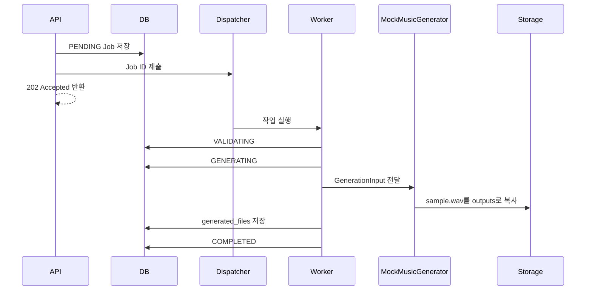

# Worker 아키텍처

> 문서 목적: Phase 1 Mock 작업 실행 구조와 확장 경계를 정의한다.
> 현재 상태: **Mock Worker 구현 완료**

현재 Dispatcher는 프로세스 내부 `ThreadPoolExecutor`를 사용하며 동시 실행 수는 `WORKER_MAX_THREADS`로 설정한다. Mock 생성기는 `MOCK_GENERATION_DELAY_SECONDS`만큼 대기한 뒤 유효한 더미 WAV를 작업 출력 경로에 복사한다. 실제 음악 생성은 수행하지 않는다.

Worker는 시작, 상태 전이, 모델/추론 시작과 종료, 완료, 예외, 처리 시간을 기록한다. 예외 발생 시 오류 코드와 메시지를 남기고 Job을 `FAILED`로 전환한다.

이 구조는 개발·테스트용 Foundation이다. 프로세스 재시작 시 대기 작업 보존, 분산 lease/heartbeat, 취소, 재시도는 제공하지 않는다. 외부 Queue와 실제 AI Adapter는 후속 단계에서 별도 설계한다.
