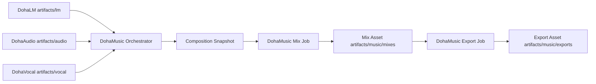

# DohaMusic Workspace Artifact 모델

> 문서 상태: [계획]
> 최종 수정일: 2026-08-10
> 관련 기능: AssetVersion 기반 Composition Snapshot, Mix, Export
> 관련 문서: [Artifact Storage 계약](artifact-storage-contract.md), [Storage Architecture](storage-architecture.md), [System Architecture](system-architecture.md), [Database Overview](../07-database/database-overview.md), [ADR-029](../11-decisions/ADR-029-dohamusic-workspace-artifact-domain.md), [ADR-032](../11-decisions/ADR-032-artifact-storage-resolver-integrity.md)

## 목적

DohaMusic은 AI Provider가 아니라 개인 AI 음악 제작 Workspace다. DohaLM·DohaAudio·DohaVocal의 Runtime 산출물과 사용자가 선택·조합해 만든 프로젝트 결과물의 저장 책임을 분리한다.

이 문서는 목표 계약을 정의한다. Asset·Snapshot 목표 Entity와 Asset Cursor·keyset Repository/Service·Resource API 5개, AssetVersion 생성·최신순 목록·상세 API 3개와 실제 사용자 DB Asset Index revision `20260808_0015`는 구현·적용했다. AssetVersion은 기존 row를 보존하고 새 번호의 row만 추가하며 PATCH·DELETE를 제공하지 않는다. Artifact ID와 물리 Payload를 1:1로 연결하는 내부 `ArtifactStorageLocation` Entity와 revision `20260809_0016`도 실제 사용자 DB에 적용했으며 Catalog row는 0개다. Catalog 조회와 local Resolver는 구현했지만 `D:/DohaArtifacts/music` 디렉터리, trusted ingestion·physical checksum·MIME 검증·Range·Artifact API 3개, Mix·Export Job과 파일 이동은 아직 구현하지 않았다.

## Workspace 흐름

```text
Lyrics Asset
  ↓
Music Asset
  ↓
Vocal Asset
  ↓
Composition Snapshot
  ↓
Mix Asset
  ↓
Export Asset
  ↓
DohaArtifacts/music
```

각 단계는 이전 결과를 덮어쓰지 않는다. Provider 결과를 Workspace AssetVersion으로 등록하고, 사용자가 선택한 버전만 Snapshot과 후속 Job의 입력이 된다.

## Provider와 Workspace 경계



- DohaLM은 가사 Provider의 모델·학습·평가·Runtime Artifact를 `lm`에 둔다.
- DohaAudio `[계획]`는 음악 생성·Instrumental·Stem·분석 Runtime Artifact를 `audio`에 둔다.
- DohaVocal `[계획]`는 AI Vocal·녹음 기술 처리·Voice Conversion·보정 Runtime Artifact를 `vocal`에 둔다.
- DohaMusic은 Provider 결과의 선택 관계, Snapshot, Mix, Preview와 Export를 `music`에 둔다.
- Provider는 서로 직접 호출하지 않고 DohaMusic Orchestrator를 통한다.

## Composition Snapshot 계약

Snapshot은 Asset의 최신값이 아니라 불변 `AssetVersion`을 참조한다. 이후 Asset에 새 버전이 추가돼도 기존 Mix와 Export가 같은 입력을 추적할 수 있어야 한다.

최소 계획 필드는 다음과 같다.

```text
lyrics_asset_version_id
music_asset_version_id
vocal_asset_version_id
stem_asset_version_ids
processing_chain
mix_settings
provider_versions
model_versions
created_at
```

Snapshot 자체는 Mix Asset이 아니다. 특정 조합과 설정을 재현하기 위한 불변 입력 계약이며, 변경할 때는 기존 Snapshot을 수정하지 않고 새 Snapshot을 만든다. 권위 있는 Snapshot 관계 데이터와 현재 선택 상태의 원장은 DB다. `DohaArtifacts/music/snapshots`에는 재현·교환·백업을 위한 직렬화 Artifact만 저장하며 이 파일을 DB 관계의 독립 원장으로 사용하지 않는다.

## Mix Asset 계약

Mix는 DohaMusic 책임이다. 선택한 Vocal·Music·Stem AssetVersion, processing chain과 mix settings를 결합하고 결과를 새 Mix AssetVersion으로 등록한다.

Mix 파일 Artifact의 목표 위치는 `D:/DohaArtifacts/music/mixes`다. Provider Runtime은 이 위치에 직접 결과를 기록하지 않는다.

## Export Asset 계약

Export는 선택한 Mix AssetVersion을 WAV·MP3·FLAC 같은 전달 형식으로 변환한다. 각 출력은 별도 Export AssetVersion과 Artifact로 추적하고 목표 위치는 `D:/DohaArtifacts/music/exports`다.

현재 구현은 Pipeline의 WAV Export만 제공하며 MP3·FLAC와 독립 Export Asset은 `[계획]`이다.

## Preview와 실행 기록

- Preview는 낮은 용량의 빠른 재생 파일, 짧은 구간과 waveform cache를 포함할 수 있다.
- Preview는 원본 Mix·Export를 대체하지 않으며 source AssetVersion과 생성 규칙을 기록한다.
- `runs`는 Mix·Export Job 실행 로그, 설정 Snapshot과 오류·시간 같은 안전한 진단 metadata를 저장한다.
- 로그에는 비밀정보, 개인 음성 내용과 로컬 절대 경로를 기록하지 않는다.

## 현재 호환 경계

현재 `PipelineExecutor`, `pipeline_jobs`, `pipeline_files`와 `AUDIO_STORAGE_ROOT`는 그대로 유지한다. 기존 `final.wav`, Preview 후보와 metadata를 즉시 이동하거나 새 Asset으로 backfill하지 않는다. [Artifact Storage 계약](artifact-storage-contract.md)의 `artifact://<artifact_id>`와 `artifact_storage_locations` Catalog Entity·Migration은 실제 사용자 DB까지 적용했다. 파일 전환은 별도 Inventory·backup·rehearsal·승인, Resolver·trusted ingestion 검증과 rollback Gate를 통과한 작업으로 수행한다.
