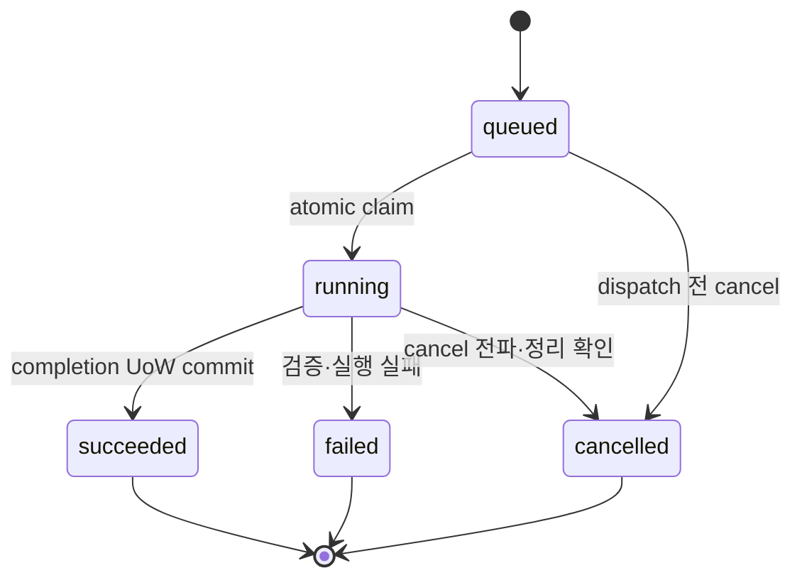

# Workspace Job Foundation 공식 계약

> 문서 상태: [완료: 계약·Job Service·Completion UoW·Worker execution foundation·Job API 5/5] / [미구현: 실제 Provider transport·background daemon]
> 최종 수정일: 2026-08-11
> 관련 기능: Workspace Job, Provider Invocation, Artifact lineage와 비동기 실행 제어
> 관련 문서: [Workspace REST API 계약](../06-api/workspace-rest-api-contract.md), [Provider API 계약](../06-api/provider-api-contract.md), [Job 상태 모델](../07-database/job-state-model.md), [Artifact Storage 계약](artifact-storage-contract.md), [ADR-033](../11-decisions/ADR-033-workspace-job-execution-boundary.md)

## 1. 목적과 현재 상태

이 문서는 Workspace `Job`, `JobInput`, `JobOutput`, `ModelUsage`의 공식 실행 계약을 고정한다. 계약은 DohaStudio Common Specification `0.1.0` / `draft-baseline`을 좁히는 DohaMusic 구현 기준이며 공통 명세의 불변 Job·Artifact·Provider 원칙과 충돌하지 않는다.

revision `20260810_0017`의 Worker Index와 실행 제어 Column 위에 atomic claim·lease·heartbeat·attempt·race-safe 만료 recovery와 단일 `run_once()` 기반을 구현했다. Provider 실행 중 heartbeat callback과 cancel marker 확인을 제공하고 성공 결과는 claim token을 전달해 Completion UoW가 확정한다. 공식 Job Router 5개는 이 Service 경계를 공개 API에 연결했다. 실제 Provider transport와 background daemon·scheduler는 아직 구현하지 않았다.

## 2. Legacy Runtime Job과 Workspace Job

| 구분 | Legacy Runtime Job | Workspace Job |
|---|---|---|
| 저장 | `generation_jobs`, `stem_jobs`, `voice_conversion_jobs`, `pipeline_jobs` | `jobs`, `job_inputs`, `job_outputs`, `model_usages` |
| 실행 | 기존 ThreadPool Worker와 `PipelineExecutor` | claim·lease 기반 단일 `run_once()` execution foundation [완료], background daemon [미구현] |
| 상태 | 기능별 대문자 상태와 Pipeline 단계 | `queued`, `running`, `succeeded`, `failed`, `cancelled` |
| 취소·재시도 | 기존 Pipeline cooperative cancel·새 Pipeline Job retry | 내부 cancellation marker·새 Job lineage·공식 action API [완료] |
| 결과 | Legacy file row와 상대 경로 | Completion UoW의 Artifact·AssetVersion·JobOutput lineage 기반 [완료], 실제 Provider transport [미구현] |

Legacy 완료 상태는 Workspace Job 완료를 의미하지 않는다. backfill·dual write·Runtime read 전환 전에는 두 체계를 혼합하거나 같은 API로 가장하지 않는다.

## 3. Aggregate와 불변 경계

```text
Job
├── JobInput[]
├── JobOutput[]
└── ModelUsage[]

CompositionSnapshot ─┐
AssetVersion ────────┼─ Job Aggregate 외부의 불변 lineage Resource
Artifact ────────────┘
```

`Job`은 실행 root다. 생성 후 요청 identity, Project·Workspace, Job type, Snapshot, 입력, Provider·Manifest 요청과 settings를 수정하지 않는다. `JobInput`은 생성 transaction에서 고정하고 `JobOutput`과 `ModelUsage`는 실행 결과로 append한다. 종료 상태에서는 History audit append 외에 입력·출력·ModelUsage·settings·상태를 변경하지 않는다.

## 4. 공식 Job type과 입출력 Matrix

현재 제품과 Compatibility Runtime에 근거가 있는 type만 허용한다. 미래 Singing Voice·Lyrics Revision·Vocal Correction type은 Provider capability와 계약이 확정된 뒤 versioned 변경으로 추가한다.

| Job type | Snapshot | 필수·선택 Input role | 실행 capability | Output role | 기본 retryable | Cancel 기대 |
|---|---|---|---|---|---|---|
| `lyrics_generation` | 선택 | 없음. 공개 prompt는 bounded settings에 저장 | `lyrics_generation` | `lyrics` | `false` | cooperative |
| `music_generation` | 선택 | `lyrics` 선택 | `music_generation` | `generated_audio` | `false` | cooperative |
| `stem_separation` | 선택 | `source_audio` 필수 | `stem_separation` | `vocal_stem`, `instrumental_stem` | `false` | cooperative |
| `voice_conversion` | 선택 | `source_vocal`, `voice_reference` 필수 | `voice_conversion` | `converted_vocal` | `false` | cooperative |
| `audio_analysis` | 선택 | `source_audio` 필수 | DohaMusic `audio_analysis` | `analysis` | `false` | 단계 경계 cooperative |
| `mix` | 필수 | `vocal`, `instrumental` 필수, `stem` 선택 | DohaMusic `mix` | `mix` | `false` | 단계 경계 cooperative |
| `export` | 필수 | `mix` 필수 | DohaMusic `export` | `export` | `false` | 단계 경계 cooperative |

`music_generation`은 prompt-only Instrumental을 지원하므로 Snapshot을 강제하지 않는다. Snapshot을 제공한 Job은 입력 role이 가리키는 Asset lineage가 Snapshot의 exact AssetVersion과 일치해야 한다. `mix`와 `export`는 최종 Workspace 조합과 설정을 재현해야 하므로 Snapshot이 필수다.

## 5. JobInput과 Artifact 선택

`job_inputs.input_role`을 source revision `20260810_0017`에서 nullable staging Column으로 추가했다. 기존 row에 의미 없는 role을 추측해 채우지 않으며 Job 생성 계약과 향후 명시적 검증·backfill 이후 `NOT NULL` 전환을 별도 검토한다. 허용 role은 Job type matrix로 제한하며 자유 문자열을 Provider에 그대로 전달하지 않는다.

현재 `asset_version_id XOR artifact_id` 규칙은 유지한다.

- 실제 bytes 또는 직렬화 Payload를 소비하는 입력은 명시적 `artifact_id`가 authoritative하다.
- `asset_version_id`는 물리 Payload 선택이 필요 없는 논리 입력에만 허용한다.
- `AssetVersion → latest Artifact`, 첫 Artifact 또는 임의 Artifact 자동 선택을 금지한다.
- Artifact는 요청 Project의 Workspace 또는 허용된 Owner-global Asset에 속하고, 제공된 Snapshot lineage와 모순되지 않아야 한다.
- CompositionSnapshot은 논리 조합을 고정하고 JobInput은 실제 실행 Payload를 고정한다.

## 6. JobOutput과 lineage

`job_outputs.output_role`을 source revision `20260810_0017`에서 nullable staging Column으로 추가했다. 기존 row에 의미 없는 role을 추측해 채우지 않으며 Job 완료 계약과 향후 명시적 검증·backfill 이후 `NOT NULL` 전환을 별도 검토한다. 현재 type의 생성 결과는 직렬화된 분석 결과를 포함해 Artifact를 canonical output으로 사용한다. Artifact가 새 AssetVersion에 속하므로 `Artifact → AssetVersion`으로 두 lineage를 함께 확인한다.

`asset_version_id XOR artifact_id` 규칙은 유지하되 현재 Matrix의 물리 출력은 `artifact_id`를 사용한다. 향후 Payload 없는 논리 출력만 `asset_version_id`를 사용할 수 있다. Provider가 Workspace AssetVersion·Artifact·Selection을 직접 만들거나 변경하지 않는다.

## 7. 공개 상태와 내부 실행 제어

공개 상태는 다음 5개만 사용한다.



`cancel_requested`는 공개 상태로 추가하지 않는다. source revision `20260810_0017`에서 내부 `cancel_requested_at`을 추가했다. 실행 중 cancel 요청 동안 public status는 `running`을 유지하고 Worker·Provider 전파와 결과 정리를 확인한 후에만 `cancelled`로 전이한다.

- `queued` cancel은 claim되지 않았음을 조건부 갱신으로 확인한 경우 즉시 `cancelled`다.
- 이미 `cancelled`인 Job의 반복 cancel은 같은 결과를 반환한다.
- `succeeded`·`failed` cancel은 `409 JOB_NOT_CANCELLABLE`이다.
- completion UoW commit 전 확인된 cancel이 우선한다. 이미 `succeeded` commit이 끝난 뒤에는 cancel할 수 없다.
- Provider가 cancel을 지원하지 않으면 결과를 정상 Artifact로 등록하지 않고 staging 제거 또는 quarantine 처리한다.

## 8. Retry와 Idempotency

Retry는 원본 상태를 되돌리지 않고 항상 새 `Job`을 만들며 `retry_of_job_id`로 실패·취소 원본을 가리킨다. Snapshot, ordered input, Job type, settings와 Provider·Manifest 요청은 기본적으로 frozen copy한다. 공개 retry 요청은 변경 body를 받지 않는다. 변경이 필요하면 일반 Job 생성으로 명시한다.

- `POST /api/v1/jobs`와 `POST /api/v1/jobs/{job_id}/retry`에는 `Idempotency-Key`가 필수다.
- create fingerprint는 effective owner·Workspace·Project·Job type·Snapshot·role/order로 정규화한 입력·Provider·Manifest·bounded settings를 포함한다.
- retry fingerprint는 owner·원본 Job·고정된 retry request를 포함한다.
- 같은 key와 fingerprint는 같은 Job을 반환하고 다른 fingerprint는 conflict다.
- distinct key를 사용한 동일 원본의 여러 수동 retry는 허용한다.
- cancel은 상태 전이 자체가 idempotent하므로 별도 idempotency record를 요구하지 않는다.

기존 `idempotency_records`를 재사용한다. Provider invocation key는 Workspace `job_id`에서 결정하며 전달 위치는 versioned Provider schema를 따른다. DohaVocal `0.1.0`은 body `idempotency_key`가 필수이므로 해당 Consumer Adapter가 body에 전달한다. 같은 key·fingerprint는 같은 Provider 실행을 반환해야 하며 Provider별 전달 위치를 동시에 두 곳에 중복하지 않는다.

## 9. Owner·Workspace·Collection 계약

Job의 접근 scope는 `Job → Project → Workspace → owner_id`다. 공개 `requested_by`, `owner_id` 입력과 owner filter를 금지하고 effective actor에서 파생한다. 다른 Owner의 Job은 `404 JOB_NOT_FOUND`로 존재를 숨긴다.

Workspace 전체 Job 목록을 공식 Collection으로 채택하고 `project_id`, `status`, `job_type`만 선택 filter로 허용한다. `project_id`는 필수가 아니다. revision `20260810_0017`에서 `jobs.workspace_id`를 추가하고 실제 사용자 DB에 적용했다. 적용 당시 기존 Job은 0건이어서 backfill 영향은 없었다. 기존 SQLite row와 하위 FK를 보존하기 위해 DB Column은 nullable staging으로 두지만 새 Job 생성은 항상 값을 기록하며 논리 계약은 필수·불변이다. Project·Workspace 일치는 Service가 검증하고 의미 기반 운영 검증 뒤 `NOT NULL` 전환을 별도 검토한다.

정렬은 `created_at DESC, job_id DESC`다. HMAC Cursor resource `job`을 구현했으며 payload는 `v=1`, resource, direction, sort, last created time, last ID, limit과 filter hash를 포함한다. fingerprint에는 effective owner, Workspace, 선택 Project·status·job type과 sort가 포함된다. Repository는 Workspace join으로 owner scope를 강제하고 Service는 `limit + 1` page와 다른 scope·filter의 Cursor 재사용 거부를 담당한다. 기존 offset 조회는 호환성을 위해 유지한다.

임시 SQLite 10,000 Job fixture와 `EXPLAIN QUERY PLAN`으로 다음 공개 목록 Index를 확정했다.

- `(workspace_id, created_at DESC, job_id DESC)`
- `(workspace_id, project_id, created_at DESC, job_id DESC)`
- `(workspace_id, status, created_at DESC, job_id DESC)`
- `(workspace_id, job_type, created_at DESC, job_id DESC)`

지원 Query에서 full scan과 `TEMP B-TREE`가 없어야 한다. 무제한 복합 filter용 Index를 추측해 추가하지 않는다.

Worker 기반에는 `ix_jobs_claim_queue(status, cancel_requested_at, created_at, job_id)`와 `ix_jobs_lease_recovery(status, lease_expires_at, job_id)`를 추가했다. atomic claim·lease·heartbeat·만료 recovery와 상태 전이는 구현했으며 실제 Provider transport와 지속 실행 daemon은 후속 범위다.

## 10. Provider request와 result

```text
Workspace Job
→ Provider Invocation
→ Provider Result
→ Trusted Ingestion
→ Artifact·Catalog
→ 필요한 새 AssetVersion
→ JobOutput·ModelUsage
→ Workspace Job succeeded
```

DohaMusic만 Provider를 호출하고 Provider 간 직접 호출을 금지한다. Provider request는 Workspace Job ID, capability, Provider contract version, exact Artifact ID, Manifest ID와 bounded settings만 전달하며 경로·비밀정보·동의 증적 원문을 포함하지 않는다.

Provider의 `success`는 Provider-side 생성 완료다. Workspace `succeeded`는 DohaMusic의 무결성 검증·publish·lineage 등록과 DB commit까지 완료됐음을 의미한다.

## 11. Completion Unit of Work와 부분 출력

완료 순서는 다음과 같다.

1. Provider 결과 수신
2. staging Payload와 예상 output role 수 검증
3. authoritative SHA-256·size·MIME 계산
4. overwrite 없는 immutable publish
5. 필요한 새 AssetVersion 준비
6. Artifact·Catalog·JobOutput·ModelUsage를 하나의 DB transaction에 등록
7. final integrity와 cancel marker 재확인
8. 같은 transaction에서 Job을 `succeeded`로 전이

Filesystem과 DB는 하나의 transaction이 될 수 없으므로 기존 Trusted Ingestion 보상 패턴을 재사용한다. DB commit 실패 시 이번 invocation이 만든 payload만 identity를 재확인해 제거한다. 제거 실패는 orphan reconciliation signal을 남긴다.

필수 output 중 일부만 성공하면 Job은 `failed`다. 부분 Payload는 정상 사용자 Artifact로 공개하지 않고 internal staging에서 제거하거나 `quarantined`로 격리한다. 자동 overwrite·자동 restore·기존 Artifact 삭제는 하지 않는다.

현재 구현은 bounded `ProviderResult`·`ProviderOutput` DTO를 사용하고 raw Provider response와 secret을 받지 않는다. output role별 Artifact kind와 storage domain을 서버가 고정하며 caller checksum·size를 authoritative 값으로 받지 않는다. Trusted ingestion의 prepare/register/verify primitive를 Completion Service의 단일 transaction에 결합하고, publish 뒤 DB rollback·commit 실패에는 이번 실행의 inode만 identity 확인 후 제거한다. 동일 `succeeded` 결과는 실제 staging bytes의 checksum·size·MIME와 기존 Artifact·AssetVersion·ModelUsage를 비교해 replay하며 다른 결과는 fail-closed conflict다.

## 12. ModelUsage와 재현성

Job의 `model_manifest_id`는 요청값이며 `ModelUsage`는 Provider가 확인한 실제 실행값이다. 실제 Provider, model, version, checkpoint, Manifest, contract version, license와 commercial status를 완료 transaction에 기록한다.

현재 ModelUsage Column은 유지한다. Seed, adapter와 inference config는 schema version이 있는 bounded `Job.settings_snapshot`에 저장하고 비밀 prompt/context는 분리한다. nullable unique 의미는 구현 테스트로 검증하되 이번 계약에서 ModelUsage Migration은 요구하지 않는다.

## 13. Worker claim·lease·heartbeat와 crash recovery

source revision `20260810_0017`에서 `claim_token`, 길이 128의 `claimed_by`, `lease_expires_at`, `heartbeat_at`, 음수가 아닌 `attempt`를 Job에 추가했다. 아래 Worker execution foundation을 구현했지만 운영 daemon·scheduler는 아직 구현하지 않았다.

- Worker는 `queued`이고 취소 요청이 없는 Job 하나를 조건부 atomic update로 claim한다.
- claim 성공 Worker만 `queued → running`할 수 있다.
- 실행 Worker는 lease를 소유하고 heartbeat로 연장한다.
- 같은 Job을 두 Worker가 동시에 실행할 수 없다.
- `attempt`는 같은 immutable Job의 dispatch·Provider invocation 시도이고 공개 retry와 다르다.
- 같은 Job attempt는 Provider idempotency가 중복 side effect를 방지할 수 있을 때만 허용한다.
- running lease가 만료되면 원본을 무조건 queued로 되돌리지 않는다. `WORKER_LEASE_EXPIRED`, retryable `true`로 `failed` 처리하고 새 실행은 명시적 retry Job으로 남긴다.

## 14. Progress·오류·감사

Progress는 0~100이며 단조 증가한다. terminal commit 전 100을 강제하지 않고 100 자체가 성공을 의미하지 않는다. Provider progress는 clamp·normalize하며 `stage`는 allowlist 또는 길이가 제한된 안전한 문자열이다.

오류에는 code, 안전한 public message, retryable과 opaque details reference만 저장한다. Stack trace, PID, command, 절대 경로, CUDA·model·Dataset 경로, credential과 Provider 원문 응답은 공개하거나 영속화하지 않는다.

상태·claim·cancel·retry·Provider 결과의 durable audit는 Generative AI Track OPEN 조건이다. 기존 append-only `History`를 사용하고 공개 History API는 이번 Foundation의 필수 범위로 두지 않는다.

## 15. 공식 API와 완료 Gate

JobInput·JobOutput 독립 Endpoint는 제공하지 않는다.

| Method | Path | 상태 |
|---|---|---|
| `GET` | `/api/v1/jobs` | [완료] |
| `POST` | `/api/v1/jobs` | [완료] |
| `GET` | `/api/v1/jobs/{job_id}` | [완료] |
| `POST` | `/api/v1/jobs/{job_id}/cancel` | [완료] |
| `POST` | `/api/v1/jobs/{job_id}/retry` | [완료] |

현재 구현·검증 기준 Resource API는 30/64이며 Job API는 5/5다. 이 Draft PR이 develop에 병합되기 전에는 완료 Gate를 통과한 것으로 선언하지 않는다.

Backend Foundation Complete는 Asset·AssetVersion·Artifact·CompositionSnapshot에 더해 이 문서의 role·Artifact 선택·owner scope·Cursor/Index·idempotency·상태·cancel·retry·claim/lease·crash recovery·Provider 경계·completion UoW와 공식 Job API 5개가 모두 구현·검증·병합된 때만 선언한다.

이 Draft PR 병합 전에는 Generative AI Track을 OPEN으로 표시하지 않는다. 병합 뒤 문서·Actions Gate가 유지되면 Backend Foundation Complete와 Generative AI Track OPEN 전환을 별도 확인한다. 실제 Provider transport나 background daemon 완료를 뜻하지 않는다.

## 16. source Migration과 남은 범위

additive source revision `20260810_0017`에서 다음을 구현했다.

- `jobs.workspace_id`
- `jobs.cancel_requested_at`
- `jobs.claim_token`
- `jobs.claimed_by`
- `jobs.lease_expires_at`
- `jobs.heartbeat_at`
- `jobs.attempt`
- `job_inputs.input_role`
- `job_outputs.output_role`
- 검증된 Workspace·Project·status·job type keyset Index 4개
- claim queue·lease recovery Index 2개

`jobs.workspace_id`, `job_inputs.input_role`, `job_outputs.output_role`은 nullable staging이다. Worker execution foundation과 공식 API 5개는 구현했지만 실제 DohaLM·DohaAudio·DohaVocal transport와 background daemon·scheduler는 아직 구현하지 않았다.
