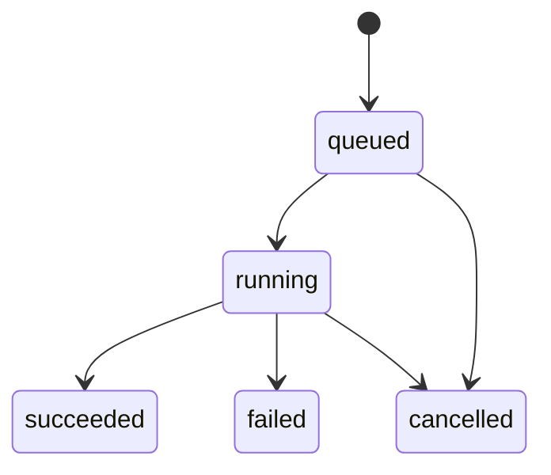

# Workspace Service와 Transaction 경계

> 문서 상태: [진행 중]
> 최종 수정일: 2026-08-24
> 관련 기능: Workspace Application Service
> 관련 문서: [Backend Architecture](backend-architecture.md), [데이터베이스 재설계](../07-database/database-redesign-overview.md), [Workspace REST API 계약](../06-api/workspace-rest-api-contract.md)

## 1. 목적

Workspace Entity 23개를 사용하는 Application Use Case와 transaction 경계를 정의한다. 기존 Runtime Repository·Service·API는 변경하지 않는다.

## 2. Service 구성

| Service | 조합하는 Repository | 주요 책임 |
|---|---|---|
| `WorkspaceService` | Workspace·Asset | Workspace·Project와 ProjectAsset N:M 연결 |
| `AssetService` | Asset·Workspace·Composition | Asset Metadata, 불변 Version, Artifact Metadata와 관계 |
| `CompositionService` | Composition·Workspace·Asset | 불변 Snapshot과 Processing Chain |
| `JobService` | Job·Workspace·Asset·Composition | 독립 Job 요청, 입출력, 상태와 ModelUsage |
| `CollaborationService` | Collaboration·Workspace·Asset | Tag·Comment·Favorite·History·Approval·Enrollment |

23개 Entity마다 Service를 만들지 않고 변경의 원자성과 Aggregate 경계를 기준으로 Service를 구성한다. Provider Job binding은 별도 persistence Service가 transaction을 소유한다.

## 3. Transaction 정책

```text
Service method
→ session_factory()
→ session.begin()
→ 같은 Session으로 Repository 구성
→ 검증·add·flush·상태 변경
→ 성공 시 commit
→ 예외 시 자동 rollback
```

- 변경 Use Case 하나가 transaction 하나를 소유한다.
- Repository는 `commit`과 `rollback`을 호출하지 않는다.
- 조회 Use Case는 transaction commit을 만들지 않는다.
- 활성 Session을 Service 외부에 노출하지 않는다.
- `expire_on_commit=False`를 사용하되 미로딩 relationship 사용을 반환 계약으로 보장하지 않는다.
- Provider 호출, Worker dispatch와 파일 I/O를 DB transaction 안에서 실행하지 않는다.

## 4. Unit of Work 판단

범용 Unit of Work Framework는 도입하지 않았다. 현재 하나의 동기 SQLAlchemy Session과 Database만 사용하며 분산 transaction과 Message Broker transaction이 없다. 별도 추상화 없이 Service 메서드가 경계를 소유하는 편이 더 명확하다.

다음 조건이 생기면 추출을 재검토한다.

- 두 개 이상 Database의 원자적 조정
- Message Broker publish와 DB write의 일관성 계약
- Service 전반에서 반복되는 transaction 정책의 독립 교체 필요
- 테스트 가능한 transaction port가 실제로 필요한 경우

## 5. Application 오류

| 오류 | 의미 | 향후 API 연결 후보 |
|---|---|---|
| `ResourceNotFoundError` | 활성 Resource 없음 | `RESOURCE_NOT_FOUND` |
| `ResourceConflictError` | Unique·중복·현재 상태 충돌 | `RESOURCE_CONFLICT` |
| `ApplicationValidationError` | 입력·Workspace 범위·참조 계약 위반 | `VALIDATION_ERROR` |
| `InvalidStateError` | 허용되지 않은 lifecycle 전이 | `INVALID_STATE` |

Service는 `HTTPException`을 발생시키지 않고 DB Constraint·Table 이름과 내부 경로를 메시지에 노출하지 않는다.

## 6. 불변성과 관계

- `AssetVersion`과 `CompositionSnapshot` 수정 메서드를 제공하지 않는다.
- Snapshot은 호출자가 전달한 정확한 `asset_version_id`만 사용한다.
- `Asset`에 `project_id`를 추가하지 않고 `ProjectAsset` N:M을 사용한다.
- Artifact는 Metadata만 등록하며 실제 파일이나 Storage URI를 해석하지 않는다.
- AssetRelation 자기 관계와 같은 방향·유형의 중복 관계를 거부한다.
- Approval은 상태를 UPDATE하지 않고 새 불변 판단 이벤트를 추가한다.

## 7. Soft Delete Unique 복구

`ProjectAsset`, `Tag`, `Favorite`는 Soft Delete 후에도 Unique row가 남는다. 같은 논리 식별자가 다시 요청되면 새 row를 insert하지 않고 기존 row의 `deleted_at`을 `None`으로 복구한다.

- `ProjectAsset`: `project_id + asset_id`, 역할과 표시 순서를 현재 요청으로 갱신
- `Tag`: `asset_id + name`, 생성 ID·생성자·생성 시각 보존
- `Favorite`: `workspace_id + asset_id`, 기존 식별자 보존

DB Partial Unique Index와 Migration은 변경하지 않는다. 복구 행위의 History 자동 기록은 backfill·API 정책과 함께 후속 구현한다.

## 8. Job 상태 전이



`succeeded`, `failed`, `cancelled`는 종료 상태다. `succeeded`는 `complete_job_with_outputs`에서 JobOutput 등록과 같은 transaction으로만 확정한다. Provider terminal success와 metadata-only Result는 이 조건을 충족하지 않으며 payload reconciliation 동안 public status는 `running`이다. Retry는 기존 Job 상태를 되돌리지 않고 새 Job을 생성한다. Provider 실행과 Worker dispatch는 이번 계층의 책임이 아니며 상세 경계는 [DohaVocal Worker Reconciliation Contract](dohavocal-worker-reconciliation-contract.md)를 따른다.

## 9. 현재 제외 범위

- Workspace REST API와 Pydantic Schema
- App Factory와 API dependency 등록
- Frontend
- Provider 호출과 Worker dispatch
- 실제 사용자 DB row 생성
- backfill·dual write와 Runtime source of truth 전환
- Legacy Runtime Table·Repository·Service 제거
