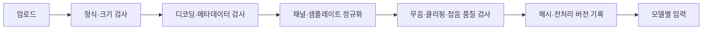

# 전처리 파이프라인

> 문서 목적: 오디오 검증부터 모델 입력 생성까지 재현 가능한 단계를 정의한다.
> 현재 상태: **설계 초안 / 실행 전**

```mermaid
flowchart LR
  U[업로드] --> F[형식·크기 검사]
  F --> D[디코딩·메타데이터 검사]
  D --> N[채널·샘플레이트 정규화]
  N --> Q[무음·클리핑·잡음 품질 검사]
  Q --> H[해시·전처리 버전 기록]
  H --> O[모델별 입력]
```

원본은 불변으로 유지하고 전처리 산출물은 새 파일로 만든다. 단계별 도구·버전·설정을 기록하며 실패 파일을 학습이나 추론에 전달하지 않는다.
