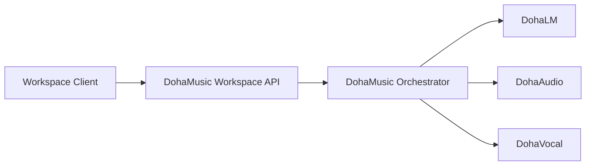

# DohaMusic Provider API 계약

> 문서 상태: [부분 구현]
> 최종 수정일: 2026-08-19
> 관련 기능: DohaMusic Workspace Job Orchestrator와 DohaLM·DohaAudio·DohaVocal Provider 연결
> 구현 상태: DohaVocal `0.1.0` Consumer Client·DTO·fake transport contract test 구현, Production HTTP transport 미구현
> 관련 문서: [Workspace API 계약](workspace-rest-api-contract.md), [Endpoint 목록](workspace-rest-api-endpoints.md), [AI Pipeline](../03-architecture/ai-pipeline.md)

## 1. 목적

Provider API는 DohaMusic Workspace·Job Orchestrator가 DohaLM, DohaAudio와 DohaVocal의 기능을 호출하는 내부 계약입니다. Workspace client용 Job API와 Provider Runtime transport를 분리합니다. Legacy `PipelineExecutor`는 호환 Workflow이며 Workspace Job Foundation 완료를 의미하지 않습니다.



- Workspace client는 `POST /api/v1/jobs`만 호출합니다.
- Orchestrator만 `/api/v1/providers/{provider_id}/jobs`를 호출합니다.
- Provider끼리는 직접 호출하지 않습니다.
- Provider Runtime의 내부 framework·model endpoint를 Workspace API로 그대로 노출하지 않습니다.
- Provider 결과의 결합, Selection, Approval, Workspace 권한과 GPU admission control은 DohaMusic 책임입니다.

## 2. Provider 식별자와 책임

| `provider_id` | 책임 | 상태 |
|---|---|---|
| `lm` | Lyrics generation·revision·analysis | DohaLM 계약에 따라 [계획] |
| `audio` | Music generation·Stem separation·Audio analysis | DohaAudio Runtime API [계획] |
| `vocal` | Singing voice·Voice conversion·Vocal correction·analysis | Fake Runtime·DohaMusic Consumer Contract·HTTP Transport Foundation [구현], 실제 model·Worker wiring·인증 [미구현] |

Provider는 Workspace Entity가 아닙니다. Provider identity와 capability는 Provider Contract와 Model Manifest에서 관리합니다.

## 3. 공통 기능과 REST 매핑

| Common 기능 | REST Method·Path |
|---|---|
| `GetCapabilities` | `GET /api/v1/providers/{provider_id}/capabilities` |
| `CreateJob` | `POST /api/v1/providers/{provider_id}/jobs` |
| `GetJobStatus` | `GET /api/v1/providers/{provider_id}/jobs/{job_id}` |
| `CancelJob` | `POST /api/v1/providers/{provider_id}/jobs/{job_id}/cancel` |
| `RetryJob` | `POST /api/v1/providers/{provider_id}/jobs/{job_id}/retry` |
| `GetResult` | `GET /api/v1/providers/{provider_id}/jobs/{job_id}/result` |
| `GetModelManifest` | `GET /api/v1/providers/{provider_id}/model-manifests/{model_manifest_id}` |
| `Health` | `GET /api/v1/providers/{provider_id}/health` |
| `Readiness` | `GET /api/v1/providers/{provider_id}/readiness` |

HTTP는 장기 transport 방향이며 현재 ACE-Step·Demucs·Seed-VC Local Runner와 Subprocess Adapter는 Legacy 호환 계층입니다. 구현 전까지 이 문서를 실제 HTTP Endpoint가 존재하는 것으로 해석하지 않습니다.

## 4. Capability Response

```json
{
  "data": {
    "provider_id": "audio",
    "api_contract_versions": ["1.0"],
    "capabilities": ["music_generation", "stem_separation"],
    "input_formats": ["application/json", "audio/wav"],
    "output_formats": ["audio/wav", "application/json"],
    "model_manifest_ids": ["opaque-manifest-id"],
    "ready": false
  },
  "request_id": "opaque-request-id"
}
```

- Capability 목록은 실제 구현·Model Manifest와 일치해야 합니다.
- 미구현 기능을 capability로 광고하지 않습니다.
- `ready=false`는 Health가 정상이어도 새 Job을 받지 못함을 의미할 수 있습니다.
- VRAM, License와 Commercial Status를 측정·검토 없이 승인 상태로 반환하지 않습니다.

## 5. CreateJob Request

```http
Idempotency-Key: job:<workspace-job-id>
```

```json
{
  "job_id": "doha-music-issued-job-id",
  "provider_id": "audio",
  "capability": "music_generation",
  "api_contract_version": "1.0",
  "project_id": "opaque-project-id",
  "inputs": [
    {
      "input_role": "lyrics",
      "artifact_id": "opaque-artifact-id"
    }
  ],
  "model_manifest_id": "opaque-manifest-id",
  "settings_snapshot": {}
}
```

### 5.1 입력 규칙

- DohaMusic이 먼저 Workspace Job ID를 발급하고 같은 `job_id`로 Provider 실행을 추적합니다.
- transport idempotency 전달 위치는 versioned Provider request schema의 단일 source를 따릅니다. DohaVocal `0.1.0`은 body `idempotency_key`를 사용합니다.
- Provider가 Workspace DB의 Asset, Version, Snapshot과 Approval을 직접 조회·수정하지 않습니다.
- 입력 Artifact는 Provider가 허용된 Artifact resolver를 통해 읽을 수 있는 opaque ID 또는 승인된 URI로 전달합니다.
- byte-level 입력은 role과 exact Artifact ID를 함께 전달하며 AssetVersion에서 latest/first Artifact를 자동 선택하지 않습니다.
- 로컬 절대 경로, 사용자 profile 경로, token, 개인 연락처와 불필요한 원문을 전달하지 않습니다.
- `settings_snapshot`은 capability별 versioned allowlist Schema를 사용합니다.
- GPU admission을 통과하지 못한 요청은 Provider에 전달하지 않고 DohaMusic Job을 `queued`로 유지합니다.

## 6. Provider Job Response

```json
{
  "data": {
    "job_id": "doha-music-issued-job-id",
    "status": "queued",
    "progress_percent": 0,
    "stage": "queued",
    "provider_id": "audio",
    "api_contract_version": "1.0",
    "model_manifest_id": "opaque-manifest-id",
    "outputs": [],
    "error": null,
    "created_at": "2026-08-05T00:00:00Z",
    "started_at": null,
    "completed_at": null
  },
  "request_id": "opaque-request-id"
}
```

상태는 `queued`, `running`, `succeeded`, `failed`, `cancelled`만 공통으로 사용합니다. Provider 내부 stage는 `stage`로 표현하고 Workspace Job 상태 enum을 확장하지 않습니다.

Provider `succeeded`는 Runtime 출력 생성 완료를 의미합니다. DohaMusic은 Artifact checksum, format, 권한과 계약을 검증한 뒤에만 Workspace Job을 `succeeded`로 확정하고 새 AssetVersion을 등록합니다.

## 7. Result Response

```json
{
  "data": {
    "job_id": "doha-music-issued-job-id",
    "status": "succeeded",
    "provider_id": "audio",
    "api_contract_version": "1.0",
    "outputs": [
      {
        "output_role": "generated_audio",
        "provider_artifact_id": "opaque-provider-artifact-id"
      }
    ],
    "version_metadata": {
      "version_origin": "ai_generated",
      "source_asset_version_ids": ["opaque-version-id"],
      "processing_chain_id": null,
      "settings_snapshot": {}
    },
    "model_manifest_id": "opaque-manifest-id"
  },
  "request_id": "opaque-request-id"
}
```

- Provider는 Workspace `asset_version_id`를 임의로 발급하거나 Selection을 변경하지 않습니다.
- `provider_artifact_id`는 Provider-side opaque handoff 식별자이며 DohaMusic Workspace `artifact_id`가 아닙니다. DohaMusic trusted ingestion이 실제 Payload를 검증하고 새 Workspace Artifact ID를 발급합니다.
- `version_metadata`는 DohaMusic이 새 AssetVersion을 만들기 위한 검증 입력입니다.
- 결과에 파일 경로를 포함하지 않습니다.
- 실패·취소 Job의 부분 출력은 성공 Artifact로 등록하지 않습니다.

## 8. Cancel과 Retry

- Cancel은 cooperative 요청일 수 있으며 접수와 최종 `cancelled`를 구분합니다.
- Provider가 안전한 즉시 중단을 지원하지 않으면 현재 stage 완료 후 취소할 수 있습니다.
- Retry는 기존 Job 상태를 초기화하지 않고 새 Workspace `job_id`를 발급합니다.
- 새 Job은 `retry_of_job_id`로 원본을 연결하고 원본 오류·입력·Model Manifest를 보존합니다.
- Retry의 Model·설정 변경은 암묵적으로 수행하지 않고 새 요청에 명시합니다.
- Idempotency replay는 같은 retry Job을 반환합니다.

## 9. Model Manifest

Provider Model Manifest Response는 Common Specification 최소 항목을 포함합니다.

- `provider_id`
- `model_id`, `model_version`, `checkpoint_version`
- `model_type`, `capabilities`
- `input_formats`, `output_formats`
- `api_contract_version`
- `dataset_manifest_id`, `training_run_id`, `evaluation_result_id`
- `license_status`, `commercial_usage_status`
- `recommended_vram`, `runtime_environment`
- `artifact_checksum`, `created_at`

Manifest에 로컬 경로를 포함하지 않습니다. 확인되지 않은 License·Commercial·VRAM은 `UNKNOWN`, `REVIEW_REQUIRED` 또는 `null`을 사용하며 성공·승인으로 추정하지 않습니다.

## 10. Provider Error

```json
{
  "error": {
    "error_code": "PROVIDER_NOT_READY",
    "message": "Provider가 새 Job을 수락할 준비가 되지 않았습니다.",
    "details": [],
    "request_id": "opaque-request-id"
  }
}
```

Provider Error는 최소 다음 의미를 구분합니다.

- 지원하지 않는 capability 또는 contract version
- Model Manifest 없음·불일치
- 입력 Artifact 없음·권한·checksum·format 실패
- Provider not ready·dependency 없음
- GPU admission 거부 또는 자원 부족
- timeout·cancel·retry 불가
- 안전한 일반 추론 실패

Provider 내부 stack trace, command, PID, CUDA path, model path와 Dataset 내용을 외부 응답에 포함하지 않습니다.

## 11. Versioning과 Idempotency

- Workspace API path의 `v1`과 Provider `api_contract_version`은 별도입니다.
- Provider는 capability response에 지원 contract version을 명시합니다.
- 호환되지 않는 요청은 `409 PROVIDER_CONTRACT_VERSION_UNSUPPORTED`로 거부합니다.
- field 삭제·의미 변경은 새 Provider major contract version에서 수행합니다.
- Idempotency 전달 위치는 versioned Provider request schema를 따릅니다. DohaVocal `0.1.0`은 body `idempotency_key`가 필수이므로 Consumer Adapter가 body에 전달합니다. 새 transport가 header를 사용할 경우 Provider contract version과 schema에서 한 source를 명시하고 drift test를 함께 갱신합니다.
- Provider는 같은 key·fingerprint에 같은 `job_id`를 반환합니다.

## 12. 접근 제어

- Frontend와 일반 Workspace client는 Provider API를 직접 호출하지 않습니다.
- Orchestrator service identity 또는 동등한 내부 권한이 필요합니다.
- 단일 사용자 개발 환경에서도 Provider API를 공개 CORS surface로 간주하지 않습니다.
- Provider 호출 Metadata는 최소화하며 개인 음성·Consent·상업 승인 원문을 전달하지 않습니다.
- Provider 결과는 DohaMusic의 Workspace 권한과 Approval을 자동 획득하지 않습니다.

## 13. 미확정 사항

- 실제 HTTP namespace를 Workspace API process 안에 둘지 독립 network에 둘지
- Local Subprocess Adapter와 HTTP Provider의 동일 contract adapter 위치
- Artifact ID resolver와 승인된 URI 형식
- Provider Job callback, polling 또는 event stream 선택
- cancel 접수 상태를 공통 상태 밖 `stage`로만 표현할지 contract 확장할지
- Provider service authentication과 key rotation
- Health·Readiness timeout, circuit breaker와 retry 정책
- Provider invocation key의 rotation·retention과 감사 보존 기간
