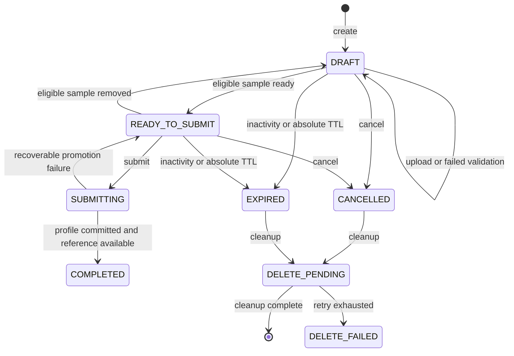

# Guided Voice Enrollment API

> 문서 상태: [진행 중] Backend·Frontend 구현 완료, 운영 후속 미구현
> 최종 수정일: 2026-08-01
> 관련 기능: F6 Guided Voice Enrollment
> 관련 문서: [현재 음성 프로필 API](audio-api.md), [Voice Enrollment 요구사항](../02-requirements/voice-enrollment-requirements.md), [데이터 모델](../07-database/voice-enrollment-data-model.md), [ADR-024](../11-decisions/ADR-024-browser-voice-recording-server-normalization.md), [ADR-025](../11-decisions/ADR-025-voice-profile-multiple-samples-reference.md), [ADR-026](../11-decisions/ADR-026-voice-enrollment-lifecycle-cleanup.md)
> 구현 상태: `/api/voice-enrollments` 7개 endpoint, 동기 정규화·검증, 임시 Storage·Profile 승격, lazy expiration과 create·upload·submit idempotency 및 Frontend Wizard 연결을 구현했다. Windows와 CI에서 실제 FFmpeg WebM/Ogg 정규화를 검증한다. 주기적 scanner·cleanup scheduler, durable Queue와 인증·소유권은 미구현이다.

## 1. 기존 API와 Enrollment API의 경계

기존 Voice Profile API는 그대로 유지한다.

```text
POST   /api/voice-profiles/upload
POST   /api/voice-profiles
GET    /api/voice-profiles
GET    /api/voice-profiles/{profile_id}
DELETE /api/voice-profiles/{profile_id}
```

기존 upload는 단일 PCM16 WAV를 검증하고 즉시 `READY` Profile을 만든다. 신규 Enrollment API는 WAV/WebM/Ogg 정규화, 최대 10개 sample, 제출 전 draft와 cleanup을 위한 별도 aggregate다. 명시적 submit 전에는 `VoiceProfile`을 만들지 않는다.

기본 prefix와 오류 envelope는 기존 `/api`와 `{"error":{"code","message"}}`를 유지한다. 공개 DTO와 일반 로그에 원본 binary, 내부 Storage key·root·path, command, stack trace와 raw decoder stderr를 포함하지 않는다.

## 2. 공통 계약

| 항목 | 제안 |
|---|---|
| 인증·소유권 | 현재 로컬 단일 사용자 한정. opaque ID는 인가 수단이 아니다. 공개 운영 전 인증·소유권·rate limit은 `[Phase 9 선행]` |
| ID | 모든 Enrollment·Sample·Profile ID는 server-generated opaque UUID |
| upload | `multipart/form-data`; binary를 JSON·Web Storage에 넣지 않음 |
| idempotency | create·sample upload·submit에 `Idempotency-Key` 필수. 128자 이하 opaque 값, endpoint+Enrollment scope |
| fingerprint | method, canonical path, 안전한 request field와 upload SHA-256. 원본 filename·binary는 기록하지 않음 |
| 처리 | 로컬 MVP는 정규화·검증·promotion을 threadpool에서 동기 완료하고 upload·submit은 `201`, 삭제·취소는 `200`을 반환한다. 별도 Job은 만들지 않는다. |
| caching | 개인 음성 metadata 응답은 `Cache-Control: private, no-store` |
| ownership | 모든 child 접근은 parent Enrollment ownership을 다시 확인. 현재는 local single-user 제한을 응답 문서에 명시 |
| 만료 | 성공 mutation 후 24시간 sliding, 생성 후 절대 7일. GET/polling은 연장하지 않음 |
| 한도 | sample당 25MiB·5~60초, Enrollment당 최대 10개. sample 구성의 품질 적합성은 `[검증 필요]` |

`WARNING` Sample은 사용자가 warning code를 submit의 `acknowledged_warning_codes`로 확인한 경우에만 대표 reference 또는 보조 Sample로 제출할 수 있다. `FAIL`은 제출을 차단한다. `PASS`·`WARNING`은 Voice Provider 적합성이나 최종 품질 보장이 아니다.

## 3. 구현 endpoint 요약

| Method | Path | 성공 | 책임 | 현재 구현 |
|---|---|---:|---|---|
| `POST` | `/api/voice-enrollments` | 201 | 동의 snapshot과 Enrollment draft 생성 | 구현 |
| `GET` | `/api/voice-enrollments/{enrollment_id}` | 200 | aggregate, Sample 요약, lazy 만료·cleanup·Profile 연결 조회 | 구현 |
| `POST` | `/api/voice-enrollments/{enrollment_id}/samples` | 201 | 원본 streaming upload, 정규화·검증 완료 | 구현 |
| `GET` | `/api/voice-enrollments/{enrollment_id}/samples/{sample_id}` | 200 | Sample metadata·validation·cleanup 조회 | 구현 |
| `DELETE` | `/api/voice-enrollments/{enrollment_id}/samples/{sample_id}` | 200 | Sample 삭제와 즉시 cleanup | 구현 |
| `POST` | `/api/voice-enrollments/{enrollment_id}/submit` | 201 | 동의·Sample·대표 reference 재검증과 Profile 생성·승격 | 구현 |
| `POST` | `/api/voice-enrollments/{enrollment_id}/cancel` | 200 | 미완료 Enrollment 취소와 전체 cleanup | 구현 |

별도 validation endpoint를 만들지 않는다. upload가 validation을 예약하고 Sample GET이 결과를 반환한다. 별도 cleanup endpoint도 만들지 않고 Enrollment·Sample GET의 `cleanup_status`로 확인한다.

## 4. 공개 DTO

### `VoiceEnrollmentRead`

```json
{
  "id": "opaque-uuid",
  "status": "READY_TO_SUBMIT",
  "name": "내 목소리",
  "description": null,
  "consent_confirmed": true,
  "consent_policy_version": "v1",
  "sample_count": 2,
  "samples": [
    {
      "id": "opaque-sample-uuid",
      "source_type": "BROWSER_RECORDING",
      "prompt_id": "ko_speech_neutral_01",
      "category": "BASIC_SPEECH",
      "status": "READY",
      "quality": {"status": "WARNING", "warnings": ["LOW_VOLUME"], "version": "basic-v1", "peak": 0.2, "rms": 0.01, "silence_ratio": 0.1, "clipping_ratio": 0.0},
      "duration_seconds": 7.2,
      "sample_rate": 48000,
      "channels": 1,
      "bit_depth": 16,
      "normalized_content_type": "audio/wav",
      "cleanup_status": "NOT_REQUESTED",
      "submit_eligible": true
    }
  ],
  "expires_at": "2026-08-02T03:00:00Z",
  "absolute_expires_at": "2026-08-08T03:00:00Z",
  "cleanup_status": "NOT_REQUESTED",
  "voice_profile_id": null,
  "created_at": "2026-08-01T03:00:00Z",
  "updated_at": "2026-08-01T03:10:00Z"
}
```

Sample 공개 DTO의 `original_content_type`, `original_size_bytes`는 허용하지만 `original_filename`은 기본 응답에서 제외하고 정제된 `display_filename`이 필요한 upload fallback에만 선택적으로 제공한다. `storage_original_key`, `storage_normalized_key`, temp path는 내부 persistence 전용이다.

## 5. Endpoint 상세

### 5.1 Enrollment 생성

`POST /api/voice-enrollments`

```http
Idempotency-Key: client-generated-opaque-key
Content-Type: application/json
```

```json
{
  "name": "내 목소리",
  "description": null,
  "consent_confirmed": true,
  "consent_policy_version": "v1"
}
```

- `201`: 새 Enrollment 또는 동일 key·fingerprint의 기존 Enrollment.
- validation: 이름 1~100자, 설명 후보 최대 500자, 현재 제공 중인 정책 version만 허용.
- lifecycle: 없음 → `DRAFT`. 동의 version·확인 시각을 snapshot으로 저장하고 submit에서 다시 확인한다.
- cleanup: binary가 없으므로 row 만료만 예약한다.
- 권한: 로컬 단일 사용자; Phase 9에서 authenticated owner를 강제한다.

### 5.2 Enrollment 조회

`GET /api/voice-enrollments/{enrollment_id}`

- `200`: Sample 요약, quality acknowledgement, 만료·cleanup, 완료 Profile ID 반환.
- `404`: 존재하지 않거나 향후 다른 owner인 ID. 소유권 유무를 구분하지 않는다.
- `410`: 만료 row의 안전한 상태를 보존하는 grace period 동안 `EXPIRED`; 정리 후에는 404가 될 수 있다.
- idempotency: 안전한 GET 자체가 idempotent이며 TTL을 연장하지 않는다.
- lifecycle/cleanup: 조회는 상태를 바꾸거나 cleanup을 재시작하지 않는다.

### 5.3 Sample upload·검증

`POST /api/voice-enrollments/{enrollment_id}/samples`

```http
Idempotency-Key: client-generated-opaque-key
Content-Type: multipart/form-data
```

| Part | 필수 | 제약 |
|---|---:|---|
| `file` | 예 | 허용 WAV/WebM/Ogg, 실제 25MiB 이하 |
| `source_type` | 예 | `BROWSER_RECORDING` 또는 `FILE_UPLOAD` |
| `prompt_id` | 아니요 | 서버가 제공한 prompt ID 또는 null |
| `category` | 예 | allowlist category |

- `201`: 정규화·기본 품질 검사가 끝난 `READY` Sample 반환. 긴 처리는 Starlette threadpool로 넘기지만 HTTP 요청은 완료를 기다린다.
- streaming 중 client disconnect는 부분 파일 cleanup을 예약한다. 성공 response 전 연결이 끊기면 같은 key·동일 binary로 재조회 겸 재시도한다.
- signature·MIME·container, decode duration, normalized PCM16/48kHz/mono와 품질 결과는 Backend가 최종 판정한다.
- lifecycle: `DRAFT`/`READY_TO_SUBMIT` → 검증 동안 aggregate 재평가 → eligible Sample이 있으면 `READY_TO_SUBMIT`; 실패 Sample만 있으면 `DRAFT`.
- 최대 10개를 넘으면 422 validation 오류다. byte-range resume는 지원하지 않는다.

### 5.4 Sample 조회

`GET /api/voice-enrollments/{enrollment_id}/samples/{sample_id}`

- `200`: lifecycle, 정규화 metadata, `PASS|WARNING|FAIL`, warning/error code, cleanup status.
- 현재 동기 계약에서는 정상 응답이 terminal 상태다.
- 원본·정규화 음성 content/preview URL은 제공하지 않는다. 브라우저 preview는 제출 전 메모리 Blob을 사용한다.

### 5.5 Sample 삭제

`DELETE /api/voice-enrollments/{enrollment_id}/samples/{sample_id}`

- `200`: 파일 cleanup이 끝난 안전한 공개 상태. 실패하면 `VOICE_CLEANUP_FAILED`와 내부 `DELETE_FAILED`를 보존한다.
- `409 VOICE_SAMPLE_IN_USE`: submit이 잠갔거나 완료 Profile의 active/retained Sample인 경우.
- lifecycle: Sample cleanup 완료 후 aggregate를 `DRAFT` 또는 `READY_TO_SUBMIT`로 재평가한다.
- 물리 삭제 실패는 `DELETE_FAILED`로 조회되고 204 성공처럼 숨기지 않는다.

### 5.6 Enrollment 제출

`POST /api/voice-enrollments/{enrollment_id}/submit`

```http
Idempotency-Key: client-generated-opaque-key
Content-Type: application/json
```

```json
{
  "active_reference_sample_id": "opaque-sample-uuid",
  "included_sample_ids": ["opaque-sample-uuid", "opaque-second-uuid"],
  "acknowledged_warning_codes": [
    {"sample_id": "opaque-second-uuid", "codes": ["LOW_VOLUME"]}
  ],
  "consent_confirmed": true,
  "consent_policy_version": "v1"
}
```

- `201`: Profile과 reference 승격이 완료된 `COMPLETED` Enrollment를 반환한다.
- 모든 included Sample은 `READY`이고 `PASS` 또는 확인된 `WARNING`이어야 한다. active Sample은 included 목록에 있어야 한다.
- `consent_confirmed=true`와 현재 policy version을 최종 시각으로 저장한다.
- 같은 key·fingerprint 또는 이미 동일하게 완료된 Enrollment는 같은 Profile을 반환한다. 다른 payload의 재submit은 409다.
- transaction과 Storage promotion은 ADR-026을 따르며 실패한 불완전 Profile은 사용 가능 상태로 노출하지 않는다.

### 5.7 Enrollment 취소

`POST /api/voice-enrollments/{enrollment_id}/cancel`

- request body 없음. `200`과 `CANCELLED`, 별도 `cleanup_status`를 반환한다.
- `DRAFT`, `READY_TO_SUBMIT`에서 허용하고 진행 중 validation은 cooperative cancel 후 cleanup한다.
- `SUBMITTING`은 commit 경계 전이면 취소를 시도하고, 이미 `COMPLETED`면 `VOICE_ENROLLMENT_ALREADY_SUBMITTED`다. Profile 동의 철회로 바꾸지 않는다.
- 같은 cancel 반복은 idempotent다. cleanup 실패는 조회 가능 상태로 남긴다.

## 6. 상태 전이



`WARNING` acknowledgement와 validation 진행은 Sample 필드이며 이 Enrollment enum에 추가하지 않는다.

## 7. 오류 계약

모든 user message는 내부 원인과 경로를 제외한 한국어 기본 문구다. 서버 로그 공통 필드는 correlation ID, endpoint, opaque Enrollment/Sample ID, 안전한 code, retry count와 허용된 size/duration이다.

| Code | HTTP | 안전한 사용자 메시지 | 재시도 | Client 조치 | 서버 로그 | 숨길 정보 |
|---|---:|---|---|---|---|---|
| `VOICE_ENROLLMENT_NOT_FOUND` | 404 | 음성 등록 작업을 찾을 수 없습니다. | 아니요 | 새 등록 시작 | opaque ID, owner check 결과 범주 | owner 존재 여부, DB query |
| `VOICE_ENROLLMENT_EXPIRED` | 410 | 음성 등록 시간이 만료되었습니다. 새로 시작해 주세요. | 새 작업만 | 새 Enrollment 생성 | 만료 기준·시각 | Storage path |
| `VOICE_ENROLLMENT_INVALID_STATE` | 409 | 현재 단계에서는 이 작업을 할 수 없습니다. | 상태 조회 후 | GET 후 허용 action 표시 | from/to 상태 | stack·lock 상세 |
| `VOICE_ENROLLMENT_ALREADY_SUBMITTED` | 409 | 이미 등록된 목소리입니다. | 조회 가능 | 연결된 Profile 조회 | Enrollment·Profile ID | 내부 path |
| `VOICE_SAMPLE_NOT_FOUND` | 404 | 음성 샘플을 찾을 수 없습니다. | 아니요 | 목록 새로고침 | parent·sample opaque ID | owner 정보 |
| `VOICE_SAMPLE_UPLOAD_FAILED` | 500 | 음성 파일을 저장하지 못했습니다. 다시 시도해 주세요. | 예 | 같은 key로 재시도 | byte count·stage·safe OS category | temp path·raw OS error |
| `VOICE_SAMPLE_UNSUPPORTED_MEDIA_TYPE` | 415 | 지원하는 WAV, WebM 또는 Ogg 음성 파일을 사용해 주세요. | 파일 변경 | fallback 안내 | declared/detected allowlist 값 | probe raw output |
| `VOICE_SAMPLE_TOO_LARGE` | 413 | 음성 파일은 25MB 이하여야 합니다. | 파일 변경 | 다시 녹음·선택 | 실제 byte·limit | 파일명·내용 |
| `VOICE_SAMPLE_DURATION_TOO_SHORT` | 422 | 음성은 5초 이상이어야 합니다. | 다시 녹음 | 해당 Sample 교체 | decoded duration | audio content |
| `VOICE_SAMPLE_DURATION_TOO_LONG` | 422 | 음성은 60초 이하여야 합니다. | 다시 녹음 | 해당 Sample 교체 | decoded duration | audio content |
| `VOICE_SAMPLE_DECODE_FAILED` | 422 | 음성 파일을 읽지 못했습니다. 다시 녹음하거나 다른 파일을 선택해 주세요. | 입력 변경 | Sample 교체 | decoder exit category·timeout 여부 | command·stderr·path |
| `VOICE_SAMPLE_NORMALIZATION_FAILED` | 500 | 음성 형식을 준비하지 못했습니다. 다시 시도해 주세요. | 예 | 같은 key 재시도 | tool version·stage·timeout | command·path·stderr |
| `VOICE_SAMPLE_VALIDATION_FAILED` | 422 | 이 음성 샘플은 등록 조건을 충족하지 않습니다. | 입력 변경 | 실패 항목·재녹음 표시 | safe validation codes·metrics | raw samples |
| `VOICE_SAMPLE_IN_USE` | 409 | 등록 처리 중이거나 사용 중인 샘플은 삭제할 수 없습니다. | 상태 후 | polling·Profile 안내 | state·reference relation | DB lock detail |
| `VOICE_CONSENT_REQUIRED` | 422 | 음성 처리와 보관 범위에 동의해 주세요. | 동의 후 | consent step focus | policy version | 동의 UI 원문 외 개인정보 |
| `VOICE_PROFILE_CREATION_FAILED` | 500 | 목소리 프로필을 만들지 못했습니다. 상태를 확인해 주세요. | 상태 조회 후 | 자동 재제출 금지, GET | transaction stage·compensation | SQL·path·stack |
| `VOICE_CLEANUP_FAILED` | 500 | 음성 파일을 안전하게 삭제하지 못했습니다. | 후속 retry 구현 전 수동 확인 | 상태 조회 | cleanup stage·safe OS category | path·raw OS error |
| `IDEMPOTENCY_CONFLICT` | 409 | 같은 요청 키가 다른 내용에 사용되었습니다. 새 요청으로 다시 시도해 주세요. | 새 key | 사용자 확인 후 새 key | key hash·fingerprint mismatch | raw key·request binary |
| `VOICE_SAMPLE_LIMIT_EXCEEDED` | 422 | 한 번에 등록할 수 있는 음성 샘플 수를 초과했습니다. | 삭제 후 | 최대 10개 안내 | count·limit | filenames |
| `VOICE_WARNING_ACKNOWLEDGEMENT_REQUIRED` | 422 | 품질 경고를 확인한 뒤 제출해 주세요. | 확인 후 | warning에 focus | sample ID·warning code | audio metrics 원본 |

## 8. 현재 API 호환과 deprecation

- 기존 `/api/voice-profiles/upload`은 한 개의 이미 호환되는 WAV를 즉시 Profile로 만드는 local fallback으로 유지한다.
- F6 Wizard는 신규 Enrollment API가 구현·검증된 환경에서만 사용한다. feature flag rollback 시 기존 upload form으로 돌아간다.
- 기존 `VoiceProfileRead`는 field를 제거하지 않는다. 신규 `active_reference_sample_id`, sample count 등을 추가할 경우 optional additive field 또는 versioned DTO로 검토한다.
- 개발용 `POST /api/voice-profiles` path 등록은 일반 사용자 Enrollment에서 호출하지 않는다.

## 9. 구현 시 테스트 전략

### Backend unit

- MIME allowlist·signature 불일치, decode 실패·timeout, duration·sample rate·channel·bit depth와 정규화 출력
- PASS/WARNING/FAIL, warning acknowledgement, temp·partial output cleanup, expiration, idempotency와 invalid transition

### Repository·DB

- Enrollment 생성, Sample 관계, 최대 개수, Profile transaction·기존 Profile backfill, orphan 방지
- concurrent submit, 동일/충돌 idempotency, active Sample과 중복 Sample 삭제, deletion retry 상태

### API integration

- 여러 Sample 중 일부 실패, warning 확인 submit, FAIL 차단, cancel·expire·retry·duplicate submit
- cleanup pending/failed, 공개 DTO path 비노출, legacy 단일 WAV API 회귀

### Frontend 구현

- MediaRecorder feature detection·권한 거부·WebM/Ogg 안전 오류, upload·삭제·warning 확인, 새로고침·이탈·중복 제출을 구현했다.
- Chromium Desktop·Pixel 7 viewport의 WAV fallback·Profile 생성 E2E를 통과했다. 실제 MediaRecorder 장치와 Safari·Firefox MIME은 `[검증 필요]`다.
