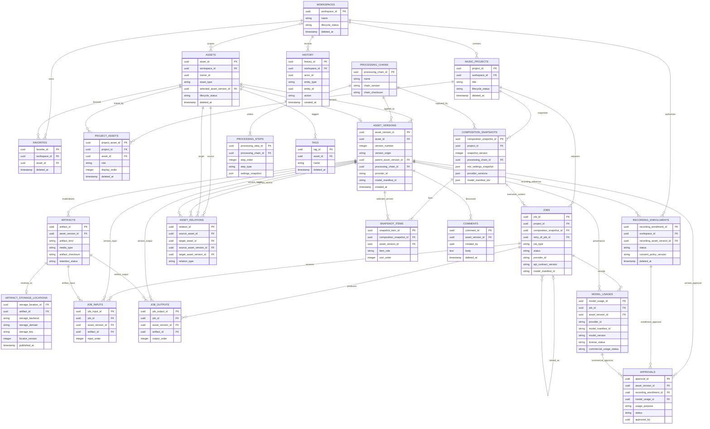

# Asset 중심 목표 ERD

> 문서 상태: [진행 중]
> 최종 수정일: 2026-08-09
> 관련 기능: DohaMusic Workspace 데이터베이스 재설계
> 구현 상태: Workspace Entity 21개와 별도 Artifact Storage Catalog Entity·source revision `20260809_0016` 구현, 실제 사용자 DB `20260808_0015`
> 관련 문서: [재설계 개요](database-redesign-overview.md), [목표 Table Definition](database-redesign-table-definition.md), [Migration 전략](database-redesign-migration-strategy.md)

## 1. 전체 ERD

## 2. 주요 관계

| 관계 | Cardinality | 정책 |
|---|---|---|
| Workspace → MusicProject | 1:N | Project는 정확히 하나의 Workspace에 속함 |
| Workspace → Asset | 1:N, 선택적 | 저장소별 단일 Workspace 계약에서는 Asset의 Workspace 참조를 생략할 수 있음 |
| MusicProject ↔ Asset | N:M | `ProjectAsset`으로만 연결 |
| Asset → AssetVersion | 1:N | 최소 한 Version, Version 번호 단조 증가 |
| AssetVersion → Artifact | 1:N | 실제 파일·Payload를 Artifact ID로 참조 |
| Artifact → ArtifactStorageLocation | 1:0..1 | authoritative locator 하나만 허용, FK 삭제 `RESTRICT` |
| Asset ↔ Asset | N:M | `AssetRelation`으로 부모·파생·Stem·Voice Conversion 관계 표현 |
| MusicProject → CompositionSnapshot | 1:N | Project별 Snapshot version 증가 |
| CompositionSnapshot → SnapshotItem | 1:N | 최소 한 정확한 AssetVersion 참조 |
| ProcessingChain → ProcessingStep | 1:N | `step_order`로 고정 순서 보존 |
| MusicProject → Job | 1:N | Project 문맥에서 독립 실행 단위 생성 |
| Job → JobInput | 1:N | 입력 Version 또는 Artifact 연결 |
| Job → JobOutput | 1:N | 성공 출력 Version 또는 Artifact 연결 |
| Job → ModelUsage | 1:N | Provider·Model·Manifest·권리 계보 기록 |
| Recording AssetVersion → RecordingEnrollment | 1:N | 작품 Recording과 Enrollment를 분리 |
| AssetVersion·RecordingEnrollment·ModelUsage → Approval | 1:N | 대상별 목적과 승인 근거 분리 |
| Asset → Tag | 1:N | Asset 내부에서 Tag 이름 유일 |
| AssetVersion → Comment | 1:N | 특정 불변 Version에 의견 고정 |
| Workspace ↔ Asset | N:M | `Favorite`로 사용자 선호 연결 |

## 3. 순환 참조 처리

`Asset.selected_asset_version_id`는 `AssetVersion.asset_id`와 함께 검증해야 합니다. 선택 대상이 같은 Asset의 Version인지 DB trigger에 의존하지 않고 Service transaction에서 확인합니다.

`AssetVersion.parent_asset_version_id`도 같은 Asset의 낮은 `version_number`만 참조해야 합니다. 순환 여부와 단조 증가 규칙은 생성 transaction에서 검사합니다.

## 4. 선택적 참조 제약

- `JobInput`과 `JobOutput`은 `asset_version_id`, `artifact_id` 중 정확히 하나만 가집니다.
- `Approval`은 `asset_version_id`, `recording_enrollment_id`, `model_usage_id` 중 정확히 하나만 가집니다.
- `AssetRelation`은 Asset 쌍 또는 AssetVersion 쌍 중 하나를 사용하며 서로 다른 수준을 섞지 않습니다.
- `History.entity_id`는 여러 Entity의 감사를 위한 논리 참조입니다. 대상 종류가 여러 Table에 걸치므로 물리 FK 대신 `entity_type` allowlist와 Service 검증을 사용합니다.

## 5. ERD에서 제외한 현행 운영 Table

현행 `idempotency_records`는 Voice Enrollment API 재생 안전을 위한 운영 Table입니다. 목표 21개 Core Entity에 억지로 흡수하지 않고 Migration 기간에 그대로 유지합니다. 공통 API 멱등성 저장소의 최종 위치는 구현 ADR에서 별도로 결정합니다.
