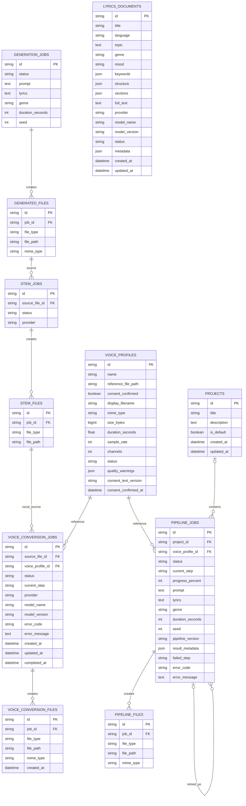
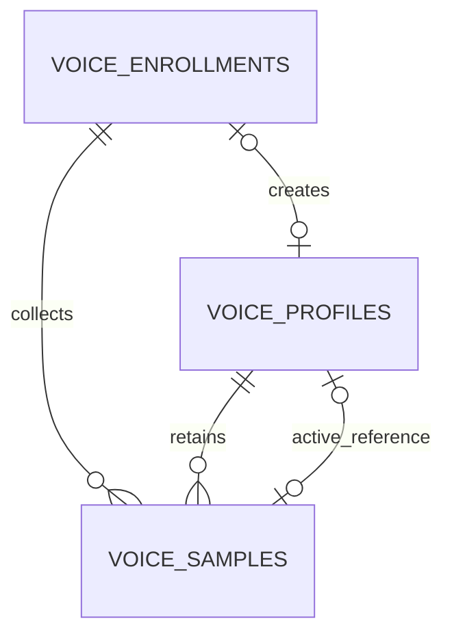
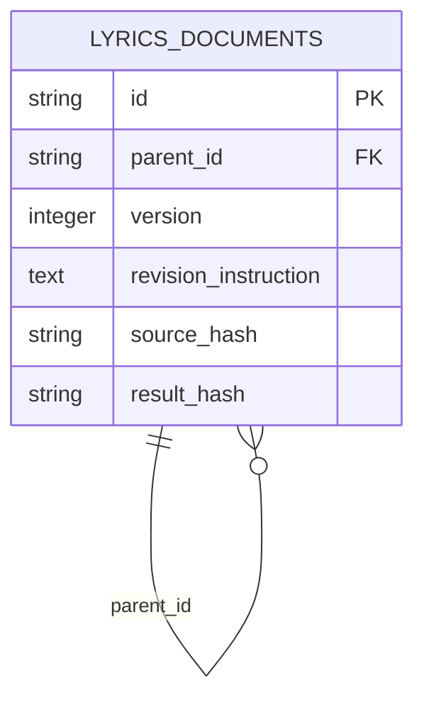

# ERD

> 현재 Runtime subset: 14개 Table, 운영 source of truth 유지
> Alembic source head·실제 사용자 DB: `20260809_0016`; source metadata·실제 Application Table 36개, Catalog row 0개
> Asset 중심 목표 구조: [목표 ERD](database-redesign-erd.md) — [진행 중]

이 Mermaid는 전체 Application schema가 아니라 기존 Runtime 14개 Table 관계만 나타냅니다. Workspace 21개 Table과 `artifact_storage_locations` Catalog는 실제 사용자 DB에 additive 적용됐지만 row·backfill·dual write가 없으므로 [목표 ERD](database-redesign-erd.md)에 분리합니다. Runtime 14개 Table은 계속 운영 source of truth입니다.

`projects` 삭제는 `pipeline_jobs.project_id`를 `NULL`로 만들고 Job·결과 파일을 보존한다. `pipeline_jobs.retry_of_job_id`는 원본 Job self FK이며 원본 제거 시 `NULL`이다. `lyrics_documents`와 `idempotency_records`는 다른 테이블과 FK로 연결하지 않는다. `voice_conversion_jobs.source_file_id`는 `stem_files` 중 `file_type=vocals`만 Service에서 허용한다. Voice Conversion과 Pipeline의 `voice_profile_id`는 동의된 profile만 허용한다. 이 현행 ERD는 Runtime 14개 Table을 나타내며 `20260806_0012`로 추가된 Workspace Table과 후속 Index는 [목표 ERD](database-redesign-erd.md)에 분리한다.

# F6 Voice Enrollment 관계(Alembic 0010~0011)

Sample은 Enrollment 또는 Profile 중 하나 이상에 속한다. Profile의 대표 Sample FK는 nullable unique이고 삭제를 제한한다. 기존 Profile은 파일 접근 없이 `LEGACY_REFERENCE` Sample로 backfill한다.

`0011`은 `voice_samples.quality_metrics` JSON과 독립 `idempotency_records`를 추가한다. `(scope, key_hash)` unique로 create·upload·submit 결과를 재생하며 raw key와 audio binary는 저장하지 않는다.
# Lyrics Revision 관계 (Alembic 0006)

Revision은 직전 문서를 parent로 가리키는 새 row다. 원본을 덮어쓰지 않으며 자식이 있는 문서 삭제는 제한한다.
