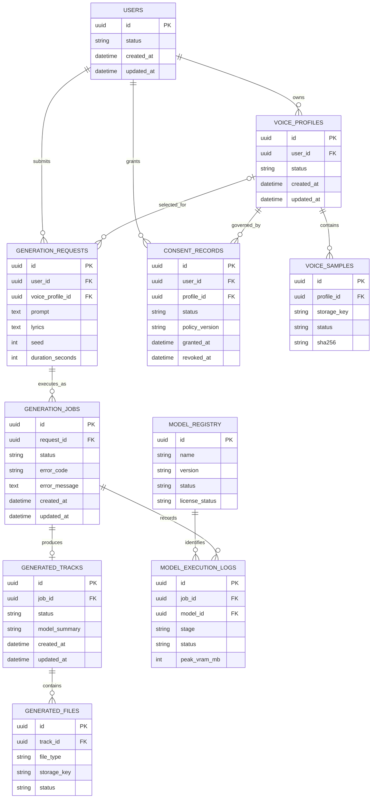

# ERD

> 문서 목적: MVP 핵심 엔터티와 관계를 Mermaid로 표현한다.
> 현재 상태: **논리 초안**

```mermaid
erDiagram
  USERS ||--o{ VOICE_PROFILES : owns
  USERS ||--o{ GENERATION_REQUESTS : submits
  USERS ||--o{ CONSENT_RECORDS : grants
  VOICE_PROFILES ||--o{ VOICE_SAMPLES : contains
  VOICE_PROFILES ||--o{ CONSENT_RECORDS : governed_by
  GENERATION_REQUESTS ||--o{ GENERATION_JOBS : executes_as
  VOICE_PROFILES o|--o{ GENERATION_REQUESTS : selected_for
  GENERATION_JOBS ||--o| GENERATED_TRACKS : produces
  GENERATED_TRACKS ||--o{ GENERATED_FILES : contains
  MODEL_REGISTRY ||--o{ MODEL_EXECUTION_LOGS : identifies
  GENERATION_JOBS ||--o{ MODEL_EXECUTION_LOGS : records

  USERS {
    uuid id PK
    string status
    datetime created_at
    datetime updated_at
  }
  VOICE_PROFILES {
    uuid id PK
    uuid user_id FK
    string status
    datetime created_at
    datetime updated_at
  }
  VOICE_SAMPLES {
    uuid id PK
    uuid profile_id FK
    string storage_key
    string status
    string sha256
  }
  CONSENT_RECORDS {
    uuid id PK
    uuid user_id FK
    uuid profile_id FK
    string status
    string policy_version
    datetime granted_at
    datetime revoked_at
  }
  GENERATION_REQUESTS {
    uuid id PK
    uuid user_id FK
    uuid voice_profile_id FK
    text prompt
    text lyrics
    int seed
    int duration_seconds
  }
  GENERATION_JOBS {
    uuid id PK
    uuid request_id FK
    string status
    string error_code
    text error_message
    datetime created_at
    datetime updated_at
  }
  GENERATED_TRACKS {
    uuid id PK
    uuid job_id FK
    string status
    string model_summary
    datetime created_at
    datetime updated_at
  }
  GENERATED_FILES {
    uuid id PK
    uuid track_id FK
    string file_type
    string storage_key
    string status
  }
  MODEL_REGISTRY {
    uuid id PK
    string name
    string version
    string status
    string license_status
  }
  MODEL_EXECUTION_LOGS {
    uuid id PK
    uuid job_id FK
    uuid model_id FK
    string stage
    string status
    int peak_vram_mb
  }
```

세부 필드는 [테이블 정의](table-definition.md), 상태 전이는 [작업 상태 모델](job-state-model.md)을 따른다.
