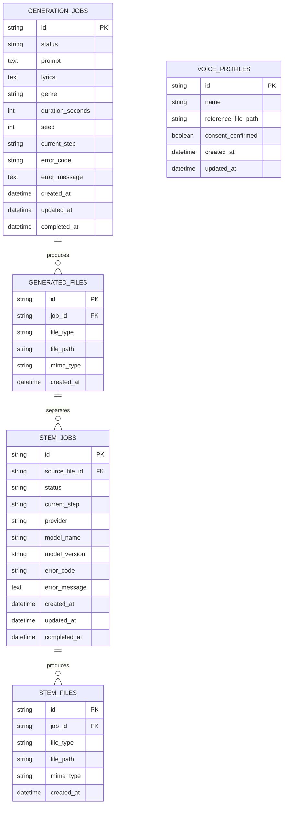

# ERD

> 문서 목적: 현재 실제 DB 엔터티와 관계를 표현한다.
> 현재 상태: **Alembic 마이그레이션 구현 완료**

`generated_files.job_id`는 `generation_jobs.id`를 참조하고 삭제 시 함께 제거된다. `stem_jobs.source_file_id`는 입력 `generated_files.id`를 RESTRICT로 참조하며 `stem_files.job_id`는 Stem Job 삭제 시 함께 제거된다. `voice_profiles`는 생성·Stem Job과 연결하지 않으며 실제 음색 변환에도 사용하지 않는다.

세부 필드는 [테이블 정의](table-definition.md), 상태 전이는 [작업 상태 모델](job-state-model.md)을 따른다.
