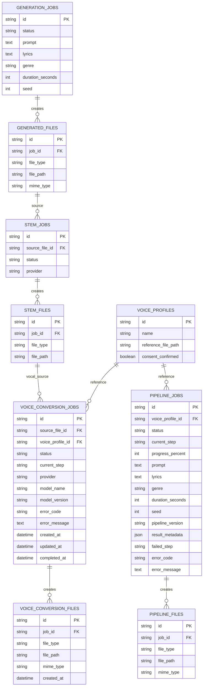

# ERD

`voice_conversion_jobs.source_file_id`는 `stem_files` 중 `file_type=vocals`만 Service에서 허용한다. Voice Conversion과 Pipeline의 `voice_profile_id`는 동의된 profile만 허용한다. 입력 FK는 `RESTRICT`, 출력 파일은 Job 삭제 시 `CASCADE`다. migration revision은 `20260729_0004`다.
