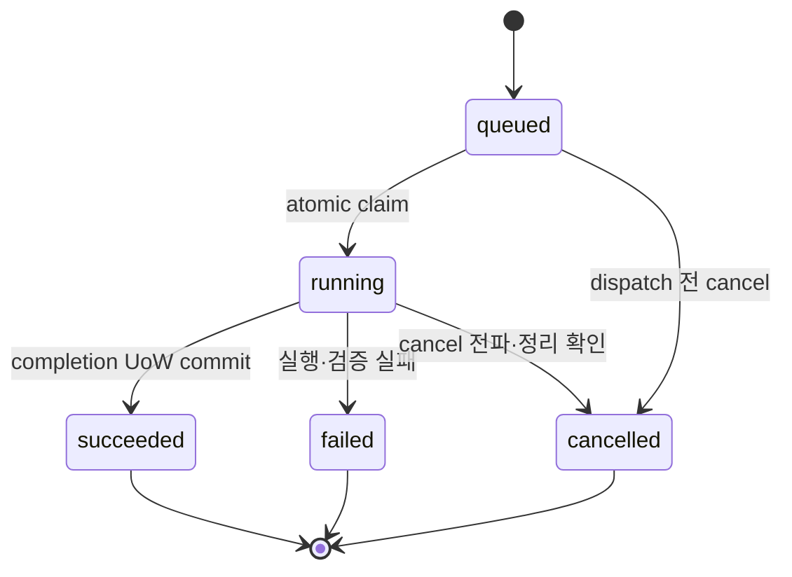

# 작업 상태 모델

> 문서 상태: [완료: 계약]
> 최종 수정일: 2026-08-10
> 문서 목적: Legacy Runtime Job과 Workspace Job의 상태를 분리하고 유효 전이를 정의한다.
> 관련 문서: [Workspace Job Foundation](../03-architecture/workspace-job-foundation.md), [Job API](../06-api/job-api.md), [ADR-021](../11-decisions/ADR-021-pipeline-job-cancel-retry.md), [ADR-033](../11-decisions/ADR-033-workspace-job-execution-boundary.md)

## Legacy Runtime Job — [구현 완료]

기존 Generation·Stem·Voice·Pipeline Job은 기능별 대문자 상태와 Pipeline 단계를 사용한다. `PENDING`, `VALIDATING`, `GENERATING`, `STEM_SEPARATING`, `VOICE_CONVERTING`, `MIXING`, `EXPORTING`, `COMPLETED`, `FAILED`, `CANCEL_REQUESTED`, `CANCELLED`는 Legacy Runtime vocabulary다.

Pipeline `PENDING` cancel, 실행 단계 cooperative `CANCEL_REQUESTED → CANCELLED`와 실패·취소 원본을 복제한 새 Pipeline Job retry는 구현돼 있다. 이 상태와 기존 ThreadPool Worker는 Workspace `jobs`의 공식 5-state·claim·lease 구현 완료 근거가 아니다.

## Workspace Job — [계약·source Column/Index·실행 제어·공식 API 완료]

공개 상태는 다음 5개만 사용한다.

| 상태 | 의미 | 허용 후속 상태 |
|---|---|---|
| `queued` | 아직 Provider side effect가 시작되지 않은 대기 상태 | `running`, `cancelled` |
| `running` | claim·lease를 가진 Worker가 실행 중 | `succeeded`, `failed`, `cancelled` |
| `succeeded` | Artifact 검증·publish·lineage와 상태 commit 완료 | 없음 |
| `failed` | 안전한 오류와 retryability를 기록하고 종료 | 없음 |
| `cancelled` | 실행 중단과 부분 결과 정리를 확인하고 종료 | 없음 |

`cancel_requested`는 공개 상태가 아니다. source revision `20260810_0017`의 내부 `cancel_requested_at` marker로 관리한다. Service는 claim되지 않은 queued Job을 즉시 `cancelled`로 만들고 running Job에는 marker만 기록하며, Worker·Provider에 전파한 뒤에만 `cancelled`로 확정한다. `progress_percent=100`이나 Provider `success`만으로 `succeeded`가 되지 않는다.

Retry는 terminal 원본의 상태를 되돌리지 않고 새 Job을 생성한다. 같은 Job 안의 bounded execution attempt와 공개 retry lineage를 구분한다. CURRENT runtime은 lease 만료 running Job을 자동으로 queued에 되돌리지 않고 retryable failure로 종료하며, TARGET reclaim은 아래 별도 계약을 따른다.

terminal Job은 불변이다. atomic claim은 queued→running과 token·Worker·lease·heartbeat·attempt 증가를 함께 확정한다. CURRENT runtime은 lease 만료를 같은 row의 재queue 없이 `WORKER_LEASE_EXPIRED` retryable failure로 종료한다. TARGET은 [Workspace Worker Re-entry Lifecycle](../03-architecture/workspace-worker-reentry-lifecycle.md)에 등록된 replay-safe Provider Job만 expired `running` claim을 새 token으로 CAS reclaim하며, heartbeat와 recovery는 lease 값을 조건에 포함해 stale snapshot 경쟁을 차단한다.

공식 API는 조회·생성·취소·재시도 action만 제공하며 PATCH·DELETE는 없다. queued 취소는 즉시 `cancelled`를 반환하고 running 취소는 marker만 기록한 실제 `running` 상태와 `202`를 반환한다. retry는 terminal 원본을 바꾸지 않고 frozen lineage를 복제한 새 queued Job을 `202`로 반환한다.
