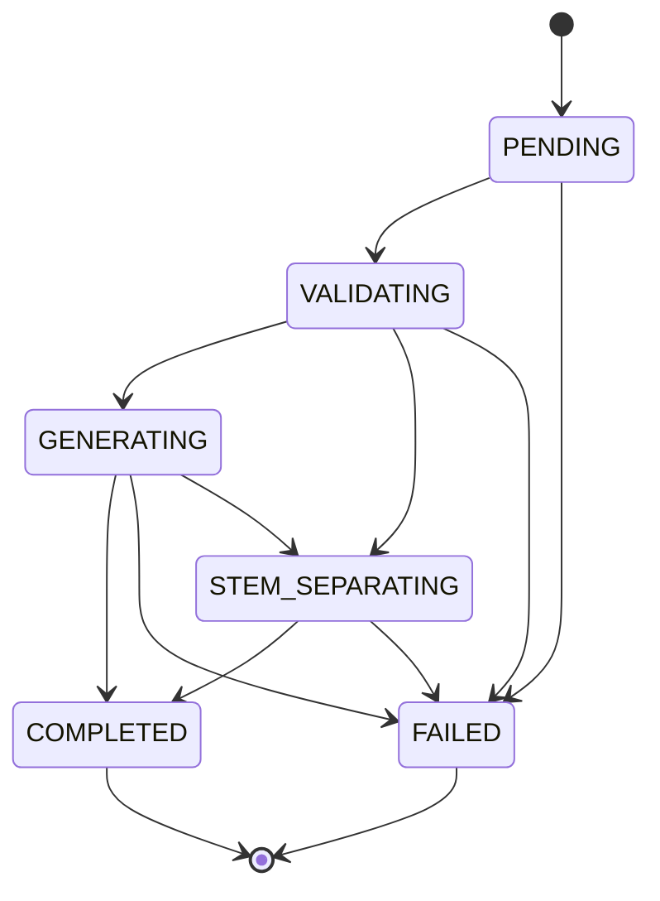

# 작업 상태 모델

> 문서 목적: 생성·Stem Job의 유효 상태 전이를 정의한다.
> 현재 상태: **구현 완료**

| 상태 | 의미 | `current_step` 예시 |
|---|---|---|
| `PENDING` | DB에 저장되어 Worker 실행을 기다림 | `queued` |
| `VALIDATING` | Worker가 입력과 실행 전제조건 확인 | `validating` |
| `GENERATING` | `MusicGenerator` 구현 실행 중 | `generating` |
| `STEM_SEPARATING` | `StemSeparator` 구현 실행 중 | `stem_separation_started` |
| `COMPLETED` | 파일 메타데이터 저장까지 완료 | `completed` |
| `FAILED` | 예외와 오류 코드를 기록하고 종료 | `failed` |

허용되지 않은 상태 전이는 Repository에서 거부한다. `COMPLETED`와 `FAILED`는 종료 상태이며 `completed_at`을 기록한다.

생성 Job은 `GENERATING`, 별도 Stem Job은 `STEM_SEPARATING` 경로를 사용한다. 공통 enum은 향후 단일 파이프라인 연결도 허용하지만 이번 구현은 두 Job을 자동 연쇄하지 않는다. 취소·재시도·복구는 포함하지 않는다.
