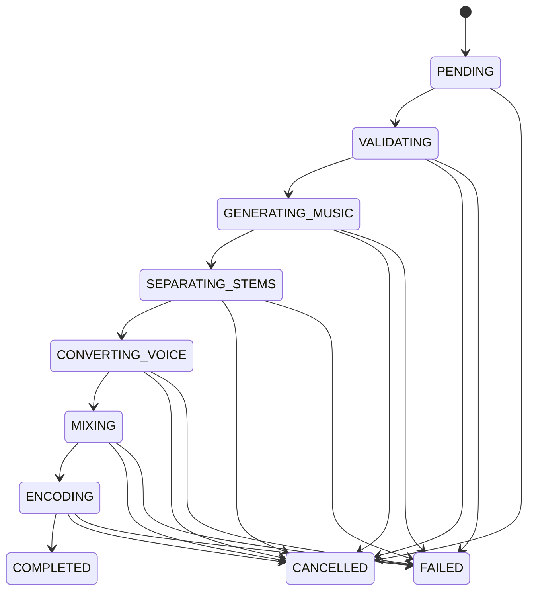

# 작업 상태 모델

> 문서 목적: 비동기 생성 작업의 유효 전이, 완료·실패·재시도 규칙을 정의한다.
> 현재 상태: **설계 초안**

| 상태 | 진입/완료 조건 | 대표 실패 | 재시도 |
|---|---|---|---|
| PENDING | 요청·작업 저장 / Worker lease 획득 | 큐/할당 실패 | 가능 |
| VALIDATING | 실행권 획득 / 입력·소유권·동의·모델 확인 | 입력·동의 오류 | 수정 후 새 요청 |
| GENERATING_MUSIC | 검증 완료 / 원곡 출력 검증 | 모델·OOM·출력 오류 | 오류 분류에 따라 |
| SEPARATING_STEMS | 원곡 존재 / 보컬·반주 검증 | 분리·파일 오류 | 조건부 |
| CONVERTING_VOICE | Stem·동의 유효 / 변환 보컬 검증 | 변환·동의 철회 | 조건부; 철회 시 불가 |
| MIXING | 변환 보컬·반주 존재 / 믹스 검증 | 길이·레벨·인코딩 입력 오류 | 가능 |
| ENCODING | 믹스 존재 / 파일·메타데이터 저장 | 저장소·코덱 오류 | 가능 |
| COMPLETED | 모든 필수 산출물과 메타데이터 확정 | 해당 없음 | 불필요 |
| FAILED | 오류 코드·단계·정리 결과 기록 | 해당 없음 | `retryable`일 때 새 작업 |
| CANCELLED | 취소 승인·안전 지점 중단·정리 | 해당 없음 | 새 작업으로 가능 |

단계는 역행하지 않는다. 재시도는 기존 행을 되돌리지 않고 원 요청을 참조하는 새 `generation_jobs` 행을 만든다. 취소 요청은 즉시 접수하되 모델 호출의 안전 중단 지점에서 `CANCELLED`로 확정한다.
