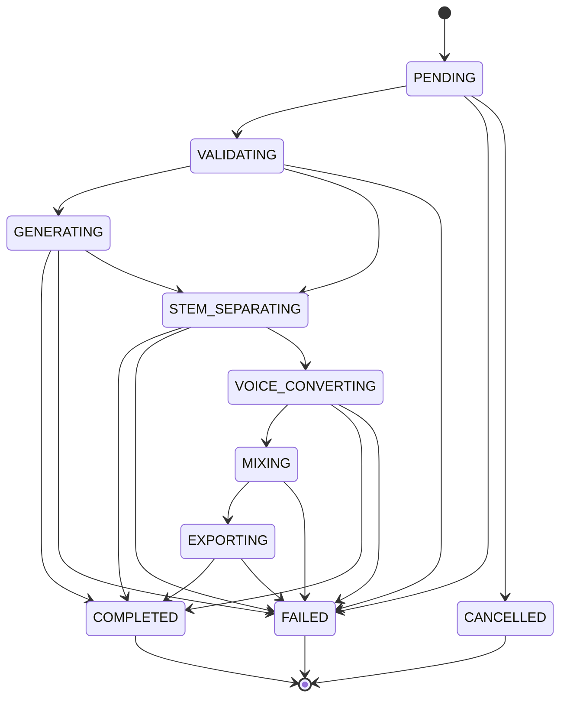

# 작업 상태 모델

> 문서 목적: 독립 AI Job과 통합 Pipeline Job의 유효 상태 전이를 정의한다.
> 현재 상태: **구현 완료**

| 상태 | 의미 | `current_step` 예시 |
|---|---|---|
| `PENDING` | DB에 저장되어 Worker 실행을 기다림 | `queued` |
| `VALIDATING` | Worker가 입력과 실행 전제조건 확인 | `validating` |
| `GENERATING` | `MusicGenerator` 구현 실행 중 | `generating` |
| `STEM_SEPARATING` | `StemSeparator` 구현 실행 중 | `stem_separation_started` |
| `VOICE_CONVERTING` | `VoiceConverter` 구현 실행 중 | `voice_started` |
| `MIXING` | `AudioMixer` 실행 중 | `mixer_started` |
| `EXPORTING` | WAV·metadata 출력 중 | `export_started` |
| `COMPLETED` | 파일 메타데이터 저장까지 완료 | `completed` |
| `FAILED` | 예외와 오류 코드를 기록하고 종료 | `failed` |
| `CANCELLED` | 취소된 종료 상태로 예약 | 취소 API 미구현 |

허용되지 않은 상태 전이는 Repository에서 거부한다. `COMPLETED`, `FAILED`, `CANCELLED`는 종료 상태다. 현재 Worker는 완료·실패에 `completed_at`을 기록하며 취소 실행 경로는 아직 없다.

독립 Job은 각자 필요한 상태만 사용한다. Pipeline Job은 전체 순서를 사용하고 `progress_percent`를 20·40·60·80·100으로 갱신한다. 자동 재시도는 같은 단계 내부 attempt로 기록하므로 상태를 되돌리지 않는다. 취소 API, 프로세스 재시작 복구와 수동 재실행은 포함하지 않는다.
