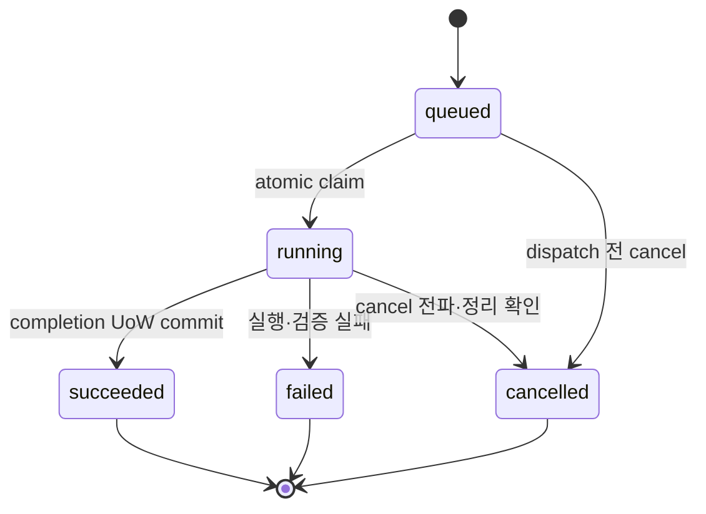

# 작업 상태 모델

> 문서 상태: [완료: 계약]
> 최종 수정일: 2026-08-10
> 문서 목적: Legacy Runtime Job과 Workspace Job의 상태를 분리하고 유효 전이를 정의한다.
> 관련 문서: [Workspace Job Foundation](../03-architecture/workspace-job-foundation.md), [Job API](../06-api/job-api.md), [ADR-021](../11-decisions/ADR-021-pipeline-job-cancel-retry.md), [ADR-033](../11-decisions/ADR-033-workspace-job-execution-boundary.md)

## Legacy Runtime Job — [구현 완료]

기존 Generation·Stem·Voice·Pipeline Job은 기능별 대문자 상태와 Pipeline 단계를 사용한다. `PENDING`, `VALIDATING`, `GENERATING`, `STEM_SEPARATING`, `VOICE_CONVERTING`, `MIXING`, `EXPORTING`, `COMPLETED`, `FAILED`, `CANCEL_REQUESTED`, `CANCELLED`는 Legacy Runtime vocabulary다.

Pipeline `PENDING` cancel, 실행 단계 cooperative `CANCEL_REQUESTED → CANCELLED`와 실패·취소 원본을 복제한 새 Pipeline Job retry는 구현돼 있다. 이 상태와 기존 ThreadPool Worker는 Workspace `jobs`의 공식 5-state·claim·lease 구현 완료 근거가 아니다.

## Workspace Job — [계약·source Column/Index 완료, 실행 제어 미구현]

공개 상태는 다음 5개만 사용한다.

| 상태 | 의미 | 허용 후속 상태 |
|---|---|---|
| `queued` | 아직 Provider side effect가 시작되지 않은 대기 상태 | `running`, `cancelled` |
| `running` | claim·lease를 가진 Worker가 실행 중 | `succeeded`, `failed`, `cancelled` |
| `succeeded` | Artifact 검증·publish·lineage와 상태 commit 완료 | 없음 |
| `failed` | 안전한 오류와 retryability를 기록하고 종료 | 없음 |
| `cancelled` | 실행 중단과 부분 결과 정리를 확인하고 종료 | 없음 |

`cancel_requested`는 공개 상태가 아니다. source revision `20260810_0017`의 내부 `cancel_requested_at` marker로 관리하고 running 상태에서 Worker·Provider에 전파한 뒤에만 `cancelled`로 확정한다. `progress_percent=100`이나 Provider `success`만으로 `succeeded`가 되지 않는다.

Retry는 terminal 원본의 상태를 되돌리지 않고 새 Job을 생성한다. 같은 Job 안의 bounded execution attempt와 공개 retry lineage를 구분하며, lease 만료 running Job은 자동으로 queued에 되돌리지 않고 retryable failure로 종료한다.

terminal Job은 상태·입력·출력·ModelUsage·settings를 변경하지 않으며 append-only History audit만 허용한다. cancellation marker, claim·lease·heartbeat·attempt와 nullable staging role Column 및 Index는 revision `20260810_0017`로 실제 사용자 DB에 적용했다. Service·Worker 상태 전이는 후속 범위다.
