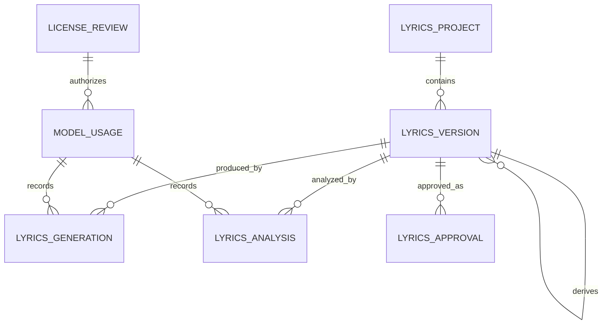

# 가사 버전·승인 데이터 모델

> 문서 상태: [계획]
> 최종 수정일: 2026-08-05
> 관련 기능: DohaLM 가사 공동 창작·사용자 최종 승인
> 관련 문서: [DohaLM 연동](../03-architecture/dohalm-integration.md), [테이블 정의](table-definition.md), [ERD](erd.md), [생성 콘텐츠 정책](../09-security/generated-content-policy.md)

## 1. 범위와 현재 구현

현재 구현은 `lyrics_documents`의 self-reference `parent_id`, 증가하는 `version`, 수정 지시와 전후 hash로 원본 보존 Revision을 제공한다. 이 문서의 `LyricsProject`·`LyricsVersion`·`LyricsGeneration`·`LyricsAnalysis`·`LyricsApproval`·`ModelUsage`·`LicenseReview` 분리는 DohaLM 연동을 위한 계획 개념 모델이며 아직 ORM·migration·API로 구현되지 않았다.

## 2. 개념 관계

## 3. 엔티티 책임

| 엔티티 | 책임 | 최소 정보 |
|---|---|---|
| `LyricsProject` | 한 곡의 가사 작업 aggregate | ID, 소유 사용자, 제목·콘셉트, 현재 승인본 ID, 생성·수정 시각 |
| `LyricsVersion` | 사용자·AI 가사 본문의 불변 버전 | ID, project ID, parent ID, version number, `version_type`, content, content hash, actor type, 생성 시각 |
| `LyricsGeneration` | AI 초안·수정 제안 호출 | input version ID, output version ID, prompt 참조/hash, generation settings, request ID, 상태·오류, 생성 시각 |
| `LyricsAnalysis` | 구조·음절·운율·반복·주제 분석 | target version ID, analysis types, versioned result, model usage ID, 생성 시각 |
| `LyricsApproval` | 사용자의 명시적 최종 승인 이벤트 | approved version ID, version hash, approver, 승인 시각, 철회 시각·사유 |
| `ModelUsage` | 실제 Provider·모델·manifest와 호출 계보 | provider, model name·version, manifest ID/hash, 설정, license review ID, 시작·완료 시각 |
| `LicenseReview` | 정확한 artifact 조합의 상업 이용 판정 | model·weights·dataset·adapter·runtime identity, 근거, 판정 상태, 검토일·검토자 |

## 4. 가사 버전 타입

`LyricsVersion.version_type`은 다음 값을 구분한다.

| 값 | 의미 |
|---|---|
| `user_input` | 사용자가 최초 입력한 기존 또는 신규 가사 |
| `ai_generated` | AI가 최초 생성한 가사 초안 |
| `ai_suggestion` | 분석을 바탕으로 AI가 만든 수정 제안 |
| `user_edited` | 사용자가 직접 편집·선택·배열·삭제·추가·보완한 버전 |
| `final_approved` | 사용자가 음악 생성 사용을 명시적으로 승인한 불변 snapshot |

`final_approved`는 본문 수정으로 직접 설정하지 않는다. 사용자 승인 동작이 새 불변 version과 `LyricsApproval`을 함께 만들고, 승인 대상 hash를 보존해야 한다. 승인 뒤 수정하면 새 `user_edited` 버전이 생기며 다시 승인하기 전까지 음악 생성에 사용할 수 없다.

## 5. 불변성과 Pipeline 게이트

- 기존 버전은 덮어쓰거나 AI 결과와 사용자 수정을 같은 row에 합치지 않는다.
- 모든 파생 버전은 `parent_id`와 content hash를 기록한다.
- AI 호출은 input/output version과 `ModelUsage`를 연결한다.
- 음악 생성 Job은 `final_approved` version ID, approval ID와 content hash를 입력 snapshot으로 보존한다.
- approval의 version hash와 현재 version hash가 다르거나 승인이 철회됐으면 요청을 거부한다.
- 상업 작업은 연결된 `LicenseReview.status=commercial_approved`가 아니면 거부한다.
- 직접 작성 가사는 AI `ModelUsage` 없이 승인할 수 있지만 입력 권리 확인 정책은 그대로 적용한다.

## 6. 현재 스키마에서의 전환 — [검증 필요]

현재 `lyrics_documents`는 기본적인 원본 보존 Revision을 이미 제공한다. 구현 시 다음 대안을 ADR과 migration에서 비교한다.

1. `lyrics_documents`를 `LyricsVersion` 역할로 확장하고 나머지 엔티티를 추가한다.
2. 새 aggregate로 이관하고 기존 row를 `LyricsProject`·`LyricsVersion`으로 backfill한다.

어느 대안도 아직 승인되지 않았다. migration은 기존 ID·parent·version·hash를 보존하고 downgrade의 데이터 손실 가능성, 사용자 소유권, 보존·삭제와 Pipeline snapshot 호환성을 정의해야 한다.
