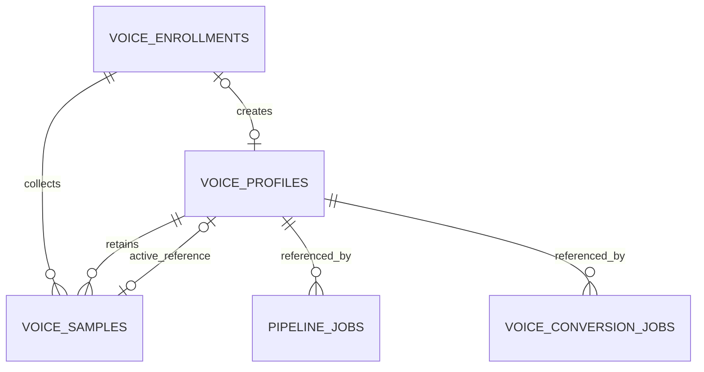

# Voice Enrollment 데이터 모델

> 문서 상태: [진행 중]
> 최종 수정일: 2026-08-01
> 관련 기능: F6 Guided Voice Enrollment
> 관련 문서: [현재 ERD](erd.md), [현재 테이블 정의](table-definition.md), [Voice Enrollment API](../06-api/voice-enrollment-api.md), [ADR-025](../11-decisions/ADR-025-voice-profile-multiple-samples-reference.md), [ADR-026](../11-decisions/ADR-026-voice-enrollment-lifecycle-cleanup.md)
> 구현 상태: Alembic `20260801_0010` 영속 모델에 이어 `20260801_0011`이 sample `quality_metrics`와 hashed `idempotency_records`를 추가한다. Enrollment API·Storage·정규화·기본 품질·lazy 만료·즉시 cleanup primitive를 구현했고 scanner·scheduler는 미구현이다.

## 1. 구현 범위

F6 Backend는 기존 `/api/voice-profiles` 공개 계약과 `voice_profiles.reference_file_path`를 유지하면서 다음을 구현했다.

- `voice_enrollments`: 제출 전 등록 세션, 동의, 만료, 실패와 cleanup 상태
- `voice_samples`: Enrollment·Profile에 연결되는 개별 sample metadata와 lifecycle
- `voice_profiles.active_reference_sample_id`: 현재 대표 reference인 `voice_samples.id`
- 기존 Profile당 `LEGACY_REFERENCE` Sample backfill
- 상태 전이 검증과 최소 Repository CRUD·조회

`0011` migration은 파일에 접근하지 않는다. WebM/Ogg decode·파일 promotion·cleanup은 Runtime Service 책임이며 Frontend Wizard와 cleanup scheduler는 포함하지 않는다.

## 2. 관계

Sample은 `enrollment_id` 또는 `voice_profile_id` 중 하나 이상을 가져야 한다. 승격 중 lineage를 보존하기 위해 두 FK가 함께 존재할 수 있다. 한 Enrollment는 최대 한 Profile을 생성하도록 `voice_enrollments.voice_profile_id`를 nullable unique로 둔다. 대표 Sample은 nullable unique FK이며 삭제 제한을 적용한다.

대표 Sample이 같은 Profile 소유이고 `PROMOTED` 상태인지 여부는 이식 가능한 DB 제약으로 표현하지 않고 `VoiceProfileRepository.set_active_reference`가 검사한다.

## 3. `voice_enrollments`

| 필드 | 타입 | Null | 책임 |
|---|---|---:|---|
| `id` | varchar(36) PK | 아니요 | server-generated UUID |
| `profile_name` | varchar(100) | 아니요 | Profile draft 이름 |
| `profile_description` | text | 예 | Profile draft 설명 |
| `status` | varchar(32) | 아니요 | Enrollment lifecycle |
| `consent_confirmed` | boolean | 아니요 | 동의 확인 여부 |
| `consent_policy_version` | varchar(50) | 예 | 동의문 버전 |
| `consent_confirmed_at` | datetime | 예 | 동의 확인 시각 |
| `voice_profile_id` | varchar(36) FK, unique | 예 | 완료 후 생성 Profile |
| `last_activity_at` | datetime | 아니요 | sliding TTL 계산 근거 |
| `expires_at`, `absolute_expires_at` | datetime | 예 | 만료 후보 시각 |
| `submitted_at`, `cancelled_at`, `completed_at` | datetime | 예 | lifecycle evidence |
| `failure_code` | varchar(100) | 예 | 안전한 실패 코드 |
| `cleanup_status` | varchar(32) | 아니요 | cleanup lifecycle |
| `cleanup_requested_at`, `cleanup_completed_at` | datetime | 예 | cleanup evidence |
| `cleanup_failure_code` | varchar(100) | 예 | 안전한 cleanup 실패 코드 |
| `created_at`, `updated_at` | datetime | 아니요 | UTC metadata |

상태는 `DRAFT`, `READY_TO_SUBMIT`, `SUBMITTING`, `COMPLETED`, `FAILED`, `CANCELLED`, `EXPIRED`, `DELETE_PENDING`, `DELETE_FAILED`다. `COMPLETED → DRAFT`, `CANCELLED → SUBMITTING`, `EXPIRED → READY_TO_SUBMIT` 같은 역전이는 Repository에서 거부한다.

cleanup 상태는 `NOT_REQUESTED`, `PENDING`, `RUNNING`, `FAILED`, `COMPLETED`다. 이번 구현은 상태와 조회 기반만 제공하며 실제 scanner·worker는 실행하지 않는다.

## 4. `voice_samples`

| 필드 | 타입 | Null | 책임 |
|---|---|---:|---|
| `id` | varchar(36) PK | 아니요 | server-generated UUID |
| `enrollment_id` | varchar(36) FK | 예 | 원본 Enrollment lineage |
| `voice_profile_id` | varchar(36) FK | 예 | 승격된 Profile 소유권 |
| `source_type` | varchar(32) | 아니요 | `BROWSER_RECORDING`, `FILE_UPLOAD`, `LEGACY_REFERENCE` |
| `prompt_id` | varchar(100) | 예 | 안내 prompt 식별자 |
| `category` | varchar(50) | 아니요 | sample 역할 |
| `status` | varchar(32) | 아니요 | Sample lifecycle |
| `original_content_type`, `original_size_bytes`, `original_storage_path` | varchar, bigint, varchar | 예 | 임시 원본 metadata |
| `normalized_content_type`, `normalized_size_bytes`, `normalized_storage_path` | varchar, bigint, varchar | 예 | 정규화본 metadata |
| `duration_seconds`, `sample_rate`, `channels`, `bit_depth` | float, integer | 예 | 검증된 audio metadata |
| `quality_status`, `quality_warnings` | varchar(20), json | 예/아니요 | 품질 결과와 warning code |
| `failure_code` | varchar(100) | 예 | 안전한 validation 실패 코드 |
| `validated_at`, `promoted_at`, `expires_at`, `deleted_at` | datetime | 예 | lifecycle evidence |
| `delete_failure_code` | varchar(100) | 예 | 안전한 삭제 실패 코드 |
| `created_at`, `updated_at` | datetime | 아니요 | UTC metadata |

상태는 `UPLOADED`, `VALIDATING`, `READY`, `FAILED`, `PROMOTED`, `DELETE_PENDING`, `DELETE_FAILED`, `DELETED`다. `DELETED → READY` 같은 복구 전이는 허용하지 않는다. `READY` Sample만 Profile로 승격할 수 있고 승격 시 Enrollment 관계를 유지해 lineage를 보존한다.

Storage 경로는 내부 persistence 정보이며 공개 DTO에 노출하지 않는다. 레거시 Profile이 동일 파일 경로를 공유할 수 있으므로 migration은 Storage 경로에 unique 제약을 두지 않는다. 신규 관리 파일의 경로 충돌 방지는 후속 Storage Service 책임이다.

## 5. 인덱스와 제약

| 대상 | 구현 |
|---|---|
| Enrollment 만료 scan | index `(status, expires_at)` |
| Enrollment cleanup scan | index `(cleanup_status)` |
| Profile 중복 생성 방지 | unique `voice_enrollments.voice_profile_id` |
| Enrollment sample 조회 | index `(enrollment_id, status)` |
| Profile sample 조회 | index `(voice_profile_id, status)` |
| Sample cleanup scan | index `(status, expires_at)` |
| Sample orphan 방지 | check `enrollment_id IS NOT NULL OR voice_profile_id IS NOT NULL` |
| 대표 reference lookup·중복 방지 | unique FK `voice_profiles.active_reference_sample_id` |

Enrollment당 최대 10개, prompt/category 중복, 동의·품질·만료 eligibility는 DB count 제약이 아니라 후속 Service transaction에서 강제한다.

## 6. 기존 Profile backfill

Alembic `20260801_0010`은 파일을 열거나 이동·삭제하지 않고 DB metadata만 변환한다.

Alembic `20260801_0011`도 파일에 접근하지 않는다. `0010`으로 downgrade하면 replay cache인 `idempotency_records`와 재계산 가능한 `quality_metrics`를 제거하므로 진행 중 요청의 재생 정보와 상세 metrics가 소실된다. Profile·Enrollment·Sample row와 음성 파일은 유지된다.

1. 기존 Profile ID로 결정적 UUID5 Sample ID를 만든다.
2. `source_type=LEGACY_REFERENCE`, `category=legacy`로 기록한다.
3. Profile이 `READY`면 Sample을 `PROMOTED`로 만들고 대표 FK를 연결한다. 그 외 상태는 `FAILED`로 기록하고 대표 FK를 비운다.
4. 기존 MIME, byte, duration, sample rate, channels, quality warnings와 `reference_file_path`만 복사한다.
5. 원본 metadata, bit depth, quality status처럼 확인할 수 없는 값은 추정하지 않고 `NULL`로 둔다.

기존 단일 Profile 생성 API도 호환 Sample과 대표 FK를 같은 transaction에 기록한다. 기존 공개 DTO와 Pipeline·Voice Conversion 참조 방식은 변경하지 않는다.

## 7. downgrade와 후속 범위

Enrollment row가 없고 모든 Sample이 `LEGACY_REFERENCE`일 때만 `20260731_0009`로 구조적 downgrade할 수 있다. 신규 Enrollment 또는 비레거시 Sample이 있으면 데이터 유실을 막기 위해 downgrade를 명시적으로 차단한다.

Runtime은 별도 `idempotency_records`에 raw key가 아닌 SHA-256 hash와 request fingerprint·resource 결과·24시간 만료를 기록한다. 24시간 sliding/7일 absolute lazy 만료와 즉시 cleanup은 구현했지만 주기적 scan·retry는 후속이다. F6 Sample은 별도 학습 opt-in·lineage·삭제 계약 없이 Phase 7 Dataset에 편입하지 않는다.
