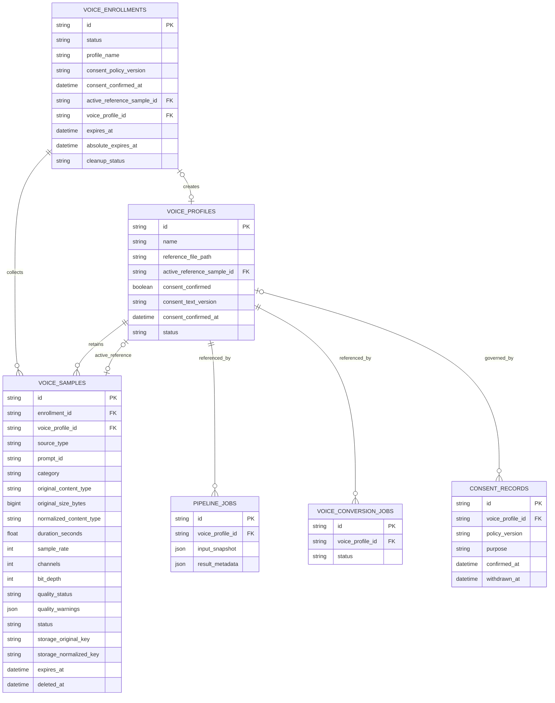

# Voice Enrollment 데이터 모델 설계

> 문서 상태: [제안] [Backend 확장 필요]
> 최종 수정일: 2026-08-01
> 관련 기능: F6 Guided Voice Enrollment
> 관련 문서: [현재 ERD](erd.md), [현재 테이블 정의](table-definition.md), [Voice Enrollment API](../06-api/voice-enrollment-api.md), [ADR-025](../11-decisions/ADR-025-voice-profile-multiple-samples-reference.md), [ADR-026](../11-decisions/ADR-026-voice-enrollment-lifecycle-cleanup.md)
> 구현 상태: 논리 모델만 정의한다. ORM·Alembic migration·runtime table은 아직 없다.

## 1. 현재 구현 schema

현재 DB에는 `voice_profiles`만 있고 `voice_enrollments`, `voice_samples`, `consent_records`는 없다. `voice_profiles.reference_file_path`는 `NOT NULL`이며 Pipeline·Voice Conversion Job이 `voice_profile_id`로 단일 Profile을 참조한다.

| 현재 필드 | 실제 의미 |
|---|---|
| `id`, `name`, `status` | UUID, 표시 이름, 현재 생성값 `READY` |
| `reference_file_path` | Storage root 기준 내부 상대 경로, 공개 DTO 제외 |
| `display_filename`, `mime_type`, `size_bytes` | upload metadata; legacy Profile은 null 가능 |
| `duration_seconds`, `sample_rate`, `channels` | 검증된 WAV metadata; legacy null 가능 |
| `quality_warnings` | 현재 3개 warning code 배열 |
| `consent_confirmed`, `consent_text_version`, `consent_confirmed_at` | 로컬 동의 확인. 인증된 주체 증적은 아님 |
| `created_at`, `updated_at` | UTC metadata |

현재 삭제는 Pipeline 또는 Voice Conversion이 Profile을 참조하면 차단하고, 관리 upload의 `voices/references/{profile_id}/reference.wav`만 물리 삭제한다. soft delete, 철회, deletion retry와 파생 artifact 추적은 없다.

## 2. 제안 aggregate

### `voice_enrollments` [제안]

| 후보 필드 | 타입 후보 | Null | 책임 |
|---|---|---:|---|
| `id` | varchar(36) PK | 아니요 | server-generated Enrollment ID |
| `status` | varchar(32) | 아니요 | `DRAFT`, `READY_TO_SUBMIT`, `SUBMITTING`, `COMPLETED`, `CANCELLED`, `EXPIRED`, `DELETE_PENDING`, `DELETE_FAILED` |
| `profile_name` | varchar(100) | 아니요 | Profile draft 이름 |
| `profile_description` | varchar(500) | 예 | `[제안]` Profile 설명 |
| `consent_policy_version` | varchar(50) | 아니요 | 표시한 정책 version |
| `consent_confirmed_at` | datetime | 예 | submit에서만 기록 |
| `active_reference_sample_id` | varchar(36) FK | 예 | submit에서 선택한 Sample |
| `voice_profile_id` | varchar(36) FK | 예 | 완료된 Profile, Enrollment당 unique |
| `expires_at` | datetime | 아니요 | mutation 기반 24시간 sliding TTL |
| `absolute_expires_at` | datetime | 아니요 | 생성 후 7일 상한 |
| `cleanup_status` | varchar(32) | 아니요 | `NOT_REQUESTED`, `PENDING`, `RUNNING`, `FAILED`, `COMPLETED` |
| `cleanup_attempts` | integer | 아니요 | 삭제 재시도 횟수 |
| `last_cleanup_error_code` | varchar(100) | 예 | 안전한 오류 code |
| `created_at`, `updated_at` | datetime | 아니요 | UTC 시각 |
| `submitted_at`, `completed_at`, `cancelled_at`, `deleted_at` | datetime | 예 | lifecycle evidence |

### `voice_samples` [제안]

| 후보 필드 | 타입 후보 | Null | 책임 |
|---|---|---:|---|
| `id` | varchar(36) PK | 아니요 | server-generated Sample ID |
| `enrollment_id` | varchar(36) FK | 예 | 등록 전 소유 aggregate |
| `voice_profile_id` | varchar(36) FK | 예 | 완료 후 Profile 관계 |
| `source_type` | varchar(32) | 아니요 | `BROWSER_RECORDING`, `FILE_UPLOAD`, `LEGACY_REFERENCE` |
| `prompt_id` | varchar(100) | 예 | 안내 prompt 식별자 |
| `category` | varchar(50) | 아니요 | 역할 allowlist |
| `display_filename` | varchar(255) | 예 | 정제된 표시 이름. path에 사용하지 않음 |
| `original_content_type` | varchar(100) | 아니요 | 검증 전 선언이 아니라 검증된 container MIME |
| `original_size_bytes` | bigint | 아니요 | 실제 streaming byte |
| `original_codec` | varchar(50) | 예 | safe allowlist probe 결과 |
| `normalized_content_type` | varchar(100) | 예 | 성공 시 `audio/wav` |
| `normalized_size_bytes` | bigint | 예 | 정규화본 실제 byte |
| `duration_seconds` | float | 예 | decoded frame 기준 |
| `sample_rate` | integer | 예 | 성공 시 48000 |
| `channels` | integer | 예 | 성공 시 1 |
| `bit_depth` | integer | 예 | 성공 시 16 |
| `quality_status` | varchar(20) | 예 | `PASS`, `WARNING`, `FAIL` |
| `quality_warnings` | json | 아니요 | versioned warning code 배열 |
| `quality_metrics` | json | 아니요 | 내부 최소 집계값; 공개는 allowlist projection |
| `quality_version` | varchar(50) | 예 | 검사 계약 version |
| `warning_acknowledged_at` | datetime | 예 | submit 경고 확인 evidence |
| `storage_original_key` | varchar(500) | 예 | 내부 전용 임시 key |
| `storage_normalized_key` | varchar(500) | 예 | 내부 전용 정규화/final key |
| `status` | varchar(32) | 아니요 | `UPLOADED`, `VALIDATING`, `READY`, `FAILED`, `DELETE_PENDING`, `DELETE_FAILED` |
| `expires_at` | datetime | 예 | Enrollment TTL과 연동 |
| `cleanup_attempts`, `last_cleanup_error_code` | integer, varchar | 아니요/예 | 삭제 재시도 추적 |
| `created_at`, `updated_at`, `deleted_at` | datetime | 아니요/아니요/예 | lifecycle metadata |

한 Sample은 생성 시 Enrollment에 속하고 Profile 승격 후 Profile에 연결된다. DB 제약은 `enrollment_id IS NOT NULL OR voice_profile_id IS NOT NULL`을 요구한다. 완료 승격 과정의 짧은 중첩 관계는 transaction 안에서만 허용하며 orphan row는 금지한다.

### `voice_profiles` 확장 [제안]

| 후보 필드 | 책임 |
|---|---|
| `description` | 사용자 표시 설명, nullable |
| `active_reference_sample_id` | 현재 Pipeline이 사용할 eligible Sample FK |
| `status` 확장 | 승격 중 내부 `PREPARING`, 사용 가능 `READY`; 철회·삭제 상태는 정책 승인 후 추가 |
| `deleted_at` | deletion workflow가 승인될 때만 도입 |

기존 `reference_file_path`와 upload metadata는 전환 기간에 유지한다. `reference_file_path`는 active Sample normalized key와 같아야 하며 Repository가 불일치를 거절한다. 단일 source of truth 전환과 legacy column 제거는 별도 migration·rollback 검증 뒤 결정한다.

### Idempotency record [제안]

create·upload·submit의 중복 방지를 위해 `voice_enrollment_idempotency` 또는 공통 idempotency table이 필요하다. 후보 필드는 scope, key hash, request fingerprint, response resource type·ID, status, expires_at이다. raw key, 원본 filename, binary와 request body 전체는 저장하지 않는다. `(scope, key_hash)`를 unique로 둔다.

## 3. 관계 ERD

아래에서 `VOICE_ENROLLMENTS`, `VOICE_SAMPLES`, `CONSENT_RECORDS`와 `VOICE_PROFILES.active_reference_sample_id`는 모두 `[제안]`이다. `VOICE_PROFILES`, `PIPELINE_JOBS`, `VOICE_CONVERSION_JOBS`는 현재 존재한다.

현재 consent는 `voice_profiles` 필드에 있고 `CONSENT_RECORDS` table은 `[Phase 9 선행]`이다. Pipeline provenance는 현재 `voice_profile_id`와 snapshot을 보존한다. F6 구현에서는 사용한 `active_reference_sample_id`를 내부 provenance에 추가하는 방안을 검토하되 공개 Storage key는 포함하지 않는다.

## 4. index·uniqueness 후보

| 대상 | 후보 | 이유 |
|---|---|---|
| Enrollment | index `(status, expires_at)` | 만료·cleanup scan |
| Enrollment | unique `voice_profile_id` where not null | 중복 submit으로 Profile 두 개 생성 방지 |
| Sample | index `(enrollment_id, status)` | aggregate 조회·validation polling |
| Sample | index `(voice_profile_id, status)` | Profile sample·삭제 검사 |
| Sample | index `(status, expires_at)` | orphan·cleanup scan |
| Sample | unique `(voice_profile_id, id)` | active reference가 같은 Profile Sample인지 composite 검증 후보 |
| Profile | FK `active_reference_sample_id` with restricted delete | 대표 Sample 삭제 방지 |
| Idempotency | unique `(scope, key_hash)` | 중복 요청 직렬화 |

SQLite partial index·deferred FK 동작과 PostgreSQL 전환 호환성은 migration 설계 때 검증한다. 최대 10개 Sample은 DB count 제약보다 Service transaction 안에서 동시 upload를 포함해 강제한다.

## 5. transaction과 파일 승격

1. submit compare-and-set으로 Enrollment를 `SUBMITTING`으로 바꾸고 included Sample을 잠근다.
2. 동의, 만료, Sample status·quality acknowledgement, active reference 소속을 다시 검사한다.
3. 정규화본을 `voices/references/{profile_id}/samples/{sample_id}` staging에 복사·fsync·재검증한다.
4. 첫 DB transaction에서 Profile `PREPARING`, Enrollment `SUBMITTING`, Sample 관계, active reference, consent 시각과 호환 `reference_file_path`를 기록한다.
5. commit 뒤 staging을 final 이름으로 atomic rename하고 파일을 다시 검증한다.
6. 두 번째 짧은 transaction에서 Profile `READY`와 Enrollment `COMPLETED`를 함께 확정한다.
7. 임시 원본과 미포함 Sample cleanup을 예약한다. 실패는 `DELETE_PENDING`/`DELETE_FAILED`로 추적한다.

Filesystem과 DB는 같은 transaction이 아니므로 단계별 idempotency와 보상 작업이 필수다. `READY` Profile은 active reference 파일의 존재·regular file·Storage 경계·format 검증을 통과해야만 Worker가 사용한다. 첫 commit 전 실패는 Profile row를 rollback하고 Enrollment를 재시도 가능한 상태로 되돌린다. 첫 commit 후 파일 확정 실패는 Profile `PREPARING`을 사용 불가로 유지하고 복구/cleanup한다.

## 6. 기존 데이터 migration·backfill 전략

실제 migration은 이번 작업에서 작성하지 않는다. 후속 순서는 다음과 같다.

1. nullable 신규 table·관계와 호환 field를 additive migration으로 추가한다.
2. 기존 Profile마다 VoiceSample 하나를 생성한다.
3. `source_type=LEGACY_REFERENCE`, `category=legacy`, `status=READY`로 두고 기존 `reference_file_path`를 normalized key로 연결한다.
4. 현재 저장된 duration·sample rate·channels·quality warning만 복사한다. null metadata와 bit depth를 추측하지 않는다.
5. Profile의 active Sample FK를 backfill하고 path 일치 검증 report를 만든다.
6. 신규 write는 Profile과 Sample을 함께 기록하고 구형 Worker는 `reference_file_path`를 계속 읽는다.
7. Pipeline·Voice Conversion이 active Sample 관계를 안전하게 조회하도록 전환한 뒤 legacy field 제거 여부를 별도 결정한다.

legacy 운영자 파일은 여러 Profile이 공유할 가능성이 있고 관리 upload 여부가 불명확하므로 migration에서 이동·삭제하지 않는다. downgrade는 active Sample 하나를 legacy path로 export할 수 있을 때만 허용하며 보조 Sample 삭제 정책을 먼저 확인한다.

## 7. 삭제·동의·Dataset 경계

- active Sample, Pipeline 또는 Voice Conversion에서 참조된 Profile은 안전한 정책 없이 삭제하지 않는다.
- 동의 철회는 Profile을 새 작업에 사용하지 못하게 하고 원본·정규화본·derived reference·cache 삭제 작업을 추적해야 한다. 기존 생성 결과물 삭제 여부는 `[정책 결정 필요]`다.
- 삭제 실패는 row와 retry metadata를 보존하고 완료로 표시하지 않는다.
- F6 Sample은 Phase 7 Dataset에 자동 편입하지 않는다. 별도 opt-in, eligibility, lineage, split과 학습 artifact 삭제가 승인된 경우에만 별도 Dataset 관계를 만든다.
- `CONSENT_RECORDS`와 authenticated owner는 공개 운영 전 `[Phase 9 선행]`이다.

## 8. 공개 DTO와 persistence 분리

공개 가능 후보는 opaque ID, source type, prompt/category, 검증된 content type·byte·duration·sample rate·channels·bit depth, quality status·warning, lifecycle·cleanup status와 시각이다. 다음은 내부 전용이다.

- `reference_file_path`, `storage_original_key`, `storage_normalized_key`, temp/staging path
- 원본 파일명, decoder command·stderr, raw OS/SQL 오류
- quality raw sample, embedding, 내부 threshold debug와 consent evidence locator

Repository는 내부 key를 반환하고 Service/API mapper가 명시 allowlist DTO를 만든다. 내부 key를 단순 문자열 직렬화로 공개 schema에 전달하지 않는다.
